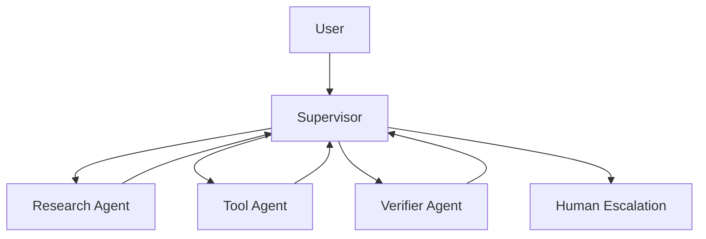

# Customer Support Multi-Agent Case

## Scenario

A support Agent answers product questions, checks order status, updates tickets, and escalates unsafe or ambiguous cases to a human.

## Architecture

## Key Decisions

- A supervisor owns routing, not individual agents.
- Research answers from retrieval and memory only.
- Tool execution handles side effects.
- The verifier can block unsafe final answers.
- Human escalation is a normal route, not a failure path.

## Failure Modes

- Research returns a stale product policy.
- The verifier blocks an answer that lacks evidence.
- A user asks for an ambiguous account change.

## Evaluation

Use the L3 system-design questions and the multi-agent supervisor Lab:

- [`../interviews/questions/l3-system-design.md`](../interviews/questions/l3-system-design.md)
- [`../../labs/l3/multi_agent_supervisor/README.md`](../../labs/l3/multi_agent_supervisor/README.md)

## Lesson

Multi-agent systems should separate research, action, verification, and escalation before adding complexity.
