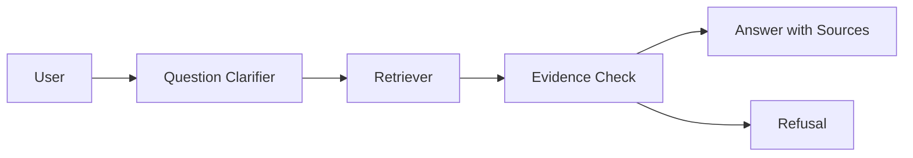

# Personal Knowledge Base RAG Case

## Scenario

A personal Agent searches local notes and answers only when retrieval supports the answer.

## Architecture

## Key Decisions

- Retrieval must be scoped to the user's local corpus.
- Memory stores preferences, not facts unless explicitly verified.
- Missing evidence triggers refusal.
- Citations are required for factual answers.

## Failure Modes

- Stale notes are treated as current facts.
- Duplicate notes conflict.
- Memory overrides retrieved evidence.

## Evaluation

Use the RAG evaluator and multi-round research labs:

- [`../../labs/l3/rag_evaluator/README.md`](../../labs/l3/rag_evaluator/README.md)
- [`../../labs/l3/multi_round_research_discussion/README.md`](../../labs/l3/multi_round_research_discussion/README.md)

## Lesson

RAG is not just search. It is evidence selection, refusal, and answer grounding.
