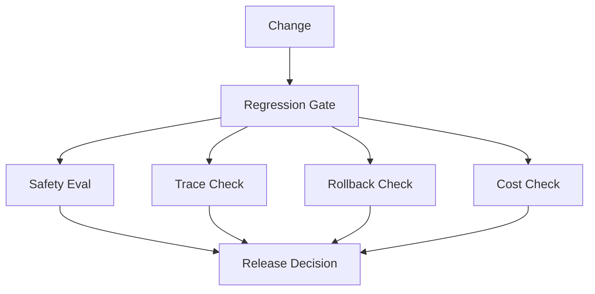

# Production Regression Gate Case

## Scenario

A production Agent release must pass safety, trace, rollback, and cost gates before rollout.

## Architecture

## Key Decisions

- Safety failures block release.
- Missing trace fields block release.
- Missing rollback plan blocks release.
- Cost over budget requires explicit approval.

## Failure Modes

- The team ships with missing traces.
- A safety eval is skipped.
- A rollback plan exists but is not tested.

## Evaluation

Use the regression gate and postmortem labs:

- [`../../labs/l4/regression_gate/README.md`](../../labs/l4/regression_gate/README.md)
- [`../../labs/l4/production_postmortem/README.md`](../../labs/l4/production_postmortem/README.md)

## Lesson

Production readiness is a gate, not a checklist someone remembers before launch.
