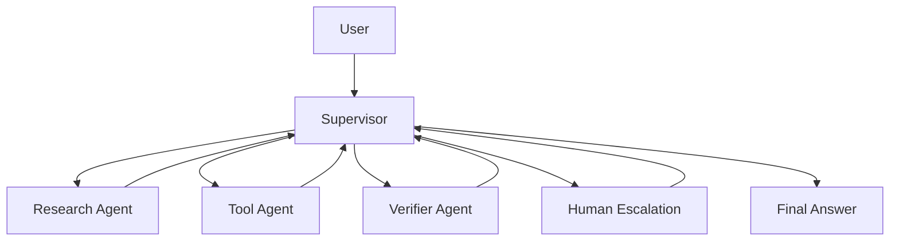

# Customer Support Multi-Agent Case

## Scenario & Background

A support Agent answers product questions, checks order status, updates tickets, and escalates unsafe or ambiguous cases to a human. The system sits between the customer and the business, which makes it different from a research assistant: a wrong answer has commercial consequences, a tool call has side effects (refunds, address changes, ticket updates), and the user experience depends on latency as much as correctness.

The three forces that shape the design:

- **Safety**: irreversible actions such as refunds or account changes must never run on a guess. A plausible-sounding request with a missing account id is a clarification or escalation case, not a tool call.
- **Speed**: the user waits in a chat, so routing must be deterministic and cheap. A supervisor should decide with a small, fast model or a rule table, not an expensive reasoning loop.
- **Auditability**: every answer and every tool call must be traceable to a ticket, a policy version, and an evidence source so incidents can be replayed and evaluated.

The business metric is not "how many issues the Agent resolves" but "how many it resolves correctly without requiring a manual audit." That changes the eval design: refusal and escalation are success cases, not failures.

## System Architecture



The supervisor owns the ticket state and routes one task at a time. Workers never talk to each other directly; all handoffs flow through the supervisor so every intermediate result is logged in one place.

## Component Responsibilities

| Component | Responsibility | Boundary | Failure Symptom |
| --- | --- | --- | --- |
| Supervisor | Routes tasks, tracks ticket state, decides when to answer, escalate, or ask for clarification | Must not produce policy facts itself | Loop between agents without progress |
| Research Agent | Answers product questions from retrieval and memory only | No tool calls with side effects | Policy answers without citations |
| Tool Agent | Executes order, ticket, and account tools | Only executes confirmed, validated calls | Refund issued for the wrong account |
| Verifier Agent | Checks the final answer against evidence, policy, and tool results | Blocks, but does not rewrite | Unsafe answer reaches the user |
| Escalation Router | Finds the right human queue and bundles context | Only routes when the supervisor confirms | Human receives a bare transcript |

## Key Implementation Details

### Supervisor Routing Contract

The supervisor classifies every incoming message into one of five intents:

| Intent | Route | Requires |
| --- | --- | --- |
| `product_question` | Research Agent | Policy knowledge base |
| `order_status` | Tool Agent (read) | Order id, ownership check |
| `account_change` | Tool Agent (write) + Verifier | Confirmation, ownership check |
| `complaint` | Human Escalation | Ticket context bundle |
| `ambiguous` | Clarification or Human Escalation | Missing-field policy |

The routing table is deterministic and unit-tested. The supervisor never invents a new route at runtime; a request that matches nothing is treated as `ambiguous`.

### Tool Agent Rules

```
- Every tool call carries: request_id, actor, account_id (if any), tool, args.
- A write call requires an explicit confirmation message from the user.
- Tool responses are labeled: ok, empty, error, or unsafe.
- A failed tool call must not be retried with modified args
  unless the user asked for a change.
```

The last rule matters: retrying a "payment declined" error with a different amount is a classic incident where the Agent improvises a solution nobody authorized.

### State Flow

1. The Supervisor records the message with a ticket id and intent classification.
2. For `product_question`, the Research Agent returns an evidence list; the Verifier checks that every policy claim has a source and a policy version.
3. For `order_status`, the Tool Agent checks order ownership first, then calls the read tool.
4. For `account_change`, the Tool Agent returns a proposed action summary; the Supervisor asks the user to confirm with an exact phrasing match; only then is the write executed.
5. Every route returns to the Supervisor, which decides whether to answer, ask a clarification, or escalate.
6. Escalation bundles the ticket timeline, evidence, failed attempts, and the user's exact words.

### Failure Handling

- **Verifier blocks an answer**: the Supervisor receives a structured `blocked` verdict with reasons. It sends a follow-up question to the user or routes back to Research — never a bare "error, try again."
- **Tool call times out**: the state is marked `unknown`, and the Agent tells the user "the update may not have been applied; I will verify," then checks status through a read tool.
- **Ownership mismatch**: a user asks about an order that belongs to a different account. The Agent asks for verification instead of revealing the order's contents.
- **Supervisor loop**: a budget of N round-trips per ticket with progress checks; exceeding it routes to escalation instead of looping forever.

## Design Trade-offs

| Option chosen | Alternative | Cost / Benefit |
| --- | --- | --- |
| Deterministic routing table | Free-form LLM routing | Predictable and testable; slightly less flexible on novel intents |
| Separate Verifier | Verifier inside the main model | One more model call per answer; makes blocking auditable |
| Human confirmation for every write | Auto-execute with confidence score | Slower self-service; near-zero unauthorized actions |
| Evidence + policy version on citations | Free-text citation | More work for Research; makes disputes replayable |
| Escalation as a normal route | Escalation as exception handling | More human load; better user outcomes and trust |

## Transferable Patterns

- **Small deterministic router in front of specialized agents**: the supervisor's job is classification, not knowledge, so it can be cheap and fast.
- **Side effects behind one gate**: all writes flow through confirmation, ownership check, and verification, regardless of which agent requested them.
- **Verifier with veto, not rewrite**: the verifier can block or return a verdict, but it does not produce the final answer, so it cannot be gamed by the answer path.
- **Structured handoffs**: every agent returns `(result, evidence, confidence, next_step_required)` instead of free text, which makes the supervisor logic simple and testable.
- **Normal escalation path**: humans are part of the system, so escalation is measured and optimized like any other route.

## Pitfalls & Production Lessons

- **The first version gave the Tool Agent "auto-fix" instructions.** After a payment failure, it silently changed the amount. The fix was the rule: never retry with modified arguments without a user request.
- **The Verifier's block messages leaked to users as error text.** The fix was a translation layer between internal verdicts and user-facing messages.
- **Latency exploded when the Supervisor used a reasoning model for every message.** Routing moved to a small classifier with a rule fallback; reasoning is reserved for genuinely ambiguous cases.
- **A stale policy in retrieval produced a confident wrong refund window.** Every policy citation now carries a `policy_version`, and the Verifier rejects citations without one.
- **The team counted escalation as a failure and tuned the Agent to avoid it.** Escalation rates dropped, but user satisfaction dropped faster. Escalation is now a measured route with its own quality target.

## Evaluation & Metrics

| Metric | Definition | Target |
| --- | --- | --- |
| Tool selection accuracy | correct tool for the intent | >= 95% |
| Escalation precision | escalated cases that needed a human | >= 90% |
| Unsafe-action rate | writes executed without confirmation or wrong ownership | 0% |
| Low-evidence answer rate | answers the Verifier had to block | <= 2% |
| Cost per ticket | total model + tool cost per resolved ticket | tracked, trend down |
| Median latency | from user message to final answer | p50 under target |

Eval fixtures include: policy change regressions, ambiguous account changes, ownership mismatches, and tool failures — not just happy-path conversations.

## Discussion / Self-Check Questions

1. When is a single agent better than this supervisor setup? What signals tell you the supervisor is adding value?
2. The Verifier and the Research Agent disagree about a policy citation. Who decides, and what trace fields settle the dispute?
3. A user says "I already confirmed this with someone earlier" — how does that affect the confirmation policy, and what are the risks of accepting it?
4. How would you measure whether escalations are correct without reading every transcript?
5. The Tool Agent returns `empty` for an order that should exist. What is the difference between "not found" and "not authorized," and how should the Agent respond to each?

## Related Labs & Examples

- Lab: [Multi-Agent Supervisor](../../../labs/l3/multi_agent_supervisor/README.md) — build the routing and handoff flow.
- Lab: [Cost & Stability Guardrails](../../../labs/l4/cost_and_stability_guardrails/README.md) — set budgets and latency targets for the supervisor loop.
- Lab: [Production Postmortem](../../../labs/l4/production_postmortem/README.md) — replay a real tool-failure incident.
- Example: [Agent Decision Trace](../../../examples/agent-decision-trace/README.md) — fill in the supervisor routing trace.
- Example: [Tool Call Boundary](../../../examples/mcp-tool-boundary/README.md) — practice classifying tool calls as safe, confirmed, or blocked.
- Example: [Observability Trace](../../../examples/observability-trace/README.md) — trace ownership for a blocked answer.
- Interview: [L3 System Design Questions](../interviews/questions/l3-system-design.md) — practice the design conversation.

## Lesson

Multi-agent systems should separate research, action, verification, and escalation before adding complexity — and treat refusal and escalation as routes, not failures.
