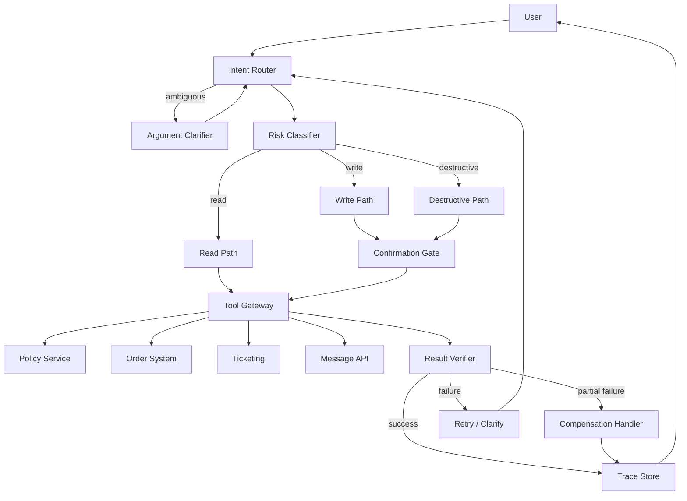

# Enterprise Multi-Tool Agent Case

## Scenario and Background

A mid-size company runs a customer operations Agent that must query orders, update tickets, check policies, and send customer messages from a single chat surface. The organization has four heterogeneous backends: an order database, a ticketing system, a policy service, and a message gateway. Before this Agent existed, every integration was human-operated through separate consoles, which produced long average handling times and inconsistent policy application.

The project constraints made the design hard:

- The Agent had to act autonomously on read-only paths, but every write or destructive action had to be auditable and revocable.
- Backends were owned by different teams and could not be modified, so all risk control had to live in the Agent layer.
- Tenants shared one order system, so every query had to be scoped to the authenticated tenant.
- The message gateway was asynchronous: a 202 response meant "accepted", not "delivered".

The goal was not to maximize task completion, but to guarantee the **five safety properties**: correct tool selection, permission enforcement, confirmation accuracy, trace completeness, and failure recovery.

## System Architecture



## Component Responsibilities

| Component | Responsibility | Failure mode it prevents |
| --- | --- | --- |
| Intent Router | Classifies the user request into read, write, or destructive intent and selects the candidate tool set. | Wrong tool selection, cross-tool ambiguity. |
| Argument Clarifier | Asks a targeted follow-up when tool arguments are incomplete or ambiguous; never guesses. | Silent mis-argument, wrong-tenant queries. |
| Risk Classifier | Assigns a risk level to each tool call and decides whether confirmation is required. | Unconfirmed destructive actions. |
| Confirmation Gate | Renders a one-time, human-readable confirmation and requires an explicit ack with actor identity. | Accidental writes, wrong-destination messages. |
| Tool Gateway | Normalizes each backend behind one interface, adds tenant scoping, and enforces timeouts. | Mixed error semantics, hung calls. |
| Result Verifier | Compares the returned state against the expectation; distinguishes empty, success, and failure. | Empty-result-is-success confusion. |
| Compensation Handler | Runs a compensating action (e.g., close the duplicated ticket, void the message) on partial failure. | Orphaned side effects. |
| Trace Store | Persists request ID, actor, tool, arguments, risk level, approval, and result for every call. | Unauditable actions. |

## Key Implementation Details

### Tool Classification Contract

Every tool was declared with a metadata block before it could be registered:

```yaml
tool: send_customer_message
risk: destructive
confirmation: required
idempotency_key: required
scope: tenant_id
timeout_ms: 8000
```

The Agent was instructed: a tool missing a required field is **not callable**; the Agent must stop and report the gap instead of improvising. This turned tool registration into a review gate, so the model never had to infer permission rules at runtime.

### Router Prompt Excerpt

```
You are the intent router. Respond with JSON only:
{"intent": "read|write|destructive", "tools": [...], "missing_fields": [...]}
Rules:
- If any required argument is missing or ambiguous, set intent to "read",
  list the missing fields, and do NOT execute any tool.
- If a request touches more than one tenant context, mark it "clarify".
- Destructive tools are never selected unless the user explicitly describes
  the action AND its target object.
```

The key detail: the router can always fall back to a read-only, clarify-only mode. Downgrading intent is a safe default.

### State Flow and Confirmation

1. User request enters the Router.
2. Router emits an intent + candidate tools, then the Risk Classifier maps each tool to a risk level from its metadata.
3. Read path executes immediately under a per-tenant context.
4. Write and destructive paths stop at the Confirmation Gate, which renders: `{tool, target, side_effect, irreversible: true/false}`.
5. On confirmation, the Tool Gateway stamps `request_id`, `actor`, and `idempotency_key`, then calls the backend.
6. The Result Verifier checks the response: schema-valid, tenant-correct, and semantically successful.
7. Every hop writes one trace record; the final trace is returned to the user with a correlation ID.

### Failure Handling

- **Empty result vs. failure**: an empty list is a valid read outcome; a timeout or schema error is a failure. The Verifier treats them differently: empty proceeds, failure triggers retry or clarification.
- **Wrong tenant**: the gateway rejects any result whose `tenant_id` does not match the request context, even if the backend returns success. This is a cheap invariant check that prevents cross-tenant leaks.
- **Partial failure**: message sent but ticket update failed → Compensation Handler closes the duplicate ticket and logs a follow-up; the user sees one consistent status instead of two contradictory ones.
- **Stale policy**: every policy read includes `as_of` and a max age. When the cached policy is older than the limit, the Agent must fetch a fresh copy before acting, or refuse with a clear reason.

## Design Trade-offs

| Trade-off | Chosen side | Cost accepted |
| --- | --- | --- |
| Strictness vs. autonomy | Confirmation gate on every write and destructive call. | Higher latency and more user friction for low-risk actions; later relaxed to a one-time session approval for repeat writes. |
| Gateway normalization vs. native backends | One unified tool interface in the Agent layer. | Backend-specific optimizations are hidden; teams must evolve the gateway contract when a backend adds features. |
| Pre-verification vs. compensation | Verify before acting where possible; compensate when the failure is already partially applied. | Compensation logic must be written and tested for every write path, roughly doubling write-path test surface. |
| Central trace store vs. per-service logs | Central store with one schema. | Extra write amplification and a single point of dependency; mitigated by buffered, async trace writes. |

## Transferable Patterns

- **Metadata-driven tool registry**: permissions, confirmation requirements, and idempotency are declared, not inferred. The model only reads metadata; it never invents policy.
- **Safe-default routing**: when in doubt, downgrade to read-only + clarify. The system degrades to "ask more questions" instead of "act dangerously".
- **Semantic result verification**: distinguish empty, success, and failure with an explicit contract, and add tenant/actor invariants on top of the backend result.
- **Compensation as a first-class pattern**: every non-idempotent write ships with a compensating action, so partial failures converge to a consistent state.

## Pitfalls and Production Lessons

1. **Refund without account context**: the first prototype happily fetched a refund form before confirming the account. Fix: the router must resolve the actor and tenant before any write intent is accepted.
2. **"Success" for the wrong tenant**: one backend returned a generic success payload that did not include the tenant id. The gateway silently accepted it. Fix: the Verifier now rejects responses whose scoping field is missing.
3. **Message sent, ticket stale**: the message gateway accepted the payload but the ticket update 500'd. Users saw an email but no ticket note. Fix: idempotency keys on both paths plus the compensation handler.
4. **Stale policy was the quiet killer**: cached policy data passed tests for weeks because fixtures never aged. Fix: policy reads now carry `as_of` and the Verifier enforces max age.
5. **Confirmation fatigue**: after the gate shipped, users clicked confirm without reading. Fix: high-risk messages now include an explicit summary sentence generated from the tool metadata, and repeated actions with the same target skip confirmation within a session.

## Evaluation Metrics

| Metric | Definition | Target |
| --- | --- | --- |
| Correct tool selection | Fraction of routed calls whose tool set matches the gold label. | ≥ 95% |
| Permission-denied accuracy | Fraction of unauthorized calls that were blocked, not executed. | 100% |
| Confirmation accuracy | Fraction of confirmed calls that were truly destructive / write-level. | ≥ 98% |
| Trace completeness | Fraction of executed calls with a full trace chain. | 100% |
| Tool failure recovery | Fraction of failed calls ending in a resolved state (retry, clarify, or compensation) within one interaction. | ≥ 90% |

## Discussion / Self-Check Questions

1. A user says "send the refund to my email" but has two verified email addresses. Where should the clarification happen, and how does the trace record the choice?
2. The message gateway returns HTTP 200 with a "queued" body. Does your Verifier treat that as success? What evidence would you add to distinguish queued from delivered?
3. When is compensation safer than blocking the write upfront, and when is it never acceptable? Pick one write path and argue both sides.
4. How would you extend the tool registry so a new backend can join without changing the Router prompt?
5. Describe one scenario where confirmation accuracy is high but permission accuracy is low. What control is missing?

## Related Labs and Examples

- Single Agent with MCP-style Tool Boundary: [`../../../labs/l2/single_agent_mcp/README.md`](../../../labs/l2/single_agent_mcp/README.md)
- Cost Aware Router: [`../../../labs/l2/cost_aware_router/README.md`](../../../labs/l2/cost_aware_router/README.md)
- Guardrail Helpers: [`../../../labs/l1/guardrail_helpers/README.md`](../../../labs/l1/guardrail_helpers/README.md)
- MCP Tool Boundary exercise: [`../../../examples/mcp-tool-boundary/README.md`](../../../examples/mcp-tool-boundary/README.md)
- Decision Trace exercise: [`../../../examples/agent-decision-trace/README.md`](../../../examples/agent-decision-trace/README.md)
- Data Source Policy exercise: [`../../../examples/data-source-policy/README.md`](../../../examples/data-source-policy/README.md)

## Portfolio Narrative

I designed a tool-using Agent with explicit risk boundaries. The key insight was not making the model more powerful; it was constraining tool execution with permissions, validation, traces, and rollback. Every write path shipped with a declared risk level, a confirmation gate, an idempotency key, and a compensation handler. The most valuable production lesson was that "success" is a semantic claim that must be verified against tenant scope and freshness, not a status code.
