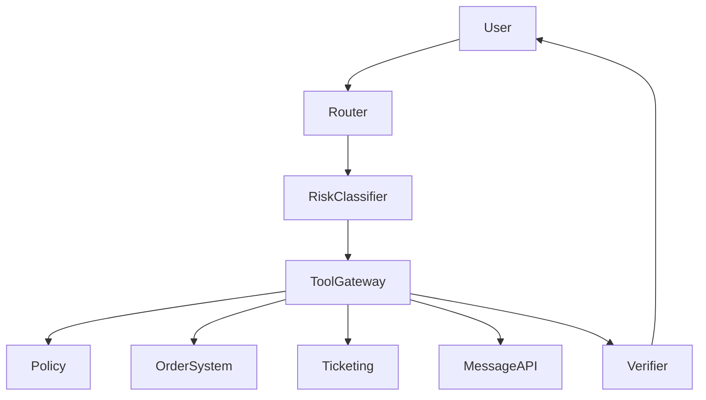

# Enterprise Multi-Tool Agent Case

## Scenario

A company Agent queries orders, updates tickets, checks policies, and sends customer messages.

## Architecture

## Key Decisions

- Every tool has read, write, or destructive classification.
- Destructive actions require confirmation.
- Tool calls are logged with request ID and actor.
- Ambiguous tool arguments trigger clarification.
- Empty tool result is different from tool failure.

## Failure Modes

- User asks for a refund but lacks account context.
- Tool returns success for the wrong tenant.
- Message API succeeds but ticket update fails.
- Policy lookup is stale.

## Evaluation

Track:

- Correct tool selection.
- Permission-denied accuracy.
- Confirmation accuracy.
- Trace completeness.
- Tool failure recovery.

## Portfolio Narrative

I designed a tool-using Agent with explicit risk boundaries. The key was not making the model more powerful; it was constraining tool execution with permissions, validation, traces, and rollback.
