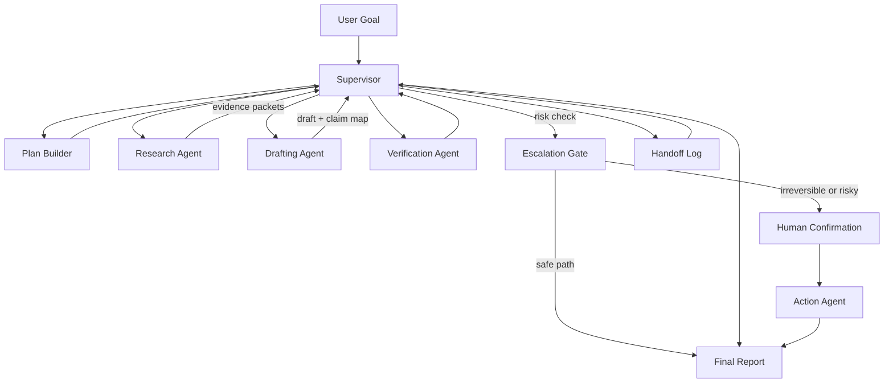

# Multi-Agent Collaboration Case

## Scenario and Background

A research assistant must collect sources, draft an answer, verify claims, and route risky steps to a human before any external action. The workload is a recurring weekly brief: ten to thirty research questions covering policy changes, market movements, and product releases, where the answer must cite sources and the final report must be safe to forward.

Why multiple agents instead of one long ReAct loop? Three observed failure modes motivated the split:

1. A single loop drifted: after many tool calls, the model lost the original question and "improved" the answer with unsupported context.
2. Mixing research, writing, and verification in one context polluted the evidence: draft prose and retrieved passages became hard to tell apart.
3. External actions (sending a report, publishing a summary) are irreversible, so they needed a separate decision path with human sign-off.

The design principle was **narrow roles, explicit contracts, and one owner of the goal**: each worker knows its job and its inputs/outputs, and the supervisor alone owns the user goal and task state.

## System Architecture



## Component Responsibilities

| Component | Responsibility | Failure mode it prevents |
| --- | --- | --- |
| Supervisor | Owns the user goal, task state, and delegation plan; routes work and merges results. | Lost user goal, duplicated work. |
| Plan Builder | Decomposes the goal into a dependency-ordered task list with acceptance criteria. | Chaotic delegation, over-delegation. |
| Research Agent | Retrieves sources, filters by relevance, and returns evidence packets with IDs and quotes. | Unsupported claims. |
| Drafting Agent | Converts evidence packets into a draft with a claim-to-source map; never invents facts. | Unsourced prose, hallucination. |
| Verification Agent | Checks every major claim against its evidence list and confidence; returns verdicts to the supervisor. | False certainty, unverified claims. |
| Escalation Gate | Classifies the final action as safe, risky, or irreversible and routes accordingly. | Unauthorized external actions. |
| Action Agent | Executes the approved action with an idempotency key and reports the outcome. | Duplicate sends, silent failures. |
| Handoff Log | Records every handoff: intent, evidence list, confidence, and requested output. | Unclear ownership, undebuggable runs. |

## Key Implementation Details

### Handoff Contract

Every handoff between agents was a structured packet, not free text:

```json
{
  "from": "research",
  "to": "supervisor",
  "intent": "evidence_packet",
  "for_claim": "refund_policy_changed",
  "evidence_ids": ["src-0142", "src-0143"],
  "confidence": 0.92,
  "requested_output": "claim accepted, needs draft citation",
  "trace_id": "tr-9f3a"
}
```

The supervisor refused to process a packet missing `intent` or `requested_output`. This contract made handoffs testable: a malformed packet is a bug, not a "personality issue".

### Prompt Slices

Supervisor system prompt (excerpt):

```
You are the supervisor. You own the user goal and the task state.
- Delegate one unit of work at a time; never delegate the same claim to two workers.
- Every worker reply must be a handoff packet with intent, evidence, confidence,
  and requested_output. If it is not, ask for the packet again.
- Verification failures are returns, not dead ends: route them back to drafting
  with the verifier's reasons attached.
- Before any external action, decide escalation: safe, risky, or irreversible.
  Irreversible actions require human confirmation; do not proceed without it.
```

Verification Agent prompt (excerpt):

```
You verify claims, you do not write the report.
- A claim is PASS only if each cited source actually supports it and the quote
  matches the source text.
- If a source id is missing or stale, return NEEDS_EVIDENCE with the exact gap.
- Do not accept "confidence" from the drafter as evidence.
- Output one verdict per claim.
```

The two prompts share a rule: **the verifier's job is rejection, not politeness**. A verifier that smooths over gaps is worse than no verifier.

### State Flow

1. Supervisor receives the goal and the Plan Builder returns an ordered task list.
2. Research Agent returns evidence packets; the supervisor stores them in the shared task state and marks the claim ready for drafting.
3. Drafting Agent returns a draft plus a claim-to-source map.
4. Verification Agent returns verdicts per claim.
5. Failed claims loop back to drafting with the verifier's reasons; each loop is logged so loops are bounded.
6. Escalation Gate classifies the final action; irreversible actions pause for human confirmation.
7. Action Agent executes with an idempotency key; the report is finalized only after execution succeeds or the human decides to stop.

### Failure Handling

- **Verifier rejects a claim**: the supervisor routes the draft back with reasons; if the same claim fails twice, the supervisor asks the user for a narrower question rather than forcing an answer.
- **Two agents conflict**: the supervisor is the single merge owner. No worker can overwrite shared state; workers only submit packets, and the supervisor resolves conflicts with a stated preference (evidence > draft prose > recency).
- **Stale shared state**: shared state is append-only; the action agent receives a snapshot with the trace id, so a stale result cannot silently replace a newer one.
- **Irreversible action blocked**: human confirmation times out → the supervisor reports "pending" and never executes; the run is marked incomplete instead of guessed.

## Design Trade-offs

| Trade-off | Chosen side | Cost accepted |
| --- | --- | --- |
| Supervisor as single owner vs. peer consensus | One owner with a handoff log. | The supervisor is a bottleneck and a single point of failure; mitigated by checkpointing its state. |
| Structured packets vs. natural-language handoffs | Strict JSON contract. | More boilerplate; agents must be trained to fill every field, and schema changes touch all agents. |
| Bounded verification loops vs. unlimited iteration | Max two loops, then user narrowing. | Some legitimate answers are deferred; accepted in exchange for bounded latency and cost. |
| Human gate vs. full autonomy | Every irreversible action waits for human confirmation. | End-to-end latency grows when a human is slow; accepted because a wrong external send is much more expensive. |

## Transferable Patterns

- **One owner, many workers**: the supervisor owns the goal and task state; workers own narrow outputs. Ownership disputes disappear when there is exactly one merge authority.
- **Handoff as an API**: packets with intent, evidence, confidence, and requested output make multi-agent behavior testable and debuggable.
- **Verification as a separate role**: a dedicated verifier with a rejection mandate catches unsupported certainty far better than a "be careful" instruction inside the drafter.
- **Escalation as a normal route**: human confirmation is a first-class node in the graph, not a panic fallback, so the system can state exactly why and when it escalates.
- **Bounded loops**: every feedback loop has a max iteration count and a narrowing fallback, which keeps latency and token cost predictable.

## Pitfalls and Production Lessons

1. **The supervisor lost the goal**: early on, the supervisor delegated aggressively and the final report answered a side question the user never asked. Fix: the Plan Builder now restates the goal at the top of every delegation batch.
2. **The verifier rubber-stamped claims**: when the verifier shared the drafter's context, it "remembered" the sources and stopped checking them. Fix: the verifier receives only the claim, the source IDs, and the quotes — nothing else.
3. **Shared state was overwritten**: two workers wrote into one mutable store and the action agent used a stale result. Fix: append-only packets plus snapshots with trace ids.
4. **Conflicting recommendations with no merge policy**: two agents gave opposite advice and the report contained both. Fix: the supervisor is the sole merge owner with a documented preference order.
5. **Certainty without evidence**: the first report said "we are confident" while 40% of claims had no sources. Fix: a "confidence" section in the report is generated only from verified verdicts, never from prose.

## Evaluation Metrics

| Metric | Definition | Target |
| --- | --- | --- |
| Handoff completeness | Fraction of handoffs with all four contract fields. | 100% |
| Evidence coverage | Fraction of major claims backed by at least one verified source. | ≥ 95% |
| Verification rejection quality | Precision of verifier rejections (rejections that were correct). | ≥ 90% |
| Escalation accuracy | Fraction of irreversible/risky actions that reached the human gate. | 100% |
| Latency and cost | End-to-end time and token cost per task, tracked per loop iteration. | Monitored, bounded loops |

## Discussion / Self-Check Questions

1. The verifier rejects a claim twice. Should the supervisor ask the user to narrow the question, or should it re-run research? Defend your choice with cost and trust arguments.
2. How would the design change if two workers legitimately need the same mutable resource, such as a shared draft document?
3. Which of the five failure modes would a single-agent ReAct loop handle better, and why?
4. Human confirmation timed out and the user never returned. Should the system act, wait, or cancel? Where is that decision made?
5. Design a handoff packet schema for a three-agent system where one agent produces code and another produces tests. What fields prevent "the test passes but tests the wrong thing"?

## Related Labs and Examples

- Multi-Agent Supervisor Lab: [`../../../labs/l3/multi_agent_supervisor/README.md`](../../../labs/l3/multi_agent_supervisor/README.md)
- Multi-Round Research Discussion Lab: [`../../../labs/l3/multi_round_research_discussion/README.md`](../../../labs/l3/multi_round_research_discussion/README.md)
- RAG Evaluator Lab: [`../../../labs/l3/rag_evaluator/README.md`](../../../labs/l3/rag_evaluator/README.md)
- RAG, Memory, and Observability Lab: [`../../../labs/l3/rag_memory_observability/README.md`](../../../labs/l3/rag_memory_observability/README.md)
- Cost Aware Router Lab: [`../../../labs/l2/cost_aware_router/README.md`](../../../labs/l2/cost_aware_router/README.md)
- RAG Evidence Refusal exercise: [`../../../examples/rag-evidence-refusal/README.md`](../../../examples/rag-evidence-refusal/README.md)
- Observability Trace exercise: [`../../../examples/observability-trace/README.md`](../../../examples/observability-trace/README.md)
- Memory Index Evidence exercise: [`../../../examples/memory-index-evidence/README.md`](../../../examples/memory-index-evidence/README.md)
- L3 system design questions: [`../interviews/questions/l3-system-design.md`](../interviews/questions/l3-system-design.md)

## Portfolio Narrative

I designed a supervisor-based research Agent where each worker had a narrow role and explicit contract. The main lesson was that multi-agent systems fail from unclear ownership, not from insufficient model size. The handoff contract turned coordination into an API, the verifier turned "be careful" into a rejection mandate, and the escalation gate made human approval a predictable, auditable step. Every loop was bounded, every state write was append-only, and every external action required an idempotency key — which is how the system stayed both fast and safe.
