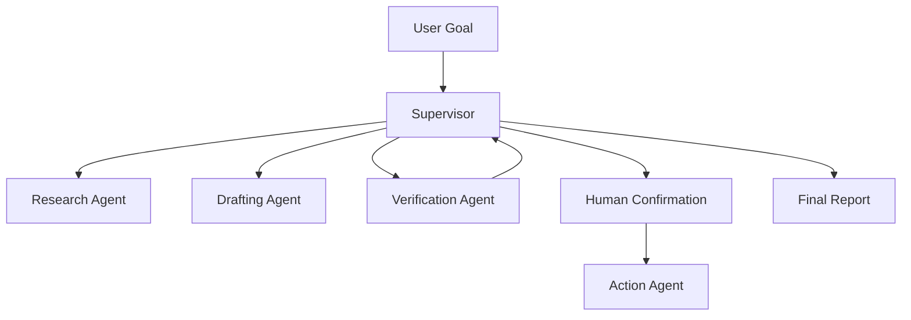

# Multi-Agent Collaboration Case

## Scenario

A research assistant must collect sources, draft an answer, verify claims, and route risky steps to a human before any external action.

## Architecture

## Key Decisions

- The supervisor owns task state, while worker agents keep their own scratch notes.
- Research, drafting, and verification have separate responsibilities and tools.
- Verification failures return control to the supervisor instead of forcing a final answer.
- External actions wait for explicit human confirmation when the task is irreversible or risky.
- Every handoff includes an intent, evidence list, confidence, and requested output.

## Failure Modes

- The supervisor delegates too many tasks and loses the user goal.
- The verifier accepts claims without checking the source list.
- The action agent uses a stale result because shared state is overwritten.
- Two agents produce conflicting recommendations and no merge policy exists.
- The final report claims certainty that the evidence does not support.

## Evaluation

Measure:

- Handoff completeness.
- Evidence coverage for every major claim.
- Verification rejection quality.
- Correct escalation for risky actions.
- End-to-end latency and token cost per task.

## Portfolio Narrative

I designed a supervisor-based research Agent where each worker had a narrow role and explicit contract. The main lesson was that multi-agent systems fail from unclear ownership, not from insufficient model size.

## Related Lab

- [`../../../labs/l3/multi_agent_supervisor/README.md`](../../../labs/l3/multi_agent_supervisor/README.md)
