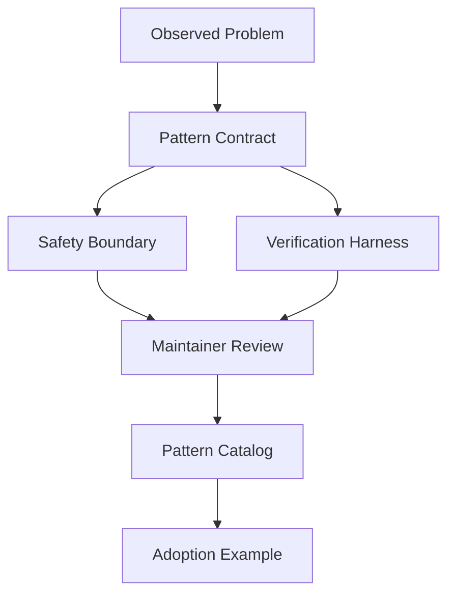

# Pattern Contribution Case

## Scenario

A team reuses a custom planning pattern and wants to turn it into a reusable contribution for Agent-Top.

## Architecture

## Key Decisions

- The pattern is stable enough when the same contract appears across multiple real tasks.
- The contribution separates principles from framework-specific code.
- The pattern includes inputs, outputs, allowed tools, failure modes, and acceptance criteria.
- Unknown cases fail closed until the contract is extended.
- Adoption examples include a non-framework walkthrough and one framework Lab reference.

## Failure Modes

- The pattern is only a wrapper around one framework API.
- The contract omits rollback or human confirmation.
- The verification harness checks happy paths only.
- Terminology drifts from the glossary.
- The pattern cannot explain when not to use it.

## Evaluation

Track:

- Reusability across at least three scenarios.
- Number of failure modes documented.
- Maintainer review outcome.
- Adoption time for a new contributor.
- Feedback from downstream Labs or cases.

## Portfolio Narrative

I converted a repeated team workflow into a reusable Agent pattern by defining a stable contract, safety boundary, and verification harness. The contribution was useful because it captured the pattern, not just one implementation.

## Related Lab

- [`../../../labs/l5/pattern_catalog/README.md`](../../../labs/l5/pattern_catalog/README.md)
