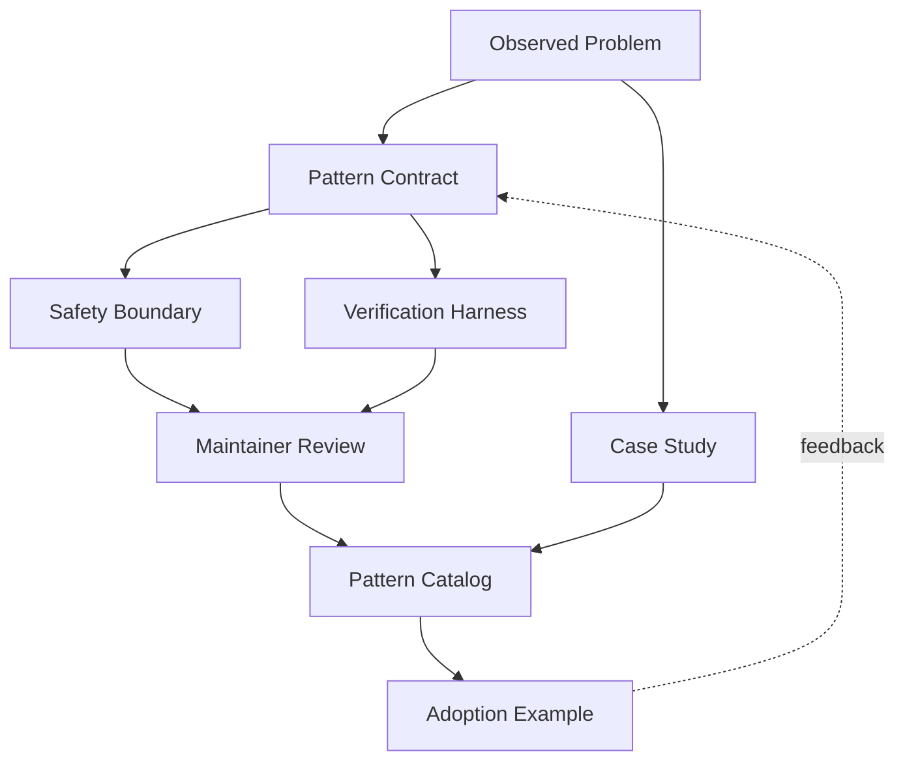

# Pattern Contribution Case

## Scenario and Background

A platform team inside our organization repeatedly implemented the same "research-then-confirm" workflow: an Agent gathered evidence from multiple sources, drafted a proposal, and then paused for human confirmation before executing anything irreversible. The workflow appeared in three different products with three different codebases, and each team had re-implemented it with slightly different assumptions. One implementation auto-executed after a 60-second timeout; another required an explicit `--yes` flag; a third had no timeout at all and stalled overnight.

The team decided to turn the repeated workflow into a reusable contribution to Agent-Top: a documented pattern with a stable contract, a safety boundary, and a verification harness. This case records how that contribution was designed, what trade-offs the maintainers forced, and how the pattern became part of the catalog instead of one more framework-specific wrapper.

## System Architecture

The contribution pipeline treats a pattern as a first-class artifact. An observed problem becomes a contract; the contract defines safety and verification; only maintainer-reviewed patterns enter the catalog:



The added edges matter: a case study documenting the original problem travels with the pattern, and adoption feedback loops back into the contract. A pattern that cannot evolve from real usage is documentation, not a pattern.

## Component Responsibilities

| Component | Responsibility | Acceptance criteria |
| --- | --- | --- |
| Observed problem | A concrete, repeated failure or friction across real tasks | Same problem appears in at least three scenarios |
| Pattern contract | Stable inputs, outputs, allowed tools, and explicit failure modes | Contract survives refactors without changing semantics |
| Safety boundary | Declares what the pattern must never do and when human confirmation is required | No auto-execution of irreversible actions |
| Verification harness | Runs happy-path, failure-mode, and adversarial cases against the contract | Every documented failure mode has a failing-then-passing test |
| Maintainer review | Checks glossary alignment, scope, and fail-closed behavior | Reviewer can explain when not to use the pattern |
| Pattern catalog | Publishes the pattern with adoption examples and a case study | New contributor adopts the pattern in under a day |
| Adoption example | Non-framework walkthrough plus one framework Lab reference | Walkthrough runs without the framework installed |

## Key Implementation Details

### The pattern contract

The contract is the heart of the contribution. For the research-then-confirm pattern, it was written as:

```yaml
pattern: research-then-confirm
inputs:
  research_question: string
  sources: list of data sources
  confirm_timeout: duration, default 30m
outputs:
  proposal: structured proposal with evidence links
  confirmation: explicit human decision record
allowed_tools:
  - read-only search and retrieval tools
  - draft/write tools that only stage changes
forbidden:
  - tools that execute irreversible actions before confirmation
failure_modes:
  - timeout_no_confirm: default to "proposal only", never auto-execute
  - source_unavailable: degrade to remaining sources and say so
  - ambiguous_proposal: require clarification instead of guessing
acceptance_criteria:
  - no irreversible action without a logged human confirmation
  - every run ends in proposal, confirmation, or explicit timeout
```

Three properties made this contract reusable rather than accidental: the inputs and outputs are domain-neutral, every failure mode has a defined behavior, and the forbidden list is enforced, not advised.

### The safety boundary

The main review battle was the timeout behavior. The team that auto-executed after 60 seconds argued that automation was the point of an Agent. The maintainers rejected it: irreversible actions need a logged human confirmation, and the timeout must default to "proposal only". The boundary also requires the confirmation record itself to be machine-readable, so a downstream gate can verify it.

### The verification harness

The harness runs four categories of cases against every candidate implementation:

1. **Happy path**: all sources available, human confirms, proposal is complete.
2. **Timeout**: no confirmation arrives; the run must end with `proposal only` and a timeout record.
3. **Source failure**: one source is unavailable; the run degrades and names the missing source.
4. **Adversarial**: a tool that could execute an irreversible action is offered; the harness asserts it is never invoked before confirmation.

Each category maps to a documented failure mode, so the harness does not just test code, it tests the contract.

### State flow and failure handling

A run moves through five states: `gathering`, `drafting`, `awaiting_confirmation`, `executing` or `abandoned`. Transitions are logged. The two rules that matter are: `awaiting_confirmation` can only exit via a logged human decision or a timeout that defaults to abandoned, and every state transition writes a machine-readable record so adoption teams can build their own gates on top of the pattern.

## End-to-End Walkthrough

Following one contribution from observation to adoption makes the process concrete. The research-then-confirm pattern took this path:

| Step | What happens | Gate |
| --- | --- | --- |
| 1 | Three teams file the same friction in a shared issue: research workflows stall or auto-execute unexpectedly | Same problem in three scenarios |
| 2 | One engineer drafts the contract with inputs, outputs, forbidden tools, and four failure modes | Contract review checklist |
| 3 | The safety boundary is written and reviewed; the auto-execute timeout is rejected as forbidden | Safety review sign-off |
| 4 | A reference implementation plus the four-category harness land in the same PR | Harness runs green |
| 5 | Maintainers check glossary alignment: `confirmation` matches the glossary; `approval` is rejected | Glossary consistency |
| 6 | The pattern enters the catalog with the case study and a non-framework walkthrough | Catalog entry published |
| 7 | A new contributor adopts the pattern for a docs-summarization product and finishes in half a day | Adoption-time metric recorded |
| 8 | The adoption reveals a new failure mode (`ambiguous_proposal`); the contract is extended, not forked | Contract v2 with new failure mode |

Step 8 is the point of the whole design: because the contract owns failure modes, a gap discovered in production becomes a version bump of the pattern, not a third re-implementation.

## Pattern Lifecycle and Maintenance

A catalog pattern is a living artifact with an explicit lifecycle:

- **Draft**: contract and harness exist in a PR; not yet cataloged.
- **Cataloged**: passed maintainer review; available for adoption with a case study.
- **Proven**: adopted by at least two teams outside the originator, with adoption feedback merged back.
- **Deprecated**: replaced by a broader pattern or proven harmful; kept with a redirect to its successor.
- **Removed**: only after deprecation, so downstream teams can migrate.

Two maintenance rules keep the catalog honest. First, an unadopted pattern is reviewed for removal after two quarters, because a pattern nobody adopts is documentation, not a pattern. Second, every contract change is a version bump with a changelog entry, so adoption teams can evaluate the blast radius of an upgrade instead of silently inheriting new behavior.

## Evaluation and Adoption Metrics

The contribution succeeded because the team tracked behavior, not just opinion:

- **Adoption time**: median time from reading the catalog entry to a working implementation. Under one day for the first external adopter.
- **Failure-mode coverage**: percentage of documented failure modes with harness cases. Must be 100% at catalog time.
- **Contract stability**: number of breaking contract changes after cataloging. Two teams adopting against v1 while the contract reached v2 showed the contract was stable where it mattered.
- **Downstream incident rate**: incidents in adopting teams attributable to the pattern's safety boundary. Zero since the timeout fix.
- **Catalog health**: ratio of adopted to unadopted patterns. One unhealthy pattern is a signal, not a scandal, but it forces a deprecation decision.

## Design Trade-offs

- **Principles vs. framework code.** The pattern ships as a documented contract plus a reference implementation, not a library. Teams lose copy-paste convenience but gain a contract that survives framework migration.
- **Fail closed vs. autonomy.** Defaulting timeouts to "proposal only" costs some automation in exchange for a hard guarantee that irreversible actions never run without confirmation.
- **Strict contract vs. fast iteration.** A strict contract slows down the first adoption, but it is what makes the third adoption fast, because the harness already encodes the team's decisions.
- **Catalog entry vs. case study.** Shipping a pattern without the originating case study leaves reviewers guessing about scope; the case study is the cheapest form of documentation and the first thing new adopters read.
- **Three scenarios vs. sooner.** Waiting for three independent occurrences delays the contribution but filters out one-off hacks that would pollute the catalog.

## Transferable Patterns

- **Contract first, code second.** A pattern contribution is judged by its contract and failure modes, not by how clean the reference implementation is.
- **Fail closed by default.** When the contract does not cover a scenario, the pattern must degrade safely and say so, never guess.
- **Harness tests the contract, not the implementation.** Each failure mode maps to a harness category, so a new implementation can be verified without rewriting the tests.
- **Adoption feedback is part of the pattern.** Every adoption that found a gap updated the contract, which is why the pattern stayed alive instead of rotting.
- **Name the anti-scope.** A pattern that cannot explain when not to use it is not ready for the catalog.

## Pitfalls and Production Lessons

- **A framework wrapper is not a pattern.** The first submission was a thin wrapper around one vendor's planner API. The review rejected it because removing the framework left no reusable idea.
- **Contracts that omit rollback or confirmation rot.** The auto-execute timeout was the exact failure a reviewer caught; the contract now forbids it explicitly.
- **Happy-path-only harnesses pass the wrong thing.** The first harness only verified successful runs, so a broken timeout path would have shipped. Adversarial and timeout cases are now required categories.
- **Terminology drift breaks adoption.** One team renamed `confirmation` to `approval` and their eval coverage silently diverged from the pattern; the glossary now owns these terms.
- **Undocumented "when not to use" confuses adopters.** Teams applied the pattern to fully-autonomous bulk jobs where confirmation made no sense; the anti-scope section fixed that.

## Discussion and Self-Check Questions

1. What makes a pattern "stable enough" to contribute, and why do three scenarios matter?
2. Why should the timeout default to "proposal only" instead of auto-executing after confirmation is missed?
3. How does the verification harness test a failure mode that the implementation tries to hide?
4. What is lost by contributing a contract without the originating case study?
5. If an adoption team needs a fourth input, should they extend the contract or fork the pattern?

## Related Labs

- L5 Pattern Catalog: [`../../../labs/l5/pattern_catalog/README.md`](../../../labs/l5/pattern_catalog/README.md)
- L5 Custom Pattern: [`../../../labs/l5/custom_pattern_lab/README.md`](../../../labs/l5/custom_pattern_lab/README.md)
- L5 Multilingual Pattern: [`../../../labs/l5/multilingual_pattern_lab/README.md`](../../../labs/l5/multilingual_pattern_lab/README.md)

## Related Examples

- Agent Decision Trace: [`../../../examples/agent-decision-trace/README.md`](../../../examples/agent-decision-trace/README.md)
- MCP Tool Boundary: [`../../../examples/mcp-tool-boundary/README.md`](../../../examples/mcp-tool-boundary/README.md)
- Data Source Policy: [`../../../examples/data-source-policy/README.md`](../../../examples/data-source-policy/README.md)

## What This Case Does Not Cover

- **Framework-specific recipe libraries.** The pattern is framework-neutral by design; teams that want a drop-in library for one specific framework should build it on top of the contract.
- **Pattern marketplaces outside Agent-Top.** The review and lifecycle rules here are specific to the Agent-Top catalog and its glossary.
- **Autonomous multi-agent orchestration.** The research-then-confirm pattern covers one Agent and a human confirmation point; orchestrating many agents changes the safety boundary and deserves its own pattern.
- **Commercialization and licensing.** The case covers technical contribution, not the business decisions around publishing or selling patterns.

## Adoption Playbook

For a team that wants to repeat this contribution, the sequencing that worked was:

1. **Collect the problem, not the code.** File the friction from three independent teams before writing any implementation.
2. **Write the contract on paper first.** Inputs, outputs, forbidden tools, and failure modes get reviewed before a line of code exists.
3. **Let a maintainer attack the safety boundary.** The auto-execute timeout was caught in review, not in production.
4. **Build the harness from the failure modes.** Four failure modes mean four test categories; happy-path-only tests are a rejection reason.
5. **Ship the case study with the pattern.** The originating story is the cheapest documentation and the first thing adopters read.
6. **Track adoption time and downstream incidents for a quarter** before declaring the pattern proven.

## Portfolio Narrative

I converted a repeated team workflow into a reusable Agent pattern by defining a stable contract, a safety boundary, and a verification harness. The contribution was useful because it captured the pattern, not just one implementation: three teams now adopt the same contract, the harness catches the timeout failure mode that originally shipped to production, and the case study lets new contributors understand scope before they write code.

## Lesson

A pattern contribution is a contract with a safety boundary and proof, not a code drop. The catalog only stays trustworthy if every entry can answer three questions: what is the contract, what must it never do, and how is that verified? Fail closed, document the anti-scope, and let adoption feedback extend the contract.
