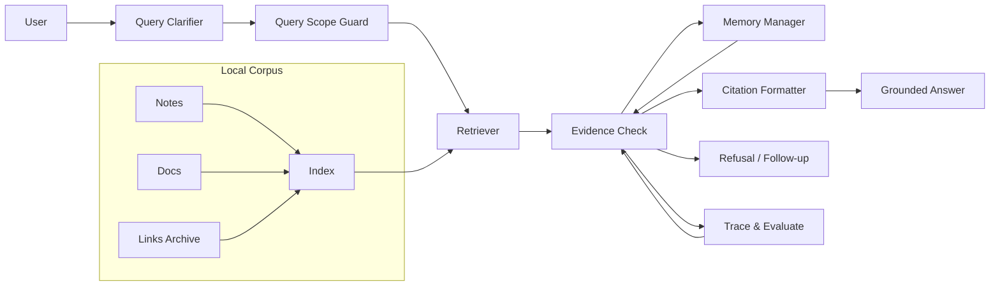

# Personal Knowledge Base RAG Case

## Scenario & Background

A personal Agent searches a user's local notes, meeting summaries, project journals, and saved links, then answers only when retrieval supports the answer. The corpus is private, ever-growing, and far too large to fit in the model context, so answers must be grounded in retrieved evidence and every factual claim must carry a source.

The case has three hard constraints:

- **Scope**: retrieval is limited to the user's local corpus. The Agent must not silently fall back to world knowledge when the corpus has no answer.
- **Privacy**: notes may contain personal data, so prompts, tool calls, and traces must avoid echoing raw content outside the trusted pipeline.
- **Grounding**: a factual answer without a retrievable source is a refusal case, not a low-confidence answer.

The central tension is that personal notes are unreliable in a different way than company documentation: they are stale (a decision made three months ago may have been reversed), duplicated (the same meeting lives in two files with different details), and opinionated (preferences must never be presented as facts).

## System Architecture



The flow is a loop, not a pipeline: when evidence quality is insufficient, control returns to the Clarifier or the Refuser instead of forcing an answer.

## Component Responsibilities

| Component | Responsibility | Boundary | Failure Symptom |
| --- | --- | --- | --- |
| Query Clarifier | Rewrites vague questions into searchable queries and asks for missing context (time range, project, person) | Must not invent facts while clarifying | Retrieved top results are unrelated |
| Query Scope Guard | Enforces "local corpus only" and rejects requests that require world knowledge | No external search or API fallback | Agent answers from training knowledge |
| Indexer | Chunks notes, computes embeddings, and keeps an updated local index | Cannot read private content outside its granted path | Search misses recent edits |
| Retriever | Returns top-k candidates with scores, route info, and metadata | Ranking is evidence, not truth | Good answer exists but never surfaces |
| Evidence Check | Classifies each candidate as supporting, conflicting, stale, or irrelevant; decides answer vs refusal | Cannot change facts, only admit them | Missing-evidence answers pass through |
| Memory Manager | Stores only explicit preference facts and marks them as memories, not facts | Never overrides retrieved evidence | Memory shadows newer notes |
| Citation Formatter | Attaches source file, heading, and snippet anchor to each claim | Only cites what Evidence Check passed | Citation points to the wrong excerpt |
| Trace & Evaluator | Logs query, candidate set, verdicts, and final answer per request | No decision authority on release | Regressions are invisible |

## Key Implementation Details

### System Prompt Rules

The system prompt makes the grounding contract explicit:

```
- You answer from the local corpus only.
- A factual sentence must reference a passed source id.
- "I cannot find evidence" is a valid answer. Guessing is not.
- Preferences stored in memory are labeled "user preference",
  never "fact".
- If sources conflict, say so and ask for a decision.
```

### Tool Set

| Tool | Input | Side Effect | Guard |
| --- | --- | --- | --- |
| `search_local_corpus(query, max_results=8)` | Query string | None (read) | Scope guard applies |
| `read_source(source_id)` | Source id | None (read) | Must come from search result |
| `store_preference(key, value)` | Memory key/value | Writes memory | Only for explicit preference statements |
| `list_recent_notes(path, since)` | Path and date | None (read) | Path whitelist |

There is deliberately no "search the web" tool. The absence of that tool makes refusal a design outcome, not a prompt-level wish.

### State Flow

1. The Clarifier normalizes the question and records the original phrasing for the trace.
2. The Scope Guard classifies the request. Requests that fundamentally require world knowledge are answered with a short refusal before any retrieval cost is spent.
3. The Retriever returns candidates; the Evidence Check scores each as `supporting`, `conflicting`, `stale`, or `irrelevant`.
4. If a single clear answer exists, the Citation Formatter builds the answer from passed sources only.
5. If candidates conflict, the Agent presents both sides with sources instead of merging them.
6. If the best candidate is older than a configured window and the topic is volatile (prices, policies, decisions), the Agent asks the user to confirm before answering.
7. If no candidate supports the claim, the Agent refuses and suggests what evidence would help.

### Failure Handling

- **Missing evidence**: the Agent refuses with a one-line reason and a follow-up suggestion. The refusal is recorded in the eval set as a required behavior.
- **Stale notes**: freshness metadata (captured date, last modified) feeds the Evidence Check; stale candidates are downgraded, not silently dropped.
- **Conflicting duplicates**: both sides are surfaced with source ids and the user decides. The merge policy is "never auto-merge conflicting facts."
- **Memory vs evidence**: memory is a last-resort input for personalization (tone, naming), never a replacement for retrieval. The prototype that let memory win produced confidently wrong answers.


## Worked Example Walkthrough

Query: "What did I decide about the server migration last quarter?"

1. **Clarifier**: the question is time-bound and project-bound, so no extra context is requested; trace records the original phrasing.
2. **Scope Guard**: local corpus only, passes.
3. **Retriever**: returns three candidates: a Q3 decision note (supporting, `captured_at` in window), a Q4 follow-up (conflicting, newer), and an unrelated meeting summary (irrelevant).
4. **Evidence Check**: marks candidate 2 as `conflicting` because it records the decision as reversed; candidate 1 is `stale` relative to candidate 2.
5. **Outcome**: the Agent answers "You decided X in Q3, then reversed it in Q4" with both source ids, and asks whether the Q4 reversal is the current state.
6. **Memory Manager**: no memory write happens, because a decision is a fact about the corpus, not a user preference.
7. **Trace**: the request records query, candidates, verdicts, and final answer so the same eval case can be replayed after an index change.

The same query without the Q4 follow-up file must produce a different, honest answer — not the same text — which is why regression evals need multiple fixtures per question.

## Design Trade-offs

| Option chosen | Alternative | Cost / Benefit |
| --- | --- | --- |
| Hybrid retrieval (keyword + vector) | Vector-only | More recall on names and acronyms at the cost of extra index complexity |
| Whole-note chunking with overlap | Fixed-size chunks | Better long-claim support; slower retrieval and noisier candidates |
| Strict refusal on missing evidence | Low-confidence answer | Loses a few helpful answers; gains trust and eval stability |
| Memory only for explicit preferences | Memory as general facts store | Less convenient, but prevents note/memory divergence |
| Freshness metadata on every source | Assume all notes current | Costs one extra index field; prevents stale-answer incidents |

## Transferable Patterns

- **Refuse as a designed decision**: the absence of a tool is a stronger guarantee than a prompt instruction.
- **Evidence verdict labels**: `supporting / conflicting / stale / irrelevant` make the final step a deterministic filter, not another model judgment.
- **Source contract**: every answer carries `(source_id, excerpt, captured_at)`, which makes evaluation and user trust tractable.
- **Scope guard before retrieval**: classify the request before spending tokens so out-of-scope work is cheap and observable.
- **Memory as personalization, not truth**: separate preference memory from factual evidence so they cannot fight each other.


## Evaluation & Metrics

The eval set separates happy-path recall from safety behavior:

| Metric | Definition | Pass bar |
| --- | --- | --- |
| Required-source hits | % of eval answers whose cited source is in the allowed set | 100% |
| Refusal correctness | % of no-evidence cases that refuse instead of guessing | 100% |
| Missing-evidence false answer | % of no-evidence cases that produced an ungrounded answer | 0% |
| Citation grounding | claims present in the cited excerpt | >= 95% |
| Stale-document detection | stale candidates downgraded or flagged | >= 90% |
| Extra cost of clarification | avg extra tokens added by Clarifier | below 15% |

Every eval case carries the expected verdict, not just the expected text, so a change in retrieval that flips a correct answer to a refusal is caught as a regression too.

## Prompt for Refusal

The refusal template keeps users in control:

```
I can't answer this from your notes.
Reason: no local source covers {topic}.
Evidence that would help: {file type or event}.
Could you add it, or should I ask someone on the team?
```

The template appears in eval fixtures so refusal quality is measured, not incidental.

## Anti-Patterns to Avoid

- Adding a web tool "just in case" — it erases the local-only guarantee.
- Putting freshness in the prompt instead of in the source metadata.
- Merging conflicting notes into one answer without telling the user.
- Using memory to fill gaps in retrieval.
- Only testing happy-path questions in the eval set.

## Pitfalls & Production Lessons

- **Vague queries produced great retrieval but wrong answers.** The fix was a Clarifier step and eval cases for ambiguous prompts.
- **Fresh notes were verbally correct but outdated** because `updated_at` was missing. Every source now carries `captured_at` and `last_modified`.
- **"Answer with confidence" steering caused citation leakage.** The prompt was rewriting passages; output began only from model tokens, and verbatim passages were linked rather than generated.
- **Duplicate notes with different details looked like retrieval success.** Recall metrics said 1.0 while the user's ground truth was contradictory; the eval set now includes conflict cases.
- **The first citation quality metric was string overlap, which rewarded copy-paste.** The metric switched to "does the claim exist in the cited excerpt," which matches user value.

## Discussion / Self-Check Questions

1. When memory and a freshly retrieved note disagree, which one should win and what trace fields make the decision auditable?
2. What is the difference between a missing source and a wrong source, and how should the Agent behave in each case?
3. How would you measure citation quality without rewarding the model for copying text verbatim?
4. A user asks "what did I decide about the server migration?" — what context should the Clarifier request before retrieval?
5. How would you add a "world knowledge" escape hatch without letting the Agent silently fabricate sources?

## Related Labs & Examples

- Lab: [RAG Evaluator](../../../labs/l3/rag_evaluator/README.md) — build a required-source and refusal eval set.
- Lab: [RAG, Memory & Observability](../../../labs/l3/rag_memory_observability/README.md) — trace retrieval and memory decisions.
- Lab: [Multi-Round Research Discussion](../../../labs/l3/multi_round_research_discussion/README.md) — multi-turn research with evidence handoffs.
- Example: [RAG Evidence Refusal](../../../examples/rag-evidence-refusal/README.md) — practice answer vs cite vs refuse decisions.
- Example: [Memory vs Evidence](../../../examples/memory-vs-evidence/README.md) — see preference memory fight retrieved evidence.
- Example: [Memory Index Evidence](../../../examples/memory-index-evidence/README.md) — inspect index-event evidence for stale memories.
- Example: [Data Source Policy](../../../examples/data-source-policy/README.md) — define which sources are allowed and stale.

## Lesson

RAG is not search. It is evidence selection, refusal, and answer grounding — and the value of the system is determined by how honestly it says "I don't know."
