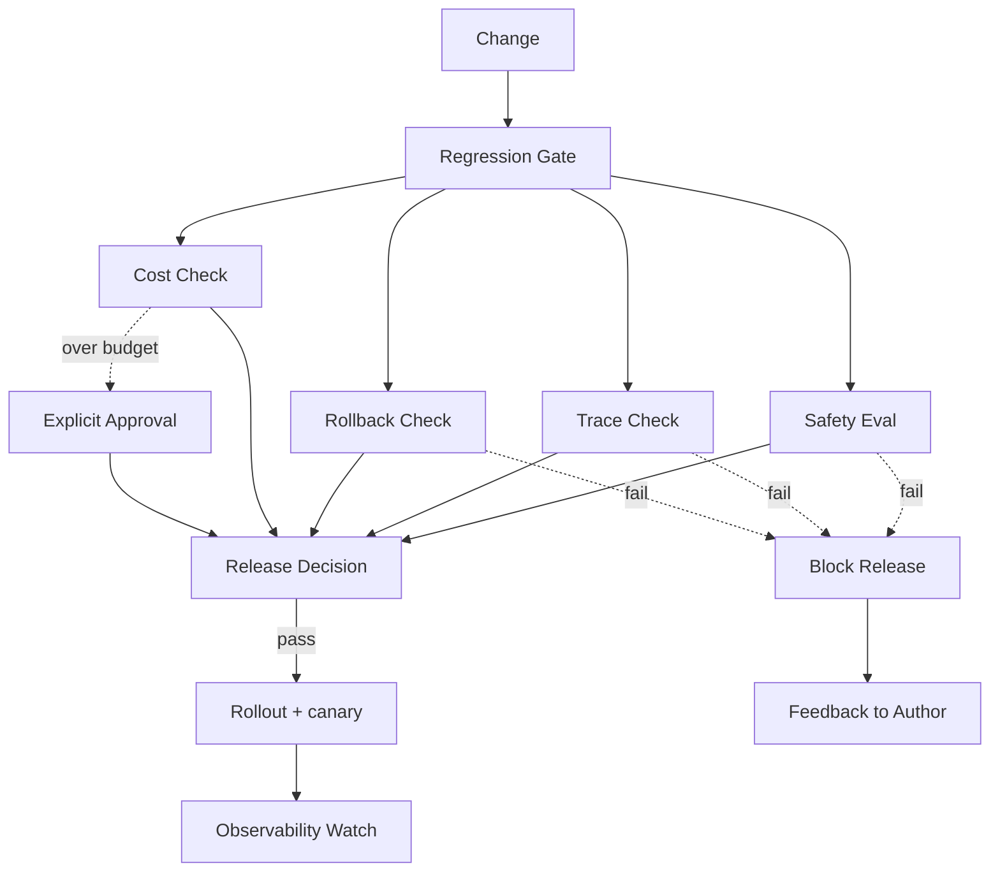

# Production Regression Gate Case

## Scenario and Background

Our team runs a customer-facing coding Agent that edits repositories, executes commands, and calls model gateway APIs. Early on, "it works on my laptop" was the only release bar: engineers merged a prompt change, a new tool, or a model-version bump when their smoke tests passed, and a failure was only noticed after customers filed tickets.

The turning point was an incident in which a new model-version bump changed the tool-calling format: the Agent silently stopped persisting its decision trace, and the safety layer no longer saw evidence that a destructive command had been reviewed. Two days later, a misdirected `git push --force` against a customer repository made rollback impossible because the change had already been propagated. The postmortem produced one hard rule: **no change reaches production without passing a deterministic regression gate**, and the gate's evidence must be machine-checkable, not a checklist someone remembers before launch.

## System Architecture

The gate is a CI-first pipeline. Every change to prompts, tools, model routing, or guardrail configuration lands in an environment where the gate runs before human approval can even be requested:



The Mermaid diagram mirrors the actual pipeline: the four checks run in parallel, every failure path converges on a block decision, and the cost check alone can route to an explicit approval instead of a hard block. Rollout and post-release observability are part of the gate story because a gate that stops checking after deployment is only half a gate.

## Component Responsibilities

| Component | Responsibility | Output |
| --- | --- | --- |
| Change intake | Normalizes the diff (prompts, tools, routing, guardrails) and attaches the author, ticket, and environment | A machine-readable change manifest |
| Safety eval | Runs the golden prompt set plus adversarial cases; every critical failure is blocking | `safety-report.json` with per-case verdicts |
| Trace check | Validates that the change produces trace records with all required fields for a sampled run | A list of missing fields or `trace-complete` |
| Rollback check | Verifies a rollback plan exists, has an owner, and has been exercised against the previous release | `rollback-plan.json` + last drill timestamp |
| Cost check | Replays the change against a cost budget and latency budget; over-budget is not auto-blocked | Budget report with delta and p95 latency |
| Release decision | Aggregates verdicts, persists them, and produces the only artifact the deploy job trusts | Signed `release-decision.jsonl` |
| Canary & observability watch | Rolls out to a slice of traffic, watches error groups and trace completeness for a window | Rollback trigger or "watch closed" signal |

## Key Implementation Details

### Prompt / tool contract

The gate does not run the whole Agent. It runs a **sampled replay**: a fixed set of golden prompts and tool scenarios are executed against the candidate change, and every step is recorded. The replay contract is part of the change itself:

```yaml
change:
  kind: model-routing-update   # prompt | tool | routing | guardrail
  ticket: PROD-482
  author: ada
  replay_set: golden-24        # named replay set in the repo
  must_block_on: [safety-critical, trace-missing, rollback-untested]
```

### State flow

1. The change lands and the gate job reads the manifest.
2. Safety, trace, rollback, and cost checks run in parallel and each writes its own JSON report.
3. The release-decision aggregator loads all four reports; any `block` verdict fails the job.
4. A cost over-budget verdict routes to an explicit approval record instead of failing.
5. On success, the deploy job signs and stores the decision, then triggers a canary rollout.
6. Observability watchers compare the canary's error-group rate and trace-completeness against the previous release's baseline.

### Failure handling

- Safety critical failure: block release, page the safety on-call, and create a follow-up eval case from the failed input.
- Missing trace field: block release and surface the exact field name and the step that should have emitted it.
- Untested rollback plan: block release. A plan file without a drill timestamp is treated the same as no plan.
- Cost over budget: no hard block; the decision record must reference an explicit approval with an owner and expiry.

## End-to-End Walkthrough

A concrete run makes the state flow legible. The change is a model-routing update that redirects long-context requests to a cheaper model (PROD-482):

| Step | What happens | Evidence produced |
| --- | --- | --- |
| 1 | Author opens the change and declares `kind: model-routing-update` with `replay_set: golden-24` | `change-manifest.yml` |
| 2 | CI parses the manifest; gate job starts | Build log with gate version pinned |
| 3 | Safety eval runs golden + adversarial prompts; one new prompt triggers an over-refusal | `safety-report.json` |
| 4 | Trace check replays the same set; `tool_name` is missing on 3 of 24 traces because the new router drops a field | `trace-gaps.json` |
| 5 | Rollback check loads `rollback-plan.json`; the plan is stale (last drill 47 days ago) | Drill timestamp < 30-day policy |
| 6 | Cost check replays the routing table against the budget; the cheaper model is projected to save 18% | `budget-report.json` |
| 7 | Aggregator sees `trace-missing` and `rollback-untested`; the job fails and pages the author with both reasons | Signed `release-decision.jsonl` with `verdict: block` |
| 8 | Author fixes the router to emit `tool_name`, re-drills the rollback, and pushes again | Second gate run, all green |
| 9 | Deploy job signs the decision, rolls out to 5% canary, and opens a 6-hour observability watch | Watch window with error-group baseline |

The walkthrough shows why evidence, not memory, is the product of the gate: the trace gap and the stale rollback plan were both invisible to a human glance at the diff, but deterministic checks caught both in the same run.

## Example Gate Verdict

The aggregator writes one record per gate run so that any postmortem can answer "what did the gate know, and when?":

```jsonl
{"run_id": "gate-2026-09-16-0142", "change": "PROD-482", "version": "2026.09.16-rc1"}
{"check": "safety", "verdict": "pass", "cases": 24, "critical_failures": 0}
{"check": "trace", "verdict": "block", "missing_fields": ["tool_name"], "affected_steps": ["router.invoke", "router.invoke", "router.invoke"]}
{"check": "rollback", "verdict": "block", "reason": "last_drill 47 days ago, policy 30 days"}
{"check": "cost", "verdict": "pass", "delta_percent": -18.0, "p95_latency_ms": 940}
{"decision": "block", "owners_paged": ["ada", "oncall-safety"], "followups": ["eval-case: over-refusal-482"]}
```

## Operating Metrics

We track four numbers on the gate itself, not just on the system it protects:

- **Block rate by check**: the ratio of blocked runs caused by each check. When trace-missing blocks dominate, the tracing layer needs investment, not the gate.
- **False-block rate**: gate verdicts manually overridden within 24 hours. A high rate means the gate is checking the wrong contract.
- **Time to first verdict**: median minutes from push to a complete decision. We keep this under 12 minutes so the gate stays part of the author loop.
- **Escaped-regression count**: regressions caught by nightly full-suite evaluation after the gate passed. This is the honest measure of sampling risk.

## Design Trade-offs

- **Replay sampling vs. full evaluation.** Running every prompt in the eval set on every change is too expensive; we sample a named golden set for the gate and run the full suite nightly. The trade-off is that a regression outside the golden set can slip through the gate, so the nightly full suite still has authority to roll back.
- **Parallel checks vs. sequential ordering.** Checks run in parallel to keep gate latency low, but each report is written atomically so the aggregator never sees a half-written verdict.
- **Cost as approval-required vs. hard block.** A hard cost block would stall legitimate long-running research tasks; routing over-budget changes to explicit approval keeps velocity while preserving a human decision point.
- **CI-first vs. pre-flight on developer machines.** CI-first means authors wait minutes for verdicts, but it guarantees the evidence is produced in the same environment that will ship.

## Transferable Patterns

- **Evidence over assertions.** A release gate is only as trustworthy as the evidence it persists. Make every verdict machine-readable (`JSONL`) and attach it to the release decision.
- **Blocking requirements stay tiny.** Only three verdicts block: safety-critical, missing trace evidence, untested rollback. The smaller the block list, the harder it is to argue around it.
- **Naming the check in the change.** Requiring the author to declare the change kind and replay set forces them to think about blast radius before the gate runs.
- **Post-release watch is part of the gate.** A gate that ends at deployment trains teams to game the gate; extending it into canary and observability windows keeps the incentive aligned.

## Adoption Playbook

Rolling the gate into a team that already ships on vibes requires sequencing, not a big-bang mandate:

1. **Start with read-only reporting.** For two weeks, run all four checks on every change but only send the report to the author. Teams accept measurement before they accept enforcement.
2. **Make the three block rules official.** Safety-critical, missing trace evidence, and untested rollback become documented release policy before the CI job starts failing on them.
3. **Turn on hard blocking for safety and rollback first.** These two are cheap to satisfy and hard to argue with, which builds trust in the gate.
4. **Add trace-missing blocking only after the tracing layer is stable.** Otherwise the gate drowns authors in noise and gets disabled.
5. **Track the four operating metrics for a quarter** and tune the sampling set based on escaped regressions before extending the gate to more change kinds.

The sequencing matters more than the individual checks: a gate that fails on day one is deleted by the second week, while a gate that earns trust check by check becomes part of the culture.

## Pitfalls and Production Lessons

- **Checklists become decoration.** Our first gate was a checklist in a wiki page; it was never read during the incident. Moving the checks into CI made them unavoidable.
- **Untested rollback plans are fiction.** We once shipped with a rollback plan that referenced a script removed two releases earlier. The drill timestamp now blocks any plan that has not been exercised.
- **Cost warnings that are not owned.** A "warning" with no owner and no expiry silently decays. Over-budget now requires an explicit approval record, and the record itself expires.
- **A skipped safety eval hides regressions.** When a change was marked "docs-only", the eval was skipped and a wording change altered tool permissions. Every change kind now maps to at least one safety eval.
- **Trace completeness is the first thing to rot.** A model-version bump changed the tracing format; the gate caught the missing fields before users did, but only after we made missing fields blocking instead of warning.

## Discussion and Self-Check Questions

1. Which failure should always block release, and why should cost over-budget be treated differently?
2. Why are missing trace fields blocking rather than warning-level?
3. What is lost by sampling a golden replay set instead of running the full evaluation suite?
4. How would you add a latency p95 threshold to this gate without making every large task blocked?
5. If the canary shows a regression after the gate passed, what new evidence should the postmortem require?

## Operational Checklist

The gate is deterministic only if its inputs are pinned. Every gate run happens against a commit-level snapshot, and the following invariants are enforced:

- The replay set, model versions, and router config are pinned by commit hash, so a verdict is reproducible a month later.
- Every check writes its report atomically and in a fixed schema version; the aggregator rejects unknown schema versions instead of guessing.
- No human can flip a verdict in the decision record. A manual override is a new audit row with an owner and expiry, never a silent edit.
- The gate binary version is recorded in each run, so "the gate changed behavior" is itself diagnosable.
- Rollback drills are scheduled from the same calendar the checklist references; a plan without a dated drill is rejected at intake.

## Related Labs

- L4 Regression Gate: [`../../../labs/l4/regression_gate/README.md`](../../../labs/l4/regression_gate/README.md)
- L4 Production Postmortem: [`../../../labs/l4/production_postmortem/README.md`](../../../labs/l4/production_postmortem/README.md)
- L4 Deployment Hygiene: [`../../../labs/l4/deployment_hygiene/README.md`](../../../labs/l4/deployment_hygiene/README.md)

## Related Examples

- Release Gate Evidence: [`../../../examples/release-gate-evidence/README.md`](../../../examples/release-gate-evidence/README.md)
- Agent Eval Regression: [`../../../examples/agent-eval-regression/README.md`](../../../examples/agent-eval-regression/README.md)
- Safety Eval: [`../../../examples/safety-eval/README.md`](../../../examples/safety-eval/README.md)
- Observability Trace: [`../../../examples/observability-trace/README.md`](../../../examples/observability-trace/README.md)

## What This Case Does Not Cover

- **Multi-region rollout ordering.** The gate proves readiness in one environment; it does not decide how a change propagates across regions, and that decision lives outside this pipeline.
- **Customer-facing abuse and adversarial traffic.** Safety evals here cover tooling and prompt behavior, not live abuse detection; that is a separate runtime control.
- **Human approval politics.** The gate makes evidence visible, but resolving disputes between an author and a safety owner is a governance process, not a CI job.
- **Long-term cost drift.** Budgets are replayed per change; gradual cost drift across many small changes needs the nightly suite and quarterly budget review, not this gate.

## Lesson

Production readiness is a gate, not a checklist someone remembers before launch. The gate's real product is persistent, machine-readable evidence: a decision record that says what was checked, what failed, and who was paged. Keep the blocking list tiny, make every verdict atomic and signed, and extend the gate past deployment into the canary and observability window. When the next incident happens, the first question a postmortem should be able to answer is not "who forgot what", but "what did the gate know, and when?"

Production readiness is a gate, not a checklist someone remembers before launch. Ship the evidence, keep the blocking list tiny, and let the gate do the remembering.
