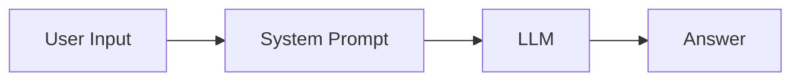
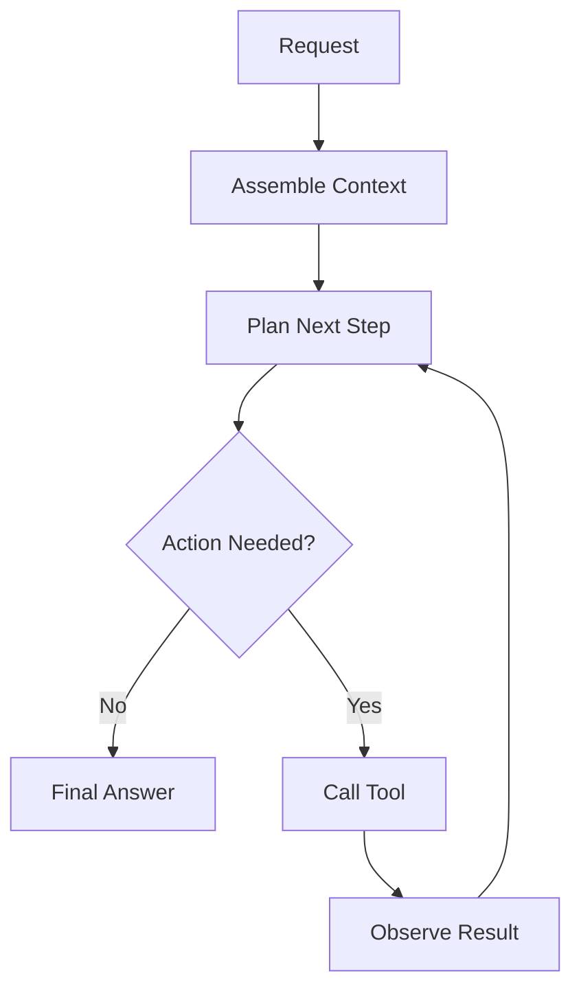
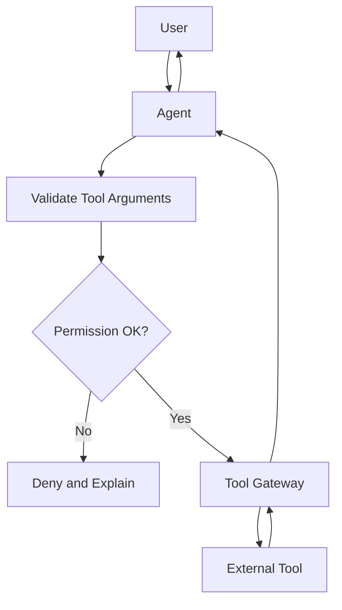
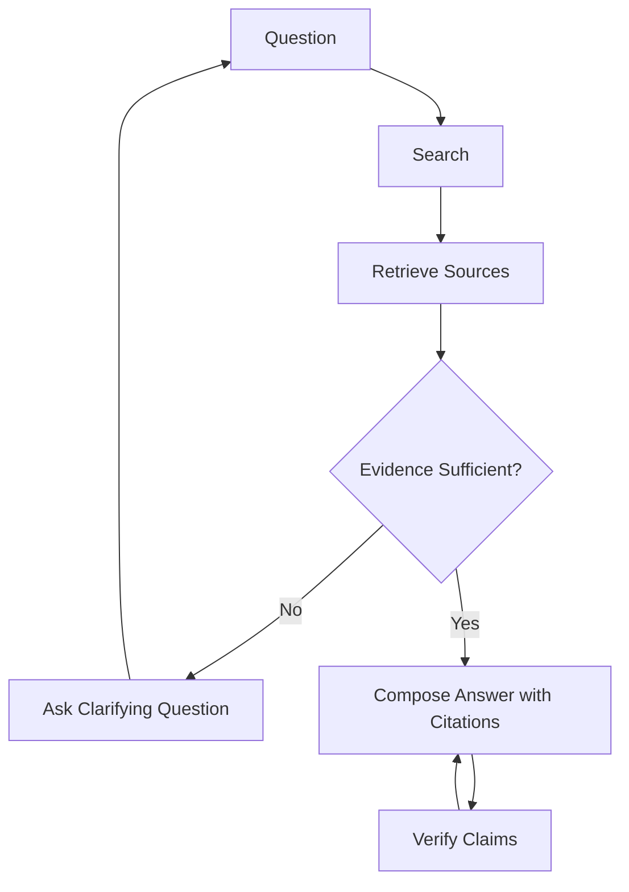
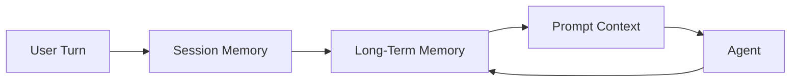
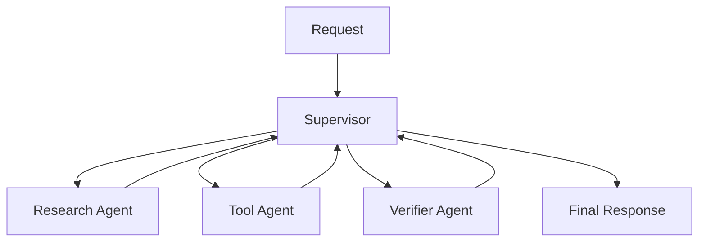
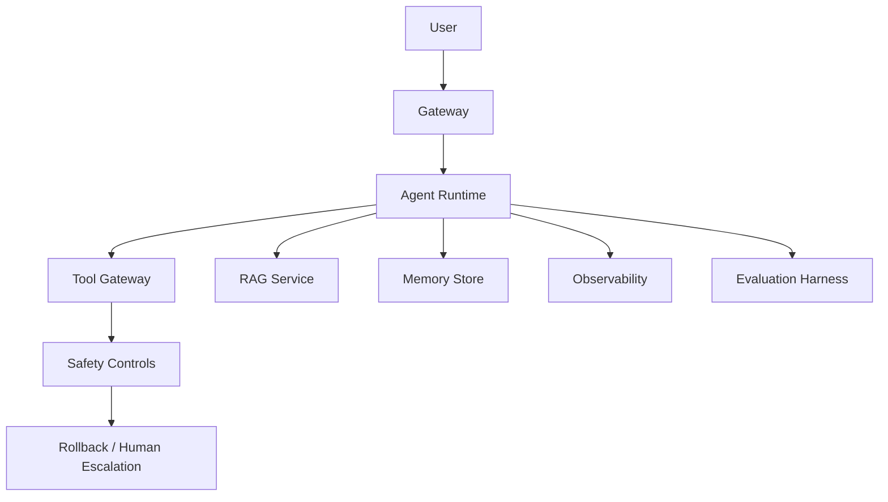

# Agent System Architecture

Most public Agent tutorials eventually converge on the same architecture patterns: one LLM call, one loop, retrieval-augmented generation, tool use, memory, observability, and multi-agent coordination.

Agent-Top keeps those patterns as stable concepts, then puts framework-specific code into Labs.

## 1. Minimal LLM Call

The first building block is a model call with a user message and a system prompt.

What to learn:

- Token and context limits.
- System prompt versus user prompt.
- Why a direct answer is not always the best path.

Related tutorial:

- [`../l0-first-llm-call.md`](../l0-first-llm-call.md)

## From First LLM Call to Multi-Round Agent

The first LLM call is useful for understanding requests, messages, context limits, and model behavior. The multi-round Agent adds state, tools, retries, observations, and stopping decisions around that model call.

Useful distinction:

| Stage | What Exists | What the Learner Should Prove |
| --- | --- | --- |
| First LLM call | Request, system prompt, user message, response | Can explain context and output shape |
| Single loop | Tool, observation, next-step decision | Can stop and recover from tool results |
| Multi-round Agent | History, memory, tools, verification, escalation | Can explain why each round exists |

This is the bridge between tutorial-style examples and production Agent systems.

## 2. Single-Agent Loop

A single Agent uses a loop: plan, act, observe, update, repeat.

What to learn:

- Stop conditions.
- Max step limits.
- Tool result ambiguity.
- Observability for every step.

Related Labs:

- [`../../labs/l1/minimal_react_agent/README.md`](../../../labs/l1/minimal_react_agent/README.md)
- [`../../labs/l1/multi_turn_state/README.md`](../../../labs/l1/multi_turn_state/README.md)

## 3. Tool-Using Agent

Tool use turns the model from an answer generator into a system participant. Tools provide external facts, current state, and side effects.

What to learn:

- Tool schema validation.
- Role and tenant permissions.
- Read-only versus write versus destructive actions.
- Confirmation for irreversible actions.

Related Labs:

- [`../../labs/l1/guardrail_helpers/README.md`](../../../labs/l1/guardrail_helpers/README.md)
- [`../../labs/l2/single_agent_mcp/README.md`](../../../labs/l2/single_agent_mcp/README.md)

## 4. RAG Agent

RAG grounds answers in retrieved sources. It is especially useful when the answer depends on private, current, or large-scale knowledge.

What to learn:

- Query planning.
- Chunking and retrieval.
- Source freshness.
- Refusal when evidence is missing.
- Multi-round search when the first retrieval misses.

Related tutorials and Labs:

- [`multi-round-research-discussion.md`](multi-round-research-discussion.md)
- [`../l3-rag-memory-observability.md`](../l3-rag-memory-observability.md)
- [`../../labs/l3/rag_evaluator/README.md`](../../../labs/l3/rag_evaluator/README.md)

## 5. Memory-Augmented Agent

Memory adds context across turns and sessions. It is useful but risky: memory can be stale, private, or overconfident.

What to learn:

- Short-term memory versus long-term memory.
- User preferences versus factual evidence.
- Forgetting and deletion.
- How to prevent stale memory from overriding current user input.

Related Lab:

- [`../../labs/l1/multi_turn_state/README.md`](../../../labs/l1/multi_turn_state/README.md)

## 6. Multi-Agent System

Multi-agent systems split responsibilities. They work best when each agent owns a clear boundary and the orchestrator can verify or escalate.

Use multi-agent when:

- Research and action need different tools.
- Verification is valuable enough to justify coordination cost.
- A human approval path is required.
- Specialized agents reduce failure modes.

Avoid multi-agent when:

- A single Agent with tools is enough.
- Shared state becomes hard to reason about.
- Debugging coordination takes more effort than solving the task.

Related Lab:

- [`../../labs/l3/multi_agent_supervisor/README.md`](../../../labs/l3/multi_agent_supervisor/README.md)

## 7. Production Agent System

A production system adds gates around the Agent loop.

Production layers:

- Gateway: auth, rate limits, input limits.
- Runtime: planning, tool routing, state.
- Tool gateway: permissions, audit logs, side effects.
- RAG: scoped retrieval and source freshness.
- Memory: privacy, stale data, deletion.
- Observability: traces, latency, cost.
- Evaluation: golden prompts, safety evals, regression gates.
- Rollback: prompt, tool, retrieval, memory, traffic controls.

Related docs:

- [`../production/evals-checklist.md`](../production/evals-checklist.md)
- [`../production/safety-checklist.md`](../production/safety-checklist.md)

## How to Read Other Tutorials

When you meet an external Agent tutorial, map it to one of these questions:

1. Is this a single LLM call or a control loop?
2. Does it use tools, RAG, memory, or multi-agent coordination?
3. What is the stop condition?
4. What evidence must exist before answering?
5. Where are safety and rollback controls?
6. Which parts are stable patterns and which parts are framework-specific?

That mapping is the core learning skill Agent-Top wants to build.
