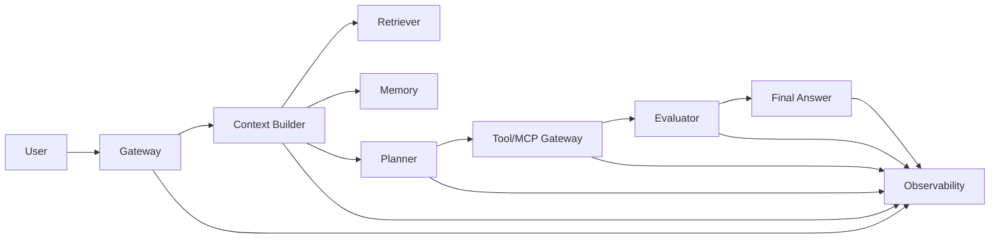

# Agent System Blueprint

The Agent System Blueprint is the bridge between a vague product requirement ("build us an agent") and a reviewable, production-ready design outline. It does not replace implementation; it forces the team to make the expensive decisions early, when changing them still costs a meeting instead of a migration.

## Definition

A blueprint is a structured design document with three properties:

- **Complete enough to review**: every major subsystem has an owner, an input, an output, and a failure mode.
- **Specific enough to build**: each decision is concrete — a strategy, a risk class, or a named data source — not a slogan.
- **Short enough to maintain**: if a document needs a rewrite to stay current, the architecture is already too complicated.

A useful mental model: the blueprint is the "test of the architecture." If the architecture is correct, the blueprint reads like a checklist; if it is wrong, the blueprint reads like an essay. A blueprint that cannot be checked against the live system — because it lives in a design doc that nobody reads — is not a blueprint, it is an artifact.

## Why a Blueprint Matters (First Principles)

An Agent is a control loop that turns model outputs into actions. That loop has three structural properties that make design mistakes expensive:

1. **Compounding uncertainty**: every step consumes context and adds latency, so an error at the start of the loop is amplified by the end.
2. **Action asymmetry**: a hallucinated sentence is a nuisance; a hallucinated action can change state irreversibly.
3. **Observability debt**: the longer a loop runs without tracing, the more expensive it becomes to explain why it behaved that way.

From these properties it follows that the highest-leverage work happens before a single model call: defining goals, non-goals, tool risk, data ownership, and gates. A blueprint captures exactly this pre-work. In systems terms, the blueprint is the specification of the control-surface: it fixes the loop's boundary, its invariants, and its escape hatches, so that the runtime code is only responsible for executing decisions that were already made deliberately.

## The Blueprint Canvas

The canvas is a ten-part template that every blueprint must fill in. "TBD" is an acceptable temporary answer only if it is flagged as an open risk.

1. **User and business outcome** — the one-line goal, the user, and the success metric.
2. **Non-goals and denied actions** — what the system must never do, and what it may refuse to do.
3. **Data sources and ownership** — every source, its owner, and its precedence.
4. **Tool/MCP surface and risk class** — every tool, its permission model, and its risk class.
5. **Planning and routing strategy** — how the system decides between tool calls, subagents, and direct answers.
6. **Memory and evidence precedence** — what is remembered, what is retrieved, and which wins on conflict.
7. **Evaluation and safety gates** — the eval sets and the gates between model output and action.
8. **Observability and trace contract** — the fields every trace must contain to be replayable.
9. **Cost and latency budgets** — the per-request budget and the slowest acceptable path.
10. **Release, rollback, and postmortem process** — how a change ships, how it is undone, and when a postmortem is triggered.

## Architecture Map

The reference architecture has one non-obvious property: the Context Builder is upstream of the Planner. Retrieval and memory shape the plan, which is exactly why evidence errors and memory errors must be caught before planning, not after. Each box in the diagram maps to one or more canvas sections:

| Component | Canvas section | Failure mode the box must address |
| --- | --- | --- |
| Gateway | 1, 2 | Unscoped goals; missing auth, rate, safety checks |
| Context Builder | 3, 6 | Wrong or stale context contaminating the plan |
| Retriever | 3 | Irrelevant or low-quality retrieval |
| Memory | 6 | Privacy leaks; stale facts overriding fresh evidence |
| Planner | 5 | Wrong route, loops, overconfidence, missing stop conditions |
| Tool/MCP Gateway | 4 | Unauthorized or irreversible actions |
| Evaluator | 7 | Unsupported claims reaching the answer or an action |
| Observability | 8 | Traces that cannot reproduce the failure |

## Design Rules

- Use the simplest architecture that meets the goal.
- Separate request input from user instruction.
- Prefer explicit stop conditions over confidence guessing.
- Verify high-stakes actions before execution.
- Treat retrieved memory as evidence, not authority.
- Make every risky behavior testable before launch.

## Key Trade-offs

| Trade-off | Lean this way | Watch out for |
| --- | --- | --- |
| Fewer vs. more subsystems | Fewer | Premature modularity hides the real loop |
| Planning depth vs. latency | Shallow first | Deep planning without observability is unteachable |
| Memory reuse vs. freshness | Freshness for facts | Reusing stale context compounds errors |
| Tool breadth vs. permission safety | Narrow + explicit | Broad surfaces multiply risk classes |
| Eval coverage vs. launch speed | Launch with minimum evals | Launching without action gates is not a shortcut |
| Trace detail vs. cost | Sampled rich traces | Sampling without a complete capture path loses incidents |

## Production Practices

- Keep the blueprint in the same repo as the code it describes, so diffs and architecture changes stay linked.
- Run a design review against the blueprint before any code is written; review again when the architecture changes.
- Track the blueprint itself: open-risk list, last-reviewed date, and the names of the reviewers.
- Wire the completion criteria into the CI gate: no deployment without an approved tool risk table.
- Write the rollback path as a runbook step, not a design wish.
- On every postmortem, update the blueprint section that the failure exposed.
- Record the cost and latency budget as numbers with units, and make the monitoring alert on the budget, not just on availability.
- Keep a "known deviations" section: every deliberate divergence from the blueprint must list who approved it and when.

## Relationship to Neighboring Concepts

- The blueprint is the **input** to a design review; [`design-review-checklist.md`](design-review-checklist.md) is the checklist applied to it.
- It references the reference architecture in [`agent-system-architecture.md`](agent-system-architecture.md) and the implementation sequence in [`implementation-guide.md`](implementation-guide.md).
- It inherits the production constraints from the [`../quick-reference/production-checklist.md`](../quick-reference/production-checklist.md).
- The finished document is reusable as a starting point for the [`../../../templates/agent-design-template.md`](../../../templates/agent-design-template.md).
- Risk concepts such as hallucination and tool errors are detailed in their own concept pages; the blueprint only needs to reference them and assign owners.

## Worked Example: Customer Support Agent

A support agent blueprint might look like this:

- **Goal**: resolve tier-1 tickets autonomously; success metric is resolution rate without human handoff.
- **Non-goals**: no billing, no account deletion, no policy creation; denied actions include any external write without a second check.
- **Data sources**: the KB index (precedence 1), the account read API (precedence 2), and long-term memory (precedence 3, refreshed from the other two).
- **Tool/MCP surface**: three tools — search KB, read account, create ticket. Create ticket is risk class "write"; it requires schema validation and a confirmation step.
- **Planning**: a fixed routing strategy first (intent classifiers), then at most three tool steps, then escalate.
- **Gates**: unsupported claims are blocked by the verifier; create-ticket requires an explicit user confirmation.
- **Budgets**: p95 latency under 5 seconds; cost under $0.01 per resolved ticket.
- **Rollback**: kill switch for auto-answer, instant fallback to human queue; tested in the staging environment weekly.

## Common Failure Modes

| Failure | Symptom | Root cause in the blueprint |
| --- | --- | --- |
| Scope creep | Agent does things the team did not ask for | Non-goals missing or not enforced |
| Tool chaos | Unreviewed tools made it to production | Tool surface and risk class absent |
| Silent staleness | Answers use month-old facts | Data source precedence undefined |
| Loop of death | Agent re-plans forever on one request | No explicit stop condition |
| Untraceable incident | Postmortem cannot reconstruct the run | Trace contract not specified |
| Rollback panic | On-call cannot undo the new behavior | Rollback process not a runbook step |

## Scope of a Blueprint

A blueprint is not every artifact a project will produce. It deliberately excludes:

- **Implementation detail**: specific prompts, chunk sizes, retry policies — these belong in code or in implementation notes, where they can be tuned without a design review.
- **Operational runbooks**: incident response, release procedures, and on-call rotations live with operations; the blueprint only names the expected behavior and the escalation path.
- **Marketing narrative**: value propositions and roadmap speeches obscure decisions. If a sentence would survive on a slide, it is probably not a decision.

What the blueprint must contain is the decision surface: goals, boundaries, risks, budgets, and gates. Everything else is input to those decisions or output of them. Keeping this scope discipline is what keeps the document short enough to maintain and strong enough to review.

## How to Use the Canvas Top-Down

Fill the canvas top-down, and let each section constrain the ones below it:

1. Write the goal and the success metric first; every later section exists to serve the metric.
2. Derive non-goals from the goal: anything the goal does not require is out of scope, and anything the metric could be gamed with is a denied action.
3. Derive the data surface from the non-goals: a denied action does not need a data source.
4. Derive the tool surface from the data surface, then classify each tool by risk.
5. Derive planning constraints from the tool risk classes, not from what is fashionable.
6. Derive budgets from the success metric: a resolution-rate goal implies a latency and cost envelope.
7. Finally, write the release, rollback, and postmortem process around the risk table.

The order matters because it removes arbitrary choices: each section can be checked against the section above it. When a reviewer asks "why this tool?", the answer is a chain that ends at the goal.

## Anti-Patterns

- **Portfolio blueprint**: twelve pages of motivation and zero pages of decisions. Cut the narrative and keep the risk table.
- **Bumper-sticker blueprint**: "we use agents and RAG" without naming tools, sources, or gates. That sentence fits on a slide and on nothing else.
- **Blue-sky blueprint**: perfect architecture for a team that does not exist yet. Optimize for the team you can hire next quarter, not the one you imagine.
- **Frozen blueprint**: the document is approved once and never updated, so it drifts from the running system. A blueprint that lies is worse than no blueprint.
- **Output-only blueprint**: describes the happy path and omits refusal, error, and rollback paths. Production is mostly failure paths.
- **Checklist theater**: the criteria are marked done without evidence. Each completion criterion needs a link to its verification (eval set, runbook, or test).

## Reviewing a Blueprint

Reviewing is a separate event from writing. A practical review protocol:

1. **Fresh-eyes read**: a reviewer who was not in the design room reads the blueprint and answers: can I build this without asking the author anything?
2. **Risk walk**: go section by section and ask, for every tool and data source, what happens if it fails.
3. **Budget check**: add the per-request latencies and costs of the planned steps; if the sum exceeds the stated budget, the budget or the design must change.
4. **Gate rehearsal**: simulate each safety gate — deny a tool call, refuse an answer, trigger rollback — and confirm the system has a defined behavior.
5. **Sign-off rule**: approval means the reviewer takes responsibility for the open risks, with a re-review date attached.

## Completion Criteria

A blueprint is done when all of the following exist and are reviewable:

- One-line goal and success metric.
- Tool risk table.
- Data source precedence.
- Release gate.
- Rollback path.
- Postmortem trigger.

## Self-Check Questions

1. **Q: Why must the Context Builder sit upstream of the Planner?**
   A: Because retrieval and memory errors are cheapest to catch before planning. If evidence is wrong, the plan built on it is wrong, and the fix cost compounds through every downstream step.

2. **Q: When is "simplest architecture" not the right choice?**
   A: When the goal explicitly requires verification, audit, or delegation. Simplest means fewest subsystems that still meet the goal, not the minimum number of moving parts at any cost.

3. **Q: What is the difference between a non-goal and a denied action?**
   A: A non-goal is something the system is not trying to do; a denied action is something it is explicitly forbidden from doing. Non-goals shape scope, denied actions shape safety and permission checks.

4. **Q: Why is "TBD" acceptable in a blueprint?**
   A: Only when flagged as an open risk. A blueprint is complete when the risk list, not the feature list, is empty; open risks must be visible to reviewers before code is written.

5. **Q: Why does the rollback path have to be a runbook step?**
   A: Because rollback is a time-critical operation. A design wish cannot be executed under incident pressure; a tested runbook step can. If the rollback step is not runnable, the release gate has not been passed.

## Related Pages

- Implementation guide: [`implementation-guide.md`](implementation-guide.md)
- Agent design template: [`../../../templates/agent-design-template.md`](../../../templates/agent-design-template.md)
- Design checklist: [`design-review-checklist.md`](design-review-checklist.md)
- Production checklist: [`../quick-reference/production-checklist.md`](../quick-reference/production-checklist.md)
