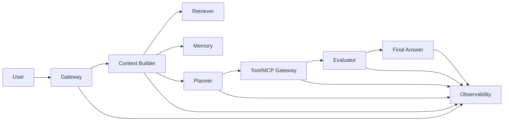

# Agent System Blueprint

This blueprint turns requirements into a production-ready design outline.

## Blueprint Canvas

1. User and business outcome.
2. Non-goals and denied actions.
3. Data sources and ownership.
4. Tool/MCP surface and risk class.
5. Planning and routing strategy.
6. Memory and evidence precedence.
7. Evaluation and safety gates.
8. Observability and trace contract.
9. Cost and latency budgets.
10. Release, rollback, and postmortem process.

## Architecture Map

## Design Rules

- Use the simplest architecture that meets the goal.
- Separate request input from user instruction.
- Prefer explicit stop conditions over confidence guessing.
- Verify high-stakes actions before execution.
- Treat retrieved memory as evidence, not authority.
- Make every risky behavior testable before launch.

## Completion Criteria

- One-line goal and success metric.
- Tool risk table.
- Data source precedence.
- Release gate.
- Rollback path.
- Postmortem trigger.

## Related Pages

- Implementation guide: [`implementation-guide.md`](implementation-guide.md)
- Agent design template: [`../../../templates/agent-design-template.md`](../../../templates/agent-design-template.md)
- Design checklist: [`design-review-checklist.md`](design-review-checklist.md)
- Production checklist: [`../quick-reference/production-checklist.md`](../quick-reference/production-checklist.md)
