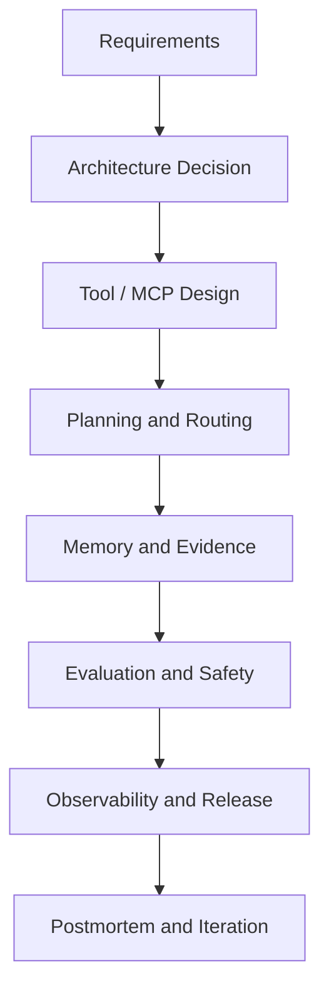

# Core Agent Implementation Guide

This guide turns the concept pages into a delivery path: requirements, architecture, implementation, evaluation, release, and postmortem.

## When To Use This Guide

Use it when you need to design or review a real Agent system, not just explain one concept.

- Build a reliable single Agent with tools.
- Design RAG, memory, MCP, or multi-agent flows.
- Add evaluation, safety, observability, or rollback.
- Prepare an interview or portfolio project with real evidence.

## End-to-End Delivery Flow

## 1. Requirements and Scope

Start by writing the system contract.

Required fields:

- Primary user and business goal.
- Allowed data sources.
- Allowed tools and side effects.
- Denied actions.
- Success criteria.
- Failure criteria.
- Human escalation triggers.
- Cost and latency budget.

Avoid starting with framework selection. First decide the smallest reliable architecture.

## 2. Architecture Decision

Choose the simplest architecture that can satisfy the requirements.

| Option | Use When | Do Not Use When |
| --- | --- | --- |
| Single LLM call | No tools, no private evidence, no action | External state or citations are required |
| Single Agent + tools | Tool use is needed but ownership is clear | Multiple specialists and verification are required |
| RAG Agent | Evidence comes from private or current docs | Sources are stale or untrusted |
| Multi-agent supervisor | Isolation or verification improves reliability | Coordination cost is not justified |
| Production Agent | Auth, evals, traces, rollback, and budgets are required | The system is only a prototype |

Record trade-offs explicitly:

- accuracy vs latency;
- cost vs safety;
- autonomy vs human approval;
- framework convenience vs control;
- memory convenience vs privacy.

## 3. Tool and MCP Design

For every tool or MCP capability:

- Name.
- Purpose.
- Input schema.
- Output schema.
- Error schema.
- Risk class: read, write, destructive.
- Required permissions.
- Idempotency behavior.
- Audit fields.
- Rollback or undo path.

Minimum controls:

- validate input before execution;
- deny by default;
- classify side effects;
- require confirmation for destructive actions;
- log actor, tenant, tool, request ID, and result;
- treat tool output as evidence, not authority.

## 4. Planning and Routing

Plan decisions before actions.

A decision event should include:

- next action;
- reason;
- expected evidence;
- risk level;
- allowed tools;
- stop condition;
- fallback.

Use human approval when:

- the action is irreversible;
- the blast radius is unclear;
- permissions are ambiguous;
- repeated tool failure occurs;
- the model is uncertain and confidence is not sufficient.

## 5. Memory and Evidence

Separate memory from evidence.

| Type | Source | Trust |
| --- | --- | --- |
| Conversation history | Current session | Medium |
| User preference memory | Confirmed preference | Medium |
| Tool result | Live external system | High if auditable |
| Retrieved source | Knowledge base or RAG | High if fresh and cited |
| Model inference | Generated by model | Low unless verified |

Rules:

- live systems of record beat stale memory;
- user corrections beat inferred memory;
- retrieved evidence beats model recall;
- evidence-heavy claims require citations or traceable tool output;
- memory writes need owner, timestamp, source, confidence, and deletion path.

## 6. Evaluation and Safety

Define evaluation before final prompt tuning.

Minimum eval classes:

- golden path;
- clarification;
- refusal;
- tool failure;
- stale source;
- hallucination;
- prompt injection;
- permission denied;
- destructive action attempt;
- cost/latency over budget.

Release gate:

- safety failures block release;
- unsupported factual claims block action;
- missing trace fields block release;
- missing rollback plan blocks release;
- cost or latency over budget requires explicit approval.

## 7. Observability and Release

Every production request should be traceable.

Required trace fields:

- request ID;
- user and tenant ID;
- model and prompt version;
- plan decisions;
- tool calls and results;
- retrieved sources;
- memory reads and writes;
- guardrail decisions;
- verifier decisions;
- final answer status;
- token cost and latency;
- escalation or human approval.

Use a rollback plan for prompts, models, tools, retrieval indexes, memory policies, and routers.

## 8. Postmortem and Iteration

After an incident or failed evaluation:

- classify the failure;
- identify affected request IDs;
- document root cause;
- add a regression eval;
- add a guardrail or trace field;
- update rollback notes;
- assign owner and due date.

A useful rule: every production failure should become an eval, guardrail, trace field, rollback path, or postmortem action.

## Evidence Pack

For a portfolio or interview, attach:

- design document;
- tool schema and risk table;
- trace sample;
- eval report;
- postmortem or dry-run postmortem;
- one clear trade-off decision.

## Related Pages

- Architecture: [`agent-system-architecture.md`](agent-system-architecture.md)
- Design review: [`design-review-checklist.md`](design-review-checklist.md)
- MCP: [`mcp.md`](mcp.md)
- Multi-agent scheduling: [`multi-agent-scheduling.md`](multi-agent-scheduling.md)
- Long-term memory: [`long-term-memory.md`](long-term-memory.md)
- Hallucination: [`model-hallucination.md`](model-hallucination.md)
- Plan and decisions: [`plan-decision-making.md`](plan-decision-making.md)
