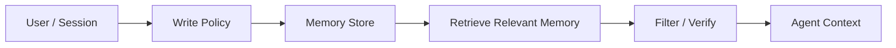

# Long-Term Memory

Long-term memory stores information across turns, sessions, users, or organizations. It helps an Agent remember preferences, constraints, decisions, and durable facts without relying only on the current prompt.

## When Memory Is Needed

Use long-term memory when the answer depends on information outside the current request:

- user preferences;
- prior decisions;
- account constraints;
- project conventions;
- recurring workflows;
- identity or role context.

Do not use it for facts that should come from current retrieval, live APIs, or verified systems of record.

## Memory Layers

| Layer | Scope | Examples | Governance |
| --- | --- | --- | --- |
| Working context | Current turn | Prompt, tool result, active plan | Clear automatically |
| Session memory | One conversation | Preferences during chat | Expire after session |
| User memory | One user over time | Formatting style, timezone | User-visible controls |
| Org/project memory | Team or project | Conventions, runbooks, standards | Owner and review process |
| Knowledge base | Broad evidence | Policies, docs, facts | Freshness and citations |

## Write Policy

Before writing memory:

- Is this still useful later?
- Is it private, sensitive, or regulated?
- Is it factual or merely inferred?
- Who owns this memory?
- Can the user delete or correct it?

Use a conservative default: store durable preferences and verified facts; avoid storing speculative claims.

## Read Policy

Before using memory:

- Is it relevant to the current task?
- Is it stale?
- Does it conflict with retrieved evidence?
- Is it private or role-appropriate?
- Does it need a citation or source link?

Retrieved memory is context, not authority. A live system of record should win over memory.

## Failure Modes

- The Agent treats memory as always true.
- A stale preference overrides a new user instruction.
- Private memory leaks across users or tenants.
- The memory store contains hallucinated facts.
- No delete or correction path exists.
- Retrieval returns noisy or unrelated memories.

## Evaluation Checklist

- Can the system distinguish memory, retrieval, and live tool output?
- Can users inspect or delete stored memories?
- Are stale memories flagged or ignored?
- Are cross-tenant access paths tested?
- Are memory writes auditable?
- Does the final answer disclose important remembered context when needed?
