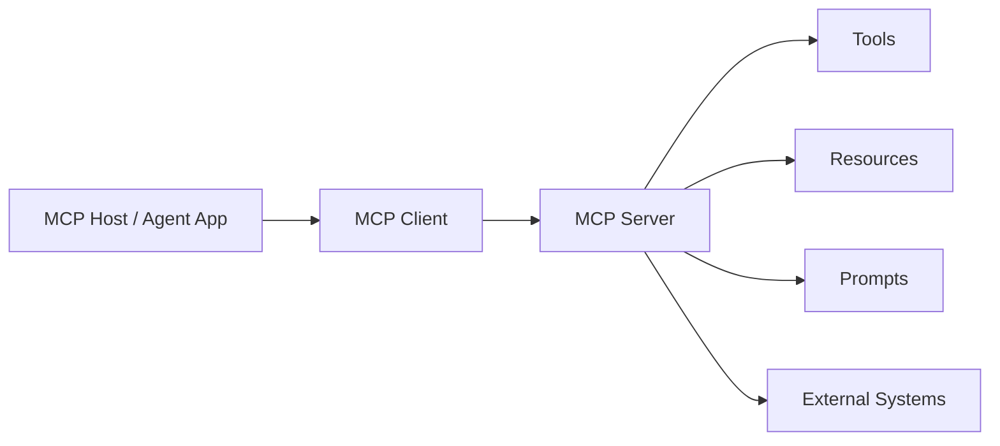

# Model Context Protocol

Model Context Protocol, or MCP, is a standard way for LLM applications to connect to servers that expose tools, resources, prompts, schemas, and external context.

## What MCP Solves

Before MCP-style boundaries, every app often rewired its own tools: schema, auth, logging, retries, error handling, and UI prompts were local and inconsistent. MCP gives the integration a shared shape.

It helps teams answer:

- What tools or resources are available?
- What input schema does each tool expect?
- Who can call a tool?
- What evidence or error came back?
- How do we audit and debug the call?

## Core Roles

| Role | What It Does | Example |
| --- | --- | --- |
| MCP Host | The app or runtime that contains the Agent | Chat app, IDE assistant, workflow runner |
| MCP Client | Connects the host to one or more servers | In-process client or stdio client |
| MCP Server | Exposes capabilities to the client | Search server, file server, database server |
| Tool | An action the server can perform | `search_docs`, `create_ticket`, `read_file` |
| Resource | A readable data source | File, URL, table, workspace file |
| Prompt | A reusable prompt template | `summarize_issue`, `review_pr` |

## MCP vs Function Calling

Function calling is a model capability: the model proposes a tool call with a name and JSON arguments.

MCP is a system boundary around that capability.

| Layer | Question | Example |
| --- | --- | --- |
| Function calling | Which tool should the model request? | `search_docs({"query": "refund"})` |
| Schema validation | Are the arguments valid? | `query` must be a non-empty string |
| MCP server | What capabilities are exposed? | tools, resources, prompts, metadata |
| Tool gateway | Is the call authorized and audited? | actor, tenant, permissions, logs |
| Agent runtime | How does the result affect the next step? | answer, retry, clarify, escalate |

MCP does not replace the model, the Agent loop, or production guardrails. It makes tool and context integration easier to inspect.

## What MCP Does Not Do

MCP is not:

- automatic authorization;
- a safety policy;
- a memory system;
- a RAG engine;
- a framework;
- a guarantee that tool results are true.

Permissions, audit, retry policy, rollback, rate limits, and data retention still need to be designed explicitly.

## How to Use MCP in Agent-Top

Agent-Top uses MCP-style ideas in Labs without requiring a live server:

- `list_tools()` exposes available capabilities.
- `call_tool()` enforces a tool name and payload boundary.
- Guardrails run before side-effecting tools.
- Tool output is treated as evidence, not final truth.

Read the L2 tutorial: [`../l2-single-agent-mcp.md`](../l2-single-agent-mcp.md).

## Debugging Checklist

When MCP-style integration fails:

1. Is the server reachable?
2. Does the tool name exist?
3. Does the payload match the schema?
4. Does the actor have permission?
5. Did the external system return an error?
6. Did the Agent interpret the result correctly?
7. Is the trace complete enough to reproduce the call?

## Related Links

- Tool/MCP safety skill card: [`../skills/tool-mcp-safety.md`](../skills/tool-mcp-safety.md)
- Lab: [`../../labs/l2/single_agent_mcp/README.md`](../../../labs/l2/single_agent_mcp/README.md)
