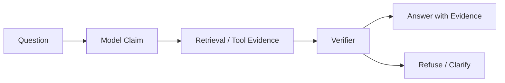

# Model Hallucination

Model hallucination is when an LLM produces confident output that is unsupported, wrong, outdated, or fabricated. In Agent systems, hallucination is dangerous because the next step may act on the generated claim — a "noun hallucination" becomes a "verb hallucination" when the agent calls a tool, updates a record, or approves a decision based on it.

## Definition

Hallucination is not a single failure. It is a family of failures with a shared symptom — output that looks fluent and confident but is not grounded in evidence. Three features help you recognize it:

- **Confidence without grounding**: the model asserts with high linguistic certainty what it cannot verify.
- **Plausibility over correctness**: the output is internally coherent and style-consistent, which makes the error hard to spot.
- **Context sensitivity**: the same prompt can succeed or hallucinate depending on retrieval quality, memory freshness, and tool results.

A practical working definition for engineers: *a claim is hallucinated when a knowledgeable verifier cannot find support for it in the model's available evidence.* This shifts the discussion from philosophy to measurement.

## Why Hallucination Matters (First Principles)

Under the autoregressive training objective, an LLM learns to predict the next token from the training distribution. It has no built-in oracle for truth, no database of current facts, and no attachment to the real world. The model's outputs are *conditionally sampled continuations*, not verified statements. Successfully combined this means:

1. **Language models optimize for fluency, not factuality**: the training signal rewards plausible text, so confidence correlates with style, not truth.
2. **Knowledge is frozen at training cutoff**: anything after the cutoff — new APIs, policies, incidents — is unknowable from parameters alone.
3. **Context is only as good as its retrieval**: the model cannot tell the difference between a fact and a "fact" that was fed to it.
4. **Uncertainty is compressed**: next-token probabilities do not expose "I do not know" in a usable form; the model says something fluent instead.

In Agent systems these four properties combine with action-taking. The model's job is no longer to produce a text that might be right; it is to produce a claim that the system will act on. That is why hallucination moves from a quality problem to a safety problem.

## Types of Hallucination

| Type | Description | Example |
| --- | --- | --- |
| Factual hallucination | Wrong fact or invented detail | Claims a policy exists when it does not |
| Source hallucination | Fabricated citation or evidence | Cites a nonexistent document |
| Overconfidence | States uncertainty as certainty | Says "the rollback definitely succeeded" |
| Stale knowledge | Uses outdated model knowledge | Answers with old API behavior |
| Tool hallucination | Misreads or ignores tool result | Claims tool failure when tool succeeded |
| Plan hallucination | Plans impossible next steps | Calls a tool that is not available |

The most dangerous class for agents is not the most common one. Factual hallucinations are caught by humans; **tool and plan hallucinations** are caught by panels of logs after the action already happened.

## Why Agents Amplify Hallucination

A normal chat answer can mislead the user. An Agent can mislead the user and then take action.

High-risk cases:

- Writing a document with fabricated citations.
- Calling a tool based on an invented policy.
- Trusting stale memory as current fact.
- Treating model confidence as authorization.
- Summarizing tool output with extra invented details.

Each of these has the same structure: a plausible claim enters the loop, an action gate misses it, and the state of the world changes. In a chat product the blast radius is one user's belief; in an agent product the blast radius is the surrounding system.

## Architecture Map

The verifier is not a second LLM that "double-checks" the first one. It is a policy boundary that answers three questions per claim: Is this claim supported by cited evidence? Does the evidence exist and match the claim? Is the action safe if the claim is wrong?

## Mitigations

- Use retrieval for private, current, or factual claims.
- Require citations for evidence-heavy answers.
- Verify generated claims before irreversible actions.
- Keep model confidence separate from tool success.
- Add refusal paths when evidence is missing.
- Log prompt, retrieved context, tool output, model claim, and final answer.
- Build evals for hallucinated facts, missing citations, stale facts, and unsupported recommendations.

## Key Trade-offs

| Trade-off | Lean this way | Watch out for |
| --- | --- | --- |
| Grounding vs. latency | Ground before acting | Every retrieval hop adds cost and delay |
| Strict verification vs. helpfulness | Strict on irreversible actions | Over-refusal frustrates users on low-risk queries |
| Freshness vs. stability | Fresh for facts, stable for procedures | Auto-refresh can flip correct answers |
| Confidence access vs. usability | Expose confidence to engineers | Users should rarely see raw scores |
| Eval coverage vs. eval cost | Cover action paths first | Eval breadth without golden sources is noisy |

## What To Ask in Review

- Which claims are factual and need evidence?
- Can the system refuse instead of guessing?
- Are citations checked against real retrieved sources?
- Does the verifier block unsupported claims before action?
- Is stale memory handled differently from verified facts?

## Production Notes

- Track hallucination as a failure class in postmortems.
- Add regression prompts for every hallucination incident.
- Prefer refusal or clarification over confident guesswork.
- Make evidence freshness visible in the final answer.
- Keep a per-claim evidence link in the trace so support can be verified after the run.
- Treat "the model said so" as a code smell in incident reviews: the fix is usually a gate, not a prompt.

## Deep Dive: Evaluating Hallucination

Hallucination evaluation should measure unsupported claims, not fluent-sounding answers. Useful categories are factuality, citation correctness, abstention, overstatement, tool misuse, and stale knowledge.

A minimal eval set should include questions with clear evidence, missing evidence, stale sources, contradictory sources, tool-result cases, and safety-sensitive cases. Score whether the answer cited the right source, avoided unsupported claims, refused when evidence was absent, changed when tool evidence changed, and blocked unsafe action.

Two practical eval techniques:

- **Negative tests**: deliberately give the model a query with no supporting evidence, and check that it refuses instead of inventing.
- **Evidence-injection tests**: change the retrieved source between two runs and verify the answer tracks the new source, killing stale-knowledge regressions.

## Grounding Patterns

Grounding is the family of techniques that bind model claims to evidence. Applied in order of leverage:

1. **Retrieval grounding**: the agent must answer factual questions from retrieved documents, not from the model's memory. The citation is the unit of grounding.
2. **Tool-result grounding**: the agent must build claims about system state on tool results, and re-fetch when state is expected to have changed. Tool output is fresher than any memory.
3. **Memory grounding**: durable facts are read from the memory store and written back only when verified. Memory is evidence with a timestamp and an owner.
4. **Structural grounding**: claims that must be machine-readable — JSON fields, command parameters, policy names — are validated against a schema rather than trusted from free text.
5. **Human-in-the-loop grounding**: for irreversible actions, the human confirms the claim before execution. This is the most expensive grounding and therefore reserved for the tail of the risk distribution.

A useful heuristic: **if a claim would be embarrassing when wrong, it needs a citation; if it would be dangerous when wrong, it needs a gate.** The same claim can be both.

## Hallucination and Memory Interaction

Memory is a double-edged sword for hallucination.

- **Freshness race**: a fact stored yesterday can be outdated today. The memory read path must resolve timestamps, and the answer must prefer the freshest evidence.
- **Source contamination**: when retrieved context includes both memory and documents, the model cannot always tell which is which. Provenance metadata — "this came from memory, owner X, updated on Y" — must be attached before the model sees the context.
- **Feedback loops**: if the agent writes its own generated claims into memory, a single hallucination can be re-read and re-quoted forever. Never persist an unverified model claim as a durable fact; persist the evidence, not the claim.
- **Forgetting as a feature**: memory that never forgets accelerates stale-knowledge hallucination. Expiry, decay, and conflict resolution are grounding tools, not data-management chores.

## Hallucination and Tool Output

Tool results are the strongest evidence an agent has, but only if the agent actually reads them:

- Parse tool results into structured fields; free-text summary is where invented details enter.
- Detect "no result" states explicitly: an empty search should produce "no evidence found", not a confident paraphrase of nothing.
- Compare model's claims against tool payloads in the verifier; the payload is the ground truth, the model's description of it is not.
- Log tool payloads alongside claims so a "tool hallucination" incident has a replayable diff.

## Incident Walkthrough: The Invented Policy

Scenario: a user asks an agent to create an expense report. The agent needs an approval policy. The relevant policy was updated last month, but the agent's memory still holds the old one.

1. The planner routes to "read policy from memory" because the memory read is cheapest.
2. The policy claim enters the context without a fresh retrieval; the verifier finds no citing document.
3. The expense report is created under the old policy, and the approval step fails in the downstream system.
4. Postmortem finds: stale memory had no timestamp check, and the evidence gate only checked "is there a citation?", not "is the citation newer than the claim?".
5. Fix: add a freshness check to the evidence gate and a re-fetch rule for policy-class claims.

This pattern — a claim that is true in the system's memory but false in the world — is the most common action-hallucination root cause in production.

## Hallucination and Action

The worst Agent hallucinations are hallucinations that trigger actions: calling a tool because the model believed it existed, updating a ticket with fabricated details, writing invented citations, or approving a risky action based on invented policy. These need action gates: schema validation, permission checks, evidence verification, human approval for irreversible steps, and regression evals.

A gate chain works best when each gate is cheap to check and fail-closed:

1. **Schema gate** rejects tool arguments that do not match the contract.
2. **Permission gate** rejects tools the principal is not allowed to call.
3. **Evidence gate** rejects claims with no citing source in the retrieved context.
4. **Precedent check** rejects destructive actions when the same action succeeded differently in the past.
5. **Human approval** remains the last resort for irreversible or high-cost actions.

## Relationship to Neighboring Concepts

- Hallucination is the failure mode that [`agent-system-blueprint.md`](agent-system-blueprint.md) manages with non-goals and gates.
- RAG mitigates knowledge-cutoff hallucinations; see [`rag-memory-mcp-flow.md`](rag-memory-mcp-flow.md).
- Memory stores durable facts, which is exactly where stale-knowledge hallucinations hide; see [`long-term-memory.md`](long-term-memory.md).
- Tool and MCP surfaces define what "calling a nonexistent tool" even means; see [`mcp.md`](mcp.md).
- Evaluation and observability provide the evidence chain; see [`../production/evals-checklist.md`](../production/evals-checklist.md).

## Self-Check Questions

1. **Q: What distinguishes a text hallucination from an action hallucination?**
   A: A text hallucination misleads a reader; an action hallucination changes system state, such as calling a tool that does not exist or approving based on invented policy. Action hallucinations need gates, not just better prompts.

2. **Q: Why does confidence in the text not predict correctness?**
   A: The model was trained to produce fluent continuations, not to estimate truth. Confidence correlates with style and distribution, which is why "the rollback definitely succeeded" can be confidently wrong.

3. **Q: What is the minimal eval set for hallucination?**
   A: One case per category: clear evidence, missing evidence, stale sources, contradictory sources, tool-result cases, and safety-sensitive cases. Each case must have a known golden source to compare against.

4. **Q: Why is the verifier a policy boundary rather than a second LLM?**
   A: A second LLM that "double-checks" reproduces the same fluency bias. A verifier is a deterministic policy that checks evidence identifiers, matches claims to sources, and rejects ungrounded actions — it blocks claims, not opinions.

5. **Q: When must hallucination handling switch from refusal to enforced action gates?**
   A: When the claim can trigger an irreversible action. Refusal is enough for answers; schema, permission, evidence, and human-approval gates are required for actions.

## Sources

- Ragas hallucination guide: https://docs.ragas.io/en/v0.1.21/concepts/hallucinations/
- Ragas FAQ on hallucinations: https://docs.ragas.io/en/latest/faq/faq.html
