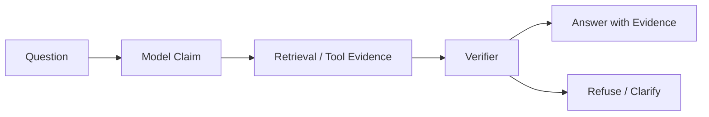

# Model Hallucination

Model hallucination is when an LLM produces confident output that is unsupported, wrong, outdated, or fabricated. In Agent systems, hallucination is dangerous because the next step may act on the generated claim.

## Types

| Type | Description | Example |
| --- | --- | --- |
| Factual hallucination | Wrong fact or invented detail | Claims a policy exists when it does not |
| Source hallucination | Fabricated citation or evidence | Cites a nonexistent document |
| Overconfidence | States uncertainty as certainty | Says “the rollback definitely succeeded” |
| Stale knowledge | Uses outdated model knowledge | Answers with old API behavior |
| Tool hallucination | Misreads or ignores tool result | Claims tool failure when tool succeeded |
| Plan hallucination | Plans impossible next steps | Calls a tool that is not available |

## Why Agents Amplify Hallucination

A normal chat answer can mislead the user. An Agent can mislead the user and then take action.

High-risk cases:

- Writing a document with fabricated citations.
- Calling a tool based on an invented policy.
- Trusting stale memory as current fact.
- Treating model confidence as authorization.
- Summarizing tool output with extra invented details.

## Mitigations

- Use retrieval for private, current, or factual claims.
- Require citations for evidence-heavy answers.
- Verify generated claims before irreversible actions.
- Keep model confidence separate from tool success.
- Add refusal paths when evidence is missing.
- Log prompt, retrieved context, tool output, model claim, and final answer.
- Build evals for hallucinated facts, missing citations, stale facts, and unsupported recommendations.

## What To Ask in Review

- Which claims are factual and need evidence?
- Can the system refuse instead of guessing?
- Are citations checked against real retrieved sources?
- Does the verifier block unsupported claims before action?
- Is stale memory handled differently from verified facts?

## Production Notes

- Track hallucination as a failure class in postmortems.
- Add regression prompts for every hallucination incident.
- Prefer refusal or clarification over confident guesswork.
- Make evidence freshness visible in the final answer.
