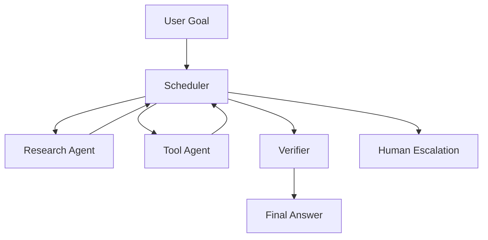

# Multi-Agent Scheduling

Multi-agent scheduling is the decision layer that decides which agents run, in what order, with what inputs, and when work should stop.

## What Scheduling Solves

Scheduling turns a set of specialized agents into a controlled workflow. It answers:

- Which agent owns the task?
- Which agents can run in parallel?
- Which agent must verify before the final answer?
- When should a worker retry, stop, or escalate?
- How do we avoid hidden loops and duplicated work?

## Common Topologies

| Topology | Use When | Watch Out For |
| --- | --- | --- |
| Supervisor | One coordinator should own routing and state | Supervisor becomes a black box |
| Pipeline | Stages are fixed: plan, retrieve, draft, verify | Stage failures are invisible |
| Handoff | Agents specialize and pass control | No stop condition |
| Parallel fan-out | Tasks can be decomposed safely | Merge conflicts and duplicated cost |
| Human route | Risky or irreversible actions | Approval becomes a formality |

## Scheduler Inputs

A scheduler should use more than model preference:

- Task type and risk level.
- Available tools and permissions.
- Evidence freshness.
- Budget: time, tokens, API calls.
- Current confidence and missing information.
- Safety policy and human approval rules.

## Scheduler Outputs

- Agent assignment.
- Input bundle for that agent.
- Allowed tools.
- Stop condition.
- Verification requirement.
- Audit event.

## When Not to Use Multi-Agent

Use a single agent with tools unless multi-agent improves isolation, verification, or clarity. Multi-agent adds coordination cost, hidden state, and debugging surface.

## Failure Modes

- Agent A and B both write to the same shared state.
- The supervisor loses the original user goal.
- The verifier accepts weak evidence.
- Parallel agents produce conflicting answers.
- The system loops because no maximum depth exists.
- Human approval is bypassed for destructive actions.

## Evaluation Checklist

- Can each agent’s responsibility be explained?
- Can the scheduler be replayed from logs?
- Does every worker have a stop condition?
- Does every evidence-heavy answer have a verifier?
- Are costs bounded?

## Deep Dive: Production Multi-Agent Patterns

Production multi-agent systems are explicit control graphs, not many LLMs talking loosely. Use a supervisor/router, sequential pipeline, hierarchical team, handoff, parallel fan-out/fan-in, or human route only when the topology improves isolation, verification, or clarity.

Separate planning, execution, verification, and governance. The scheduler should own routing and state. Worker agents should keep narrow responsibilities. Verifier output should be treated as evidence, not authority.

For each worker, define what state it may read, what state it may write, what evidence it must return, what it may not infer, and what happens on conflict.

## State and Context Isolation

Use global task state owned by the supervisor. Keep worker scratch notes local. Write durable facts only through explicit tools. Store human approval as an audit event.

For every run, log the original goal, scheduler decision, selected agent, allowed tools, tool results, verifier decision, final answer, cost, latency, retry count, and escalation.

## Sources

- NVIDIA 12-Factor Agents: https://developer.nvidia.com/blog/12-factor-agents-a-cto-s-guide-to-production-ready-multi-agent-ai-systems/
- Microsoft Azure Build multi-agentic systems with Azure AI Agent Service: https://learn.microsoft.com/en-us/azure/foundry/concepts/azure-ai-agent-service-multi-agent-build
