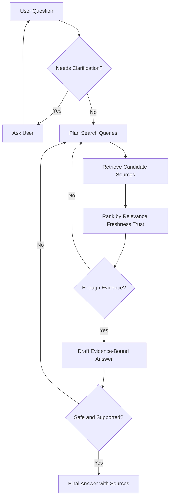

# Multi-Round Research and Discussion Flow

Multi-round research means the Agent plans several evidence-gathering rounds before answering. Multi-round discussion means the Agent can ask for clarification, challenge weak evidence, and stop when enough is known.

This flow is common in Agent tutorials and production systems because most real questions are not fully answerable from the first prompt.

## Why Multi-Round Matters

Single-pass answers fail when the question is ambiguous, the first retrieval misses the key source, the evidence is stale, or the final answer would require a risky action.

Multi-round behavior adds structure:

- Clarify the request.
- Search with more than one query shape.
- Rank and compare sources.
- Decide whether to answer, search again, ask the user, or refuse.
- Explain the final evidence boundary.

## Reference Flow



## Core Concepts

### Query Planning

Query planning turns one vague user request into several evidence-seeking queries.

Examples:

- Original: “How should we choose an Agent framework?”
- Planned queries: “framework selection criteria”, “framework version freshness”, “framework failure modes”, “framework production observability”.

Good query planning changes the question’s shape instead of repeating the same words.

### Source Selection

Source selection checks whether a result contains the evidence needed for the final claim.

Useful dimensions:

- Relevance: does it answer the actual question?
- Freshness: is it current for a moving framework or API?
- Trust: is the source authoritative for the claim?
- Scope: does it match the user’s context and permissions?

### Discussion Rounds

A discussion round can be one of these actions:

- Search more.
- Ask the user.
- Refuse weak evidence.
- Draft an answer.
- Verify the answer.
- Stop and cite the evidence.

### Convergence

The Agent should stop when:

- Required evidence is present.
- The answer is within scope.
- Stale or conflicting claims are called out.
- A next action is clear.
- The user has enough evidence to decide.

It should not stop just because the model feels confident.

## Local Lab

See the deterministic implementation:

- [`../../labs/l3/multi_round_research_discussion/README.md`](../../../labs/l3/multi_round_research_discussion/README.md)

Run it with:

```bash
python -m unittest labs.l3.multi_round_research_discussion.test_lab
```

## Production Notes

For production systems, add:

- Trace every query and source decision.
- Record why a source was rejected.
- Store clarification history separately from long-term memory.
- Evaluate whether asking the user improved the answer.
- Track how many rounds were needed and whether they reduced latency too much.

## Common Mistakes

- Searching the same phrase five times.
- Treating a high relevance score as proof.
- Ignoring freshness for framework and API topics.
- Answering with synthesized confidence before evidence is sufficient.
- Asking too many clarification questions when the question is already specific.
