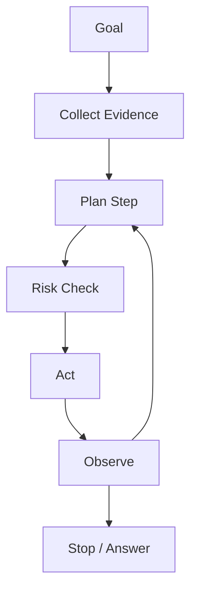

# Plan and Decision Making

Planning is the Agent decision layer: choosing the next step, assigning tools or agents, and deciding when to stop.

## Planning vs Acting

Planning says what should happen next. Acting performs a specific step.

- Plan: retrieve policy, then verify rollback path.
- Act: call `read_policy(policy_id="...")`.

Good systems keep these separate so plans can be inspected before side effects happen.

## Decision Inputs

A plan should consider:

- User goal and constraints.
- Evidence available so far.
- Tool availability and permissions.
- Risk and reversibility.
- Budget: tokens, latency, API calls.
- Stop conditions.

## Decision Outputs

A decision should produce:

- Next action.
- Reason for the action.
- Expected evidence.
- Risk level.
- Stop condition.
- Fallback if the action fails.

## Decision Types

| Decision | Question | Safe Default |
| --- | --- | --- |
| Clarify | Is the goal ambiguous? | Ask before acting |
| Retrieve | Is current/private evidence needed? | Use RAG before claiming |
| Tool call | Is an external action needed? | Validate and audit |
| Delegate | Does another agent own this step? | Use scheduler contract |
| Verify | Is the claim evidence-heavy? | Add verifier |
| Stop | Is the answer ready? | Stop when evidence is enough |

## Common Planning Failures

- The plan repeats the same failed tool call.
- The plan confuses a recommendation with permission.
- The plan skips verification for an important claim.
- The plan hides uncertainty.
- The plan has no maximum depth or budget.
- The plan executes irreversible steps without human confirmation.

## Review Questions

1. Why was this next action chosen?
2. What evidence does it expect?
3. What happens if it fails?
4. What is the stop condition?
5. Should this step be verified or human-approved first?
