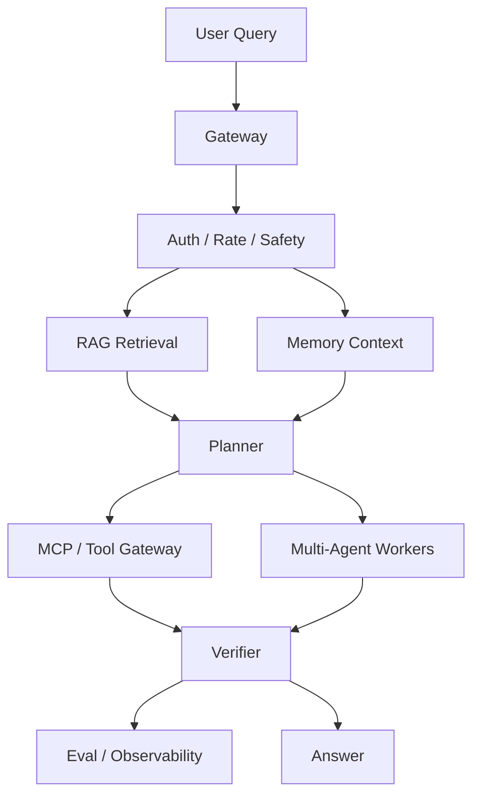

# RAG, Memory, Multi-Agent, and MCP Flow

A production Agent system usually combines multiple subsystems. Understanding the data flow matters more than naming the framework.

## Flow

1. User query enters the gateway.
2. Gateway checks auth, rate, and safety.
3. RAG retrieves relevant documents for the current task.
4. Memory provides durable user, task, or organizational context.
5. Planner chooses the right tool, subagent, or answer path.
6. MCP or tool gateway exposes tools and external data sources.
7. Multi-agent components decompose, verify, or specialize work.
8. Evaluation and observability record quality, latency, cost, and safety signals.

## Data Ownership

| Source | Owns | Risk | Correct Question |
| --- | --- | --- | --- |
| RAG | Retrieved evidence for the current question | Stale or irrelevant documents | Did retrieval return the source needed for this query? |
| Memory | Durable user or task context | Privacy, stale facts, overgeneralization | Should this fact be stored, deleted, or forgotten? |
| Tool gateway | External actions and state | Permission mistakes, side effects | Is this read, write, or destructive? |
| Planner | Step selection and routing | Wrong route, loops, overconfidence | Is the next step the smallest useful step? |
| Observability | Trace, cost, latency, errors | Incomplete trace, missing fields | Can the incident be reproduced from the trace? |

## Design Rules

- Keep retrieval scoped to the question.
- Treat memory as privacy-sensitive.
- Make subagent responsibilities explicit.
- Log tool inputs and outputs carefully.
- Use eval sets to catch regressions.
- Separate evidence from generated text.
- Do not let final answers hide missing sources.
- Prefer tool gateways that enforce permissions at execution time.
- Treat subagent output as evidence that may need verification.

## Failure Triage

When the answer is wrong, check in this order:

1. Did the user request have enough information?
2. Did retrieval return the right source?
3. Did memory introduce stale or private context?
4. Did the planner choose the right path?
5. Did the tool execute the right action?
6. Did verification catch the error before the answer?
7. Is the trace complete enough to reproduce it?

## System Design Checklist

- Can the system refuse?
- Can it cite evidence?
- Can it call tools safely?
- Can it separate read-only from write actions?
- Can it detect stale facts?
- Can it escalate to a human?
- Can it rollback or disable a risky path?
- Can each subsystem be evaluated independently?
