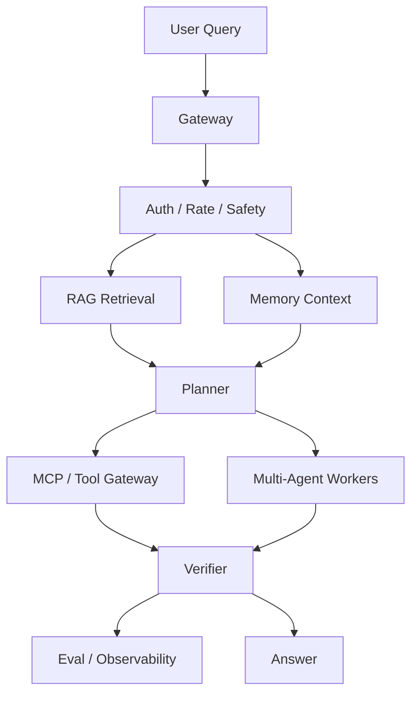

# RAG, Memory, Multi-Agent, and MCP Flow

A production Agent system usually combines multiple subsystems. Understanding the data flow matters more than naming the framework. RAG, memory, multi-agent orchestration, and MCP are not competing options; they are different storage and routing layers of one system, and their behavior is defined by how data moves between them.

## Definition

Each subsystem answers one question:

- **RAG** answers: *where does current, factual evidence live?* It retrieves documents at query time and grounds answers in sources.
- **Memory** answers: *what do we know about this user, task, or organization over time?* It persists durable context across sessions.
- **Multi-agent orchestration** answers: *who does this piece of work?* It decides between a single loop, parallel workers, a supervisor, or a verifier.
- **MCP (Model Context Protocol)** answers: *how do we expose tools and data sources safely?* It standardizes the tool server interface, permissions, and discovery.

The data flow — not the components — is the system's contract. If the flow is wrong, adding better components only makes the failure faster.

## Flow

1. User query enters the gateway.
2. Gateway checks auth, rate, and safety.
3. RAG retrieves relevant documents for the current task.
4. Memory provides durable user, task, or organizational context.
5. Planner chooses the right tool, subagent, or answer path.
6. MCP or tool gateway exposes tools and external data sources.
7. Multi-agent components decompose, verify, or specialize work.
8. Evaluation and observability record quality, latency, cost, and safety signals.

## Why the Flow Matters (First Principles)

The control loop has three sources of value and three sources of failure, and failure respects the order of the flow:

1. **Evidence beats memory, memory beats guessing**: a freshly retrieved document should outrank a stale memory should outrank a model's mental model.
2. **Permission must be enforced at execution**: what the planner intends means nothing if the tool gateway does not check permissions when the call happens.
3. **Verification is the last chance before the world changes**: after the verifier, the answer becomes an actuator input; errors that reached this point are either in the answer or in the action.

The failure order matters: if retrieval is wrong, everything downstream — plan, tools, answer — inherits the error. That is why production triage checks the flow in order, top to bottom.

## Data Ownership

| Source | Owns | Risk | Correct Question |
| --- | --- | --- | --- |
| RAG | Retrieved evidence for the current question | Stale or irrelevant documents | Did retrieval return the source needed for this query? |
| Memory | Durable user or task context | Privacy, stale facts, overgeneralization | Should this fact be stored, deleted, or forgotten? |
| Tool gateway | External actions and state | Permission mistakes, side effects | Is this read, write, or destructive? |
| Planner | Step selection and routing | Wrong route, loops, overconfidence | Is the next step the smallest useful step? |
| Observability | Trace, cost, latency, errors | Incomplete trace, missing fields | Can the incident be reproduced from the trace? |

## Design Rules

- Keep retrieval scoped to the question.
- Treat memory as privacy-sensitive.
- Make subagent responsibilities explicit.
- Log tool inputs and outputs carefully.
- Use eval sets to catch regressions.
- Separate evidence from generated text.
- Do not let final answers hide missing sources.
- Prefer tool gateways that enforce permissions at execution time.
- Treat subagent output as evidence that may need verification.

## Key Trade-offs

| Trade-off | Lean this way | Watch out for |
| --- | --- | --- |
| RAG breadth vs. precision | Narrow retrieval for the question | Broad retrieval drowns the answer in noise |
| Memory persistence vs. privacy | Keep less, delete more | Every stored fact is a future privacy event |
| One planner vs. many agents | One first | Multi-agent complexity needs evidence of value |
| Tool protocol compliance vs. speed | Compliant first | Custom protocols reinvent MCP poorly |
| Verification depth vs. latency | Verify actions, sample answers | Full verification on every answer can be too slow |

## MCP in the Flow

MCP sits between the planner and the tools. It solves three problems every naive tool integration hits:

- **Standardized interface**: one client protocol for many servers, instead of N custom SDKs bolted into the agent loop.
- **Boundary enforcement**: the server, not the model, owns the tool contract — parameters, validation, and failure modes are defined where the tool lives.
- **Operational control**: tools are versioned, listed, and rate-limited outside the prompt, so the team can change the surface without editing a prompt.

The flow implication: MCP does not make a tool safe. It makes the surface inspectable, and inspectability is the precondition for permission checks, auditing, and evals.

## Multi-Agent Components in the Flow

Multi-agent orchestration is not a style choice; it is a routing decision with strict conditions. Use decomposition when:

- The task has clearly separable sub-tasks with their own tools.
- Parallel workers reduce wall-clock latency more than they add coordination overhead.
- A verifier or reviewer must be independent of the producer.
- The work needs distinct skill models or specialized contexts.

Avoid multi-agent orchestration when: the task is a single loop, the decomposition is invented, or the coordination — message passing, state sharing, error propagation — costs more than the parallelism saves. A supervisor that only forwards messages is a latency tax, not an architecture.

## Failure Triage

When the answer is wrong, check in this order:

1. Did the user request have enough information?
2. Did retrieval return the right source?
3. Did memory introduce stale or private context?
4. Did the planner choose the right path?
5. Did the tool execute the right action?
6. Did verification catch the error before the answer?
7. Is the trace complete enough to reproduce it?

## Production Practices

- Give every subsystem its own eval set and metric, so a regression can be localized to the layer that caused it.
- Trace flow markers across the layers: retrieval id, memory read id, tool call id, agent id — joined into one request trace.
- Version the retrieval index and the tool surface independently; rollbacks then have a per-layer target.
- Store retrieval and tool payloads for a retention window so postmortems can replay the exact inputs.
- Run a synthetic "poison the source" test: make one source stale and confirm the system stops trusting it.
- Alert on flow-level invariants — evidence freshness, permission denials, unanswered retrieval — not just on answer-level accuracy.

## Relationship to Neighboring Concepts

- The flow is the runtime view of the [`agent-system-blueprint.md`](agent-system-blueprint.md) architecture map.
- Hallucination is the failure mode the flow's verifier exists to catch; see [`model-hallucination.md`](model-hallucination.md).
- Memory as a subsystem has its own lifecycle; see [`long-term-memory.md`](long-term-memory.md).
- MCP's protocol details live in [`mcp.md`](mcp.md); the planner's decision details live in [`plan-decision-making.md`](plan-decision-making.md).
- Multi-agent routing details are covered in [`multi-agent-scheduling.md`](multi-agent-scheduling.md).

## System Design Checklist

- Can the system refuse?
- Can it cite evidence?
- Can it call tools safely?
- Can it separate read-only from write actions?
- Can it detect stale facts?
- Can it escalate to a human?
- Can it rollback or disable a risky path?
- Can each subsystem be evaluated independently?

## Self-Check Questions

1. **Q: Why is the data flow more important than the component choices?**
   A: The flow defines precedence and failure propagation: evidence beats memory, permission is enforced at execution, and verification happens before the world changes. Components are only good at their position in a correct flow.

2. **Q: What does MCP actually add to the flow?**
   A: It standardizes the tool server interface and gives operational control — versioning, listing, rate limits — outside the prompt. It does not make tools safe; it makes the surface inspectable enough to enforce safety.

3. **Q: When should multi-agent decomposition be avoided?**
   A: When the task is a single loop, the decomposition is invented, or coordination overhead exceeds the parallelism savings. A supervisor that only forwards messages is a latency tax.

4. **Q: Why must permissions be enforced at execution time?**
   A: Because planning intent is not a permission decision. The tool gateway is the only place where the actual call, the principal, and the current policy meet; a check in the prompt is advisory, a check in the gateway is enforced.

5. **Q: What is the first thing to check in failure triage, and why?**
   A: Whether the user request had enough information. Every downstream artifact inherits errors from upstream; if the request itself was ambiguous or incomplete, no subsystem can fix it.
