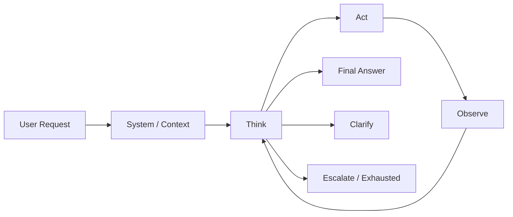
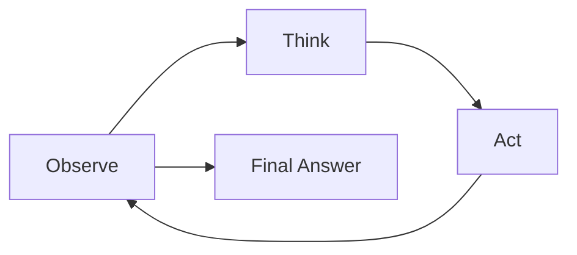
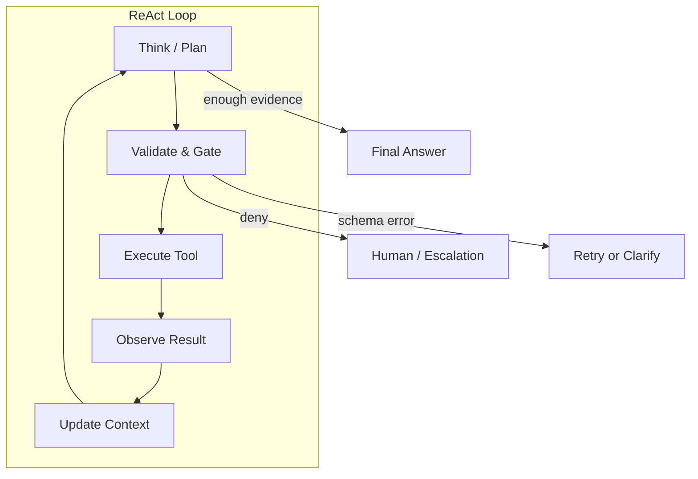

# ReAct Pattern

ReAct (Reasoning + Acting) interleaves reasoning traces with tool actions: the model first reasons about the current state, then acts, then observes, then reasons again. It is one of the most useful patterns to learn first because it exposes the moving parts of an Agent — context, planning, tool use, observation, and stop conditions — without requiring a framework.

## Basic Definition

A ReAct loop is a finite repetition of three steps:

1. **Reason** — the model explains what it knows, what it needs, and what to try next.
2. **Act** — the system executes one validated tool call on the model's behalf.
3. **Observe** — the tool result is returned to the loop as new evidence.

The loop ends when the model produces a final answer, when the request is ambiguous, when a step is unsafe, or when a resource budget is exhausted.



## Why It Matters: First Principles

The design follows from one fact: a model is not an executor, it is a proposer. The model cannot verify its own claims, cannot know which tools exist, and cannot enforce permissions. Something outside the model — the loop — must connect reasoning to the world and back.

Three consequences follow:

- **Truth is built, not asserted.** A claim becomes reliable only after evidence from tools or retrieval supports it.
- **Control lives outside the model.** The system decides what context enters, which actions are allowed, and when to stop.
- **Every loop needs termination and audit.** Without limits, loops burn tokens; without logs, failures cannot be reproduced.

These principles also explain why ReAct belongs before frameworks in a curriculum: the loop is the skeleton, and every framework is just a managed version of the same skeleton.

## Minimal Loop

1. Observe current state.
2. Think about the next step.
3. Call a tool if needed.
4. Observe tool result.
5. Repeat until the answer is complete, ambiguous, unsafe, or exhausted.



## Pseudocode

```python
state = observe(user_request)
for step in range(max_steps):
    thought, action = think(state)
    if action == "answer":
        return thought.answer
    observation = call_tool(action)
    state = update(state, observation)
return clarify_or_escalate(state)
```

A production variant separates reasoning from tool selection so the loop can be tested and gated:

```python
for step in range(max_steps):
    thought = reason(state, history)
    next_action = choose_action(thought, available_tools)  # validated by the system
    if next_action.kind == "answer":
        return next_action.content
    observation = execute_tool(next_action)               # schema-validated, permission-checked
    history.append((next_action, observation))
```

## What ReAct Makes Explicit

- The model does not directly control everything; the system does.
- Tool results are observations, not truth.
- The loop needs stop conditions.
- Failed or ambiguous actions should change the plan.
- The final answer should be produced only when evidence is sufficient.

## Architecture and Data Flow



| Component | Responsibility | Example |
| --- | --- | --- |
| Context builder | Decides what enters the prompt | current task, history, retrieved docs |
| Reasoner | Produces next step or final answer | the LLM |
| Action validator | Checks schema, permissions, safety | JSON Schema + allowlist |
| Executor | Runs the tool | function call, MCP server |
| Observer | Normalizes tool output into context | truncate, summarize, tag |
| Loop controller | Enforces limits and stop rules | max steps, token budget, deadline |

## Trade-offs

| Trade-off | ReAct | Alternative |
| --- | --- | --- |
| Debuggability | High: every step is a readable thought + action | Black-box chain-of-thought (no actions) |
| Tool coupling | Low: tools plug into a simple loop | Framework-internal abstractions |
| Efficiency | Lower: reasoning tokens per step add up | Plan-then-execute runs one plan, then actions |
| Latency | Higher: serial reasoning + tool calls | Parallel tool fan-out (multi-agent or batch) |
| Complexity | Minimal: no planner, no subagents | Hierarchical planners, supervisor graphs |
| Failure mode | Loops, repeated mistakes | Stale plans, rigid sub-tasks |

The practical rule: ReAct is right when tasks are small, tools are few, and debuggability matters more than token cost. Add planning or multi-agent structure only when ReAct loops become too long, too costly, or too repetitive.

## Stop Conditions

A ReAct loop should stop when:

- The answer is ready.
- The user request is ambiguous.
- The tool call is unsafe.
- The same tool fails repeatedly.
- The step limit is reached.
- Required evidence is missing.

## Tool Design for the Loop

Tools are the loop's senses and hands, so their quality decides loop quality:

- Keep each tool small: one clear action, typed inputs, explicit outputs.
- Make errors machine-readable: `{"ok": false, "error": "...", "code": 404}` instead of prose.
- Return empty results explicitly (`no results`) so the model does not invent content.
- Never put secrets or credentials in tool descriptions.
- Distinguish "not found" from "not permitted" in outputs.

## Common Mistakes

- Letting the model call tools without schema validation.
- Treating empty tool result as successful completion.
- No max-step limit.
- Keeping reasoning hidden and impossible to audit.
- Adding memory without knowing what belongs there.
- Looping on the same failed tool instead of switching strategy.
- Emitting long tool outputs that crowd out the original task.

## Production Notes

For production ReAct systems:

- Log every thought/action pair.
- Emit tool call IDs.
- Enforce per-tool permissions.
- Track token and latency cost per step.
- Add regression evals for loop failures.
- Set per-request budgets: max steps, max tokens, wall-clock deadline.
- Always include the original user request in the context for every step.
- Truncate or summarize tool results before re-entering the prompt.

```python
# Minimal production guard: stop conditions and budgets
def run_loop(user_request, tools, *, max_steps=8, max_tokens=4000, deadline=None):
    history = []
    for step in range(max_steps):
        if elapsed(deadline): return escalate("deadline exceeded")
        thought = reason(user_request, history, tokens_left=max_tokens)
        if thought.is_answer(): return finalize(thought)
        action = validate_schema(thought.action, tools)
        if not action.valid: return clarify(history)
        if not authorize(action): return deny(action)
        observation = execute(action, timeout=30)
        history.append((action, observation))
    return escalate("step limit reached")
```


## Worked Example: A Small Tool Set

A minimal production loop with three tools — search, read, and answer — shows how the pieces fit.

```python
import json
from dataclasses import dataclass

@dataclass
class Tool:
    name: str
    schema: dict
    fn: callable

def search_docs(query: str) -> str:
    # Real implementation queries an index; kept simple for the example.
    return json.dumps({"ok": True, "results": ["refund-policy.md", "faq-refund.md"]})

def read_file(path: str) -> str:
    return json.dumps({"ok": True, "content": "Refunds are processed within 5 business days."})

TOOLS = {
    "search_docs": Tool("search_docs", {"type": "object", "properties": {"query": {"type": "string"}}}, search_docs),
    "read_file": Tool("read_file", {"type": "object", "properties": {"path": {"type": "string"}}}, read_file),
}

def call_tool(name: str, args: dict):
    tool = TOOLS.get(name)
    if tool is None:
        return {"ok": False, "error": "unknown_tool"}
    if not valid_against_schema(args, tool.schema):
        return {"ok": False, "error": "schema_error"}
    return tool.fn(**args)
```

The loop then alternates thinking and calling `call_tool`, appends each `(action, observation)` pair to `history`, and stops on `answer` or the step budget. This is the entire core of ReAct: everything else — memory, RAG, MCP — plugs into this skeleton as tools or as context.

## Evaluating a ReAct Loop

Evaluate the loop, not just the final answer:

- **Termination:** do loops always stop within the budget across the eval set?
- **Tool selection:** does the model pick the right tool for the stated goal?
- **Argument quality:** are generated arguments schema-valid and correct for the intent?
- **Observation use:** does the final answer cite what tools actually returned?
- **Recovery:** after a tool failure, does the loop retry, switch, or escalate sensibly?
- **Safety:** are denied actions ever bypassed or retried without permission?
- **Cost:** tokens and latency per completed task stay within budget.

A useful regression set includes: normal multi-step task, tool that returns empty results, tool that returns an error, tool that returns contradictory evidence, denied permission, step-limit exhaustion, and a request that is ambiguous from the start.

## Relationship to Neighboring Concepts

- **ReAct ↔ planning:** ReAct is reactive, one step at a time. Plan-then-execute is proactive: plan first, then act, re-planning only on failure. Use ReAct when plans are short; escalate to explicit planning when tasks are long.
- **ReAct ↔ memory:** memory must serve the loop, not replace it. Durable facts enter as context; fresh tool results should override stale memory in observation.
- **ReAct ↔ MCP:** MCP is the standardized boundary through which the loop's actions are executed — tools, resources, prompts, and permission metadata become contracts instead of ad-hoc glue. The ReAct loop consumes MCP tool schemas, and MCP returns observations.
- **ReAct ↔ hallucination:** each observation is a chance to ground claims. Loops that skip verification produce confident but fabricated answers; loops with evidence gates turn reasoning into verified output.
- **ReAct ↔ RAG:** RAG is one tool inside the loop. A retrieval call is just another action whose observation is documents; the same validation and freshness rules apply.
- **ReAct ↔ multi-agent:** ReAct is the leaf pattern. Supervisors, planners, and critics orchestrate ReAct-style workers; each worker still runs a bounded loop.

## Self-Check

1. **Why must tool calls go through schema validation?** — Because the model is a proposer, not an executor. Validation prevents malformed arguments from reaching real systems, and it gives the loop a deterministic gate between thinking and acting.
2. **What should happen when the same tool fails three times?** — Stop retrying that tool, change strategy (different tool, clarify, or escalate), and record the failure for the trace and regression evals.
3. **Is an empty tool result a successful completion?** — No. Empty or missing results must be treated as "no evidence", and the loop must either gather more evidence or answer that it cannot be verified.
4. **What is the difference between a thought and an action?** — A thought is reasoning that is not executed; an action is a validated, permission-checked call. Only actions touch the world and only actions need audit trails.
5. **Why include max-step and token budgets?** — They are the loop's termination guarantees. Without them a looping or overconfident model burns unbounded tokens and delays the user's answer.

## Sources

- ReAct: Synergizing Reasoning and Acting in Language Models: https://arxiv.org/abs/2210.03629
- LangGraph ReAct agent implementation: https://langchain-ai.github.io/langgraph/reference/prebuilt/
