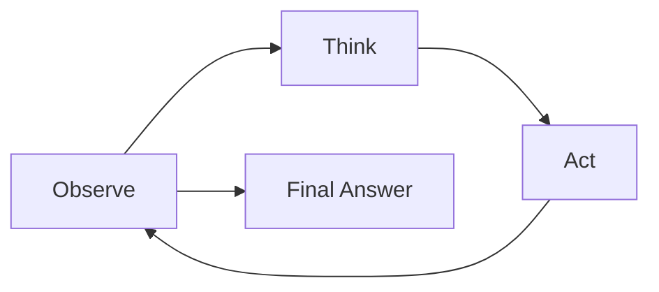

# ReAct Pattern

ReAct interleaves reasoning and action. It is one of the most useful patterns to learn first because it exposes the moving parts of an Agent without requiring a framework.

## Minimal Loop

1. Observe current state.
2. Think about the next step.
3. Call a tool if needed.
4. Observe tool result.
5. Repeat until the answer is complete, ambiguous, unsafe, or exhausted.



## Pseudocode

```python
state = observe(user_request)
for step in range(max_steps):
    thought, action = think(state)
    if action == "answer":
        return thought.answer
    observation = call_tool(action)
    state = update(state, observation)
return clarify_or_escalate(state)
```

## What ReAct Makes Explicit

- The model does not directly control everything; the system does.
- Tool results are observations, not truth.
- The loop needs stop conditions.
- Failed or ambiguous actions should change the plan.
- The final answer should be produced only when evidence is sufficient.

## Trade-offs

- Simple and debuggable.
- Easy to teach without framework APIs.
- Can loop if tool feedback is poor.
- Needs max-step limits.
- Needs validation for tool arguments.
- Works best when tools are small, reliable, and observable.

## Stop Conditions

A ReAct loop should stop when:

- The answer is ready.
- The user request is ambiguous.
- The tool call is unsafe.
- The same tool fails repeatedly.
- The step limit is reached.
- Required evidence is missing.

## Common Mistakes

- Letting the model call tools without schema validation.
- Treating empty tool result as successful completion.
- No max-step limit.
- Keeping reasoning hidden and impossible to audit.
- Adding memory without knowing what belongs there.

## Production Notes

For production ReAct systems:

- Log every thought/action pair.
- Emit tool call IDs.
- Enforce per-tool permissions.
- Track token and latency cost per step.
- Add regression evals for loop failures.
