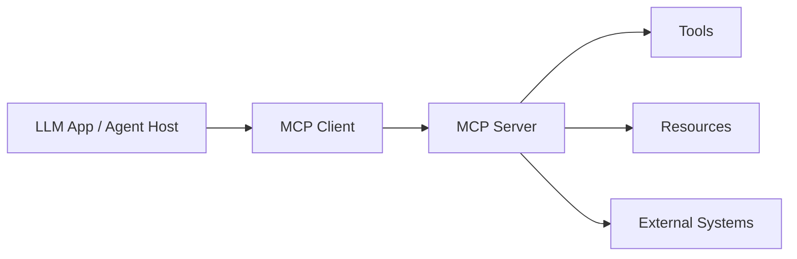

# L2 Single Agent with MCP

## Goal

Build a reliable single Agent that calls tools through a clear MCP-style boundary.

## Prerequisites

- L0 and L1 completed
- Basic understanding of guardrails and tool validation
- No API key required

## Core Ideas

- Tool servers should expose small, typed operations.
- Agents should validate input before calling tools.
- Tool results should be checked before becoming final answers.
- Guardrails should block empty, oversized, or unsafe requests.

## What MCP Actually Is

MCP, or Model Context Protocol, is a standard way for an LLM application to talk to external tools, data sources, and context providers.

In practice, an MCP host is the app that runs the Agent. An MCP client connects to an MCP server. The server exposes capabilities such as:

- tools: actions the Agent can call, such as `search_docs`, `create_ticket`, or `read_file`.
- resources: readable data sources such as files, URLs, or database records.
- prompts: reusable prompt templates offered by the server.
- tool metadata: names, descriptions, input schemas, permissions, and error behavior.



MCP does not make the LLM magically safe. It gives the Agent a cleaner, inspectable boundary for saying:

- what capabilities exist;
- what input a capability expects;
- who may call it;
- what evidence or error came back;
- how to audit the call.

## MCP vs Function Calling

Function calling is a model capability: the model asks for a tool call with a name and JSON arguments.

MCP is a system boundary around those calls.

| Layer | Question It Answers | Example |
| --- | --- | --- |
| Function calling | What tool call should the model request? | `search_docs({"query": "refund policy"})` |
| Tool schema | What are valid arguments? | `query` must be a non-empty string |
| MCP server | What tools or resources are available? | `search_docs`, `read_file`, `policy_index` |
| Tool gateway | Is this call allowed and audited? | actor, tenant, permissions, logs |
| Agent runtime | How should the result affect the next step? | answer, retry, clarify, escalate |

So MCP complements function calling. It does not replace the model, the Agent loop, or production guardrails.

## Why Tool Boundaries Matter

A tool boundary is the place where an Agent asks another system to do work. In an MCP-style design, this boundary should be explicit.

That means:

- the tool name is known;
- the payload shape is known;
- invalid input is rejected early;
- the Agent does not treat tool output as automatically safe.

## The Lab Design

The L2 Lab has three parts:

1. `ToolServer`
2. `Guardrail`
3. `run_single_agent()`

```python
class ToolServer:
    def list_tools(self) -> list[str]:
        return ["search_docs"]

    def call_tool(self, name: str, payload: dict[str, str]) -> str:
        if name != "search_docs":
            raise ValueError(f"Unknown tool: {name}")
        query = payload.get("query", "").strip()
        if not query:
            raise ValueError("query is required")
        return json.dumps({"hits": [f"synthetic result for {query}"]})

class Guardrail:
    def allow(self, query: str) -> bool:
        trimmed = query.strip()
        return bool(trimmed) and len(trimmed) <= 200

def run_single_agent(query: str) -> dict[str, object]:
    guardrail = Guardrail()
    if not guardrail.allow(query):
        return {"ok": False, "reason": "guardrail rejected query"}
    server = ToolServer()
    result = server.call_tool("search_docs", {"query": query.strip()})
    return {"ok": True, "result": result}
```

## Step-by-Step Walkthrough

### 1. Run a valid query

```bash
python - <<'PY'
from labs.l2.single_agent_mcp.agent_top_labs_l2_single_agent_mcp import run_single_agent
print(run_single_agent("agent memory"))
PY
```

Expected output:

```text
{'ok': True, 'result': '{"hits": ["synthetic result for agent memory"]}'}
```

### 2. Run an invalid query

```bash
python - <<'PY'
from labs.l2.single_agent_mcp.agent_top_labs_l2_single_agent_mcp import run_single_agent
print(run_single_agent("   "))
PY
```

Expected output:

```text
{'ok': False, 'reason': 'guardrail rejected query'}
```

### 3. Inspect the tool list

```bash
python - <<'PY'
from labs.l2.single_agent_mcp.agent_top_labs_l2_single_agent_mcp import ToolServer
print(ToolServer().list_tools())
PY
```

Expected output:

```text
['search_docs']
```

### 4. Run the tests

```bash
python -m unittest labs.l2.single_agent_mcp.test_lab
```

Expected result:

```text
Ran 2 tests in 0.00Xs

OK
```

## Why Guardrails Come First

In a real system, bad input can cause:

- expensive model calls;
- incorrect tool calls;
- unsafe external actions;
- confusing logs;
- user-facing failures that are hard to debug.

Putting the guardrail before the tool call makes rejection cheap and predictable.

## What MCP Changes

A real MCP-style server would expose tools through a protocol layer. This Lab keeps the same idea without requiring a network service:

- `list_tools()` describes what is available;
- `call_tool()` is the entry point;
- payload validation happens at the boundary;
- the Agent receives structured tool output.

## Debugging Questions

When a tool call fails, ask:

- Was the tool name allowed?
- Was the payload in the right shape?
- Did the guardrail reject the query too early?
- Was the tool output valid JSON?
- Did the Agent handle the tool result correctly?

## Common Mistakes

- Calling tools without validating input.
- Trusting tool output as final truth.
- Letting unsafe or empty requests reach the tool boundary.
- Mixing protocol concerns with business logic.

## Self-Check

1. Why should the guardrail run before the tool call?
2. What happens if the tool name is unknown?
3. Why is `query.strip()` useful here?
4. What production risk does a tool boundary reduce?
5. How would you extend this to a second tool?

## Related Lab

Read the Lab README: [`../../labs/l2/single_agent_mcp/README.md`](../../labs/l2/single_agent_mcp/README.md).

Run the Lab tests:

```bash
python -m unittest labs.l2.single_agent_mcp.test_lab
```

## Next Step

Continue with [`L3 RAG Memory Observability`](l3-rag-memory-observability.md) to combine retrieval, memory, and traces.

## Interview Questions

Reinforce L2 concepts with the framework and MCP question bank: [`L2 Framework and MCP Questions`](interviews/questions/l2-framework-mcp.md).
