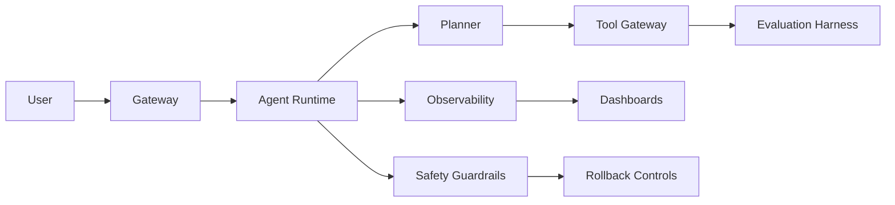

# L4 Production Agent Systems

## Goal

By the end of this tutorial, you will be able to turn an L3 Agent prototype into a production candidate that has evaluation gates, observability, safety controls, rollback paths, and a real postmortem process.

## Why L4 Matters

L0 through L3 prove that a system can work. L4 proves it can survive real traffic: bad inputs, partial tool failures, cost spikes, model changes, and operator mistakes.

A production Agent is not just a smarter prompt. It is a system with ownership, metrics, failure modes, and a way to recover.

## Prerequisites

- L0 through L3 completed.
- You can run the L4 Lab locally.
- You understand evaluation, tracing, and rollback at a conceptual level.
- Python 3.10+.

## Scenario

A customer support Agent can answer questions, call tools, and summarize tickets. In production, it needs to:

1. Reject unsafe or out-of-scope requests.
2. Stay under latency, token, and request-rate limits.
3. Record traces that let engineers reconstruct a failure.
4. Fail safely when the model, retrieval layer, or tool gateway fails.
5. Roll back when quality drops after a release.
6. Learn from incidents instead of hiding them.

## Production Architecture

Use this reference flow:



### Gateway

The gateway owns request boundaries:

- Authentication and authorization.
- Tenant or session identification.
- Rate limiting.
- Input size and content limits.
- Basic prompt-injection detection.

### Agent Runtime

The runtime owns orchestration, but not infrastructure policy:

- Planning and tool routing.
- Memory reads and writes.
- Response generation.
- Retry and fallback policy.
- Structured event emission.

### Tool Gateway

Every tool call should go through a gateway that can:

- Enforce permissions.
- Record request and response summaries.
- Apply timeouts.
- Block destructive actions.
- Replay tool calls for debugging.

### Evaluation Harness

Evals must run before release and after incidents. They should cover:

- Correct answer behavior.
- Refusal behavior.
- Tool selection.
- Failure recovery.
- Cost and latency regressions.

### Observability

Each request should produce a trace with:

- User/session/request identifiers.
- Planner decision.
- Tool calls and outcomes.
- Model version or prompt version.
- Latency and token counts.
- Safety check results.

### Rollback Controls

Rollback is not only reverting code. It may include:

- Reverting a prompt version.
- Disabling a tool path.
- Falling back to a simpler Agent.
- Lowering traffic for a risky feature.
- Freezing memory writes.

## Follow-Along

### Step 1: Review the Production Checklist

Read the checklist in this repository:

- [`production/evals-checklist.md`](production/evals-checklist.md)
- [`production/safety-checklist.md`](production/safety-checklist.md)
- [`production/quarterly-maintenance.md`](production/quarterly-maintenance.md)
- [`production/cost-stability-operations.md`](production/cost-stability-operations.md)

For every checklist item, write one of three values:

- `covered`: there is code, config, or documentation proving coverage.
- `partial`: some coverage exists but gaps remain.
- `missing`: production readiness depends on it and it does not exist.

A practical rule: `partial` is not the same as `covered`.

### Step 2: Run the L4 Lab

From the repository root:

```bash
python -m unittest labs.l4.production_postmortem.test_lab
```

Expected result:

```text
Ran 3 tests in ...
OK
```

This Lab uses a small local data model instead of a real production incident. That is intentional: the goal is to practice the shape of a production postmortem without leaking secrets or depending on a live system.

### Step 3: Understand the Lab Data Model

The Lab represents a postmortem as structured data:

- `summary`: what happened.
- `root_causes`: why it happened.
- `action_items`: concrete follow-ups.
- `rollback_plan`: how to restore safety or availability.
- `evaluation_plan`: what test or eval prevents recurrence.
- `safety_controls`: guardrails added or enforced.

Each action item has:

- A title.
- An owner.
- A due date.
- A type such as `safety-guardrail`, `eval-regression`, or `observability`.
- A completion state.

This matters because postmortems fail when they stop at narrative summaries. Production follow-up needs ownership and dates.

### Step 4: Build a Real Postmortem Draft

Use this local example as a template:

```python
from datetime import date
from labs.l4.production_postmortem.agent_top_labs_l4_production_postmortem import (
    ActionItem,
    ActionType,
    PostmortemDraft,
    highest_severity,
    required_coverage,
    unresolved_actions,
)

draft = PostmortemDraft(
    summary="The Agent answered policy questions using stale retrieved documents and did not request clarification.",
    root_causes=(
        "Retrieval did not check document freshness before answering policy questions.",
        "The prompt did not require clarification when retrieved confidence was low.",
        "The regression eval set had no stale-document scenario.",
    ),
    action_items=(
        ActionItem(
            title="Require freshness metadata for policy retrieval",
            owner="retrieval",
            due_date=date(2026, 9, 23),
            action_type=ActionType.IMMEDIATE_FIX,
        ),
        ActionItem(
            title="Add clarification behavior to prompt contract",
            owner="agent-runtime",
            due_date=date(2026, 9, 24),
            action_type=ActionType.SAFETY_GUARDRAIL,
        ),
        ActionItem(
            title="Add stale-document regression eval",
            owner="quality",
            due_date=date(2026, 9, 25),
            action_type=ActionType.EVAL_REGRESSION,
        ),
        ActionItem(
            title="Trace retrieved document IDs and freshness",
            owner="observability",
            due_date=date(2026, 9, 26),
            action_type=ActionType.OBSERVABILITY,
        ),
    ),
    rollback_plan="Disable policy answer mode and route policy questions to human review until freshness checks pass.",
    evaluation_plan="Add eval cases for stale documents, missing metadata, and low-confidence retrieval.",
    safety_controls=(
        "Block final answers when required policy metadata is missing.",
        "Route low-confidence policy responses to clarification or human review.",
    ),
)
```

Now inspect the draft:

```python
print(required_coverage(draft))
print(unresolved_actions(draft))
print(highest_severity(unresolved_actions(draft), today=date(2026, 9, 21)))
```

Expected behavior:

- `required_coverage(draft)` returns `[]` because every required field is present.
- `unresolved_actions(draft)` returns all incomplete action items.
- `highest_severity(...)` returns `Severity.SEV2` because no item is overdue and several items are urgent types.

### Step 5: Add Traceability

Every action item should map to one of these production controls:

- Eval: catches the failure class automatically.
- Guardrail: blocks unsafe behavior before response or tool execution.
- Observability: makes the failure visible next time.
- Rollback: restores known-safe behavior quickly.
- Process: changes ownership, review, or release discipline.

If an action item maps to none of these, it is probably a note, not a production fix.

### Step 6: Define Release Gates

A release should fail if any gate fails:

- Golden eval set passes.
- Safety eval passes with zero critical failures.
- Trace payload includes required fields.
- Rollback instructions are tested.
- Cost and latency stay within configured limits.
- Owner and due date exist for every open incident action item.

Recommended gate policy:

- Block release for critical safety failures.
- Block release for missing owner or rollback plan.
- Allow temporary exception only with a written expiry date and named approver.

### Step 7: Run the Full Repository Checks

From the repository root:

```bash
python scripts/check_repository.py
python -m unittest discover -s labs -p "test_*.py"
python -m compileall -q labs scripts
python -m ruff check .
```

All four commands should pass before proposing a production change.

## Common Mistakes

- Treating the incident summary as the postmortem.
- Writing root causes like "the model hallucinated" without identifying the system gap.
- Adding action items with no owner or due date.
- Forgetting that retrieval, tool calls, and memory writes all need rollback paths.
- Optimizing latency without checking correctness and safety.
- Releasing a fix without adding an eval or regression check.
- Hiding incidents because they look operational rather than architectural.

## Production Readiness Rubric

Score the system from 0 to 4:

- 0: Prototype only, no evals or rollback.
- 1: Evals exist, but safety and rollback are manual.
- 2: Eval, trace, guardrail, and rollback paths exist, but ownership is inconsistent.
- 3: Gates block risky releases and postmortems produce tracked fixes.
- 4: Production metrics, incident review, eval regression, and cost controls are continuously maintained.

A good L4 portfolio project shows at least level 3.

## Self-Check

1. What makes a postmortem actionable?
2. Why should rollback include prompt, retrieval, tool, and memory paths?
3. What should happen if a safety eval fails during a release?
4. How do you tell whether latency optimization is safe?
5. Which action item types should be treated as highest priority?

## Related Assets

- [`production/evals-checklist.md`](production/evals-checklist.md)
- [`production/safety-checklist.md`](production/safety-checklist.md)
- [`production/quarterly-maintenance.md`](production/quarterly-maintenance.md)
- [`../../templates/postmortem-template.md`](../../templates/postmortem-template.md)
- [`../../labs/l4/production_postmortem/README.md`](../../labs/l4/production_postmortem/README.md)
- [`../../labs/l4/cost_and_stability_guardrails/README.md`](../../labs/l4/cost_and_stability_guardrails/README.md)
