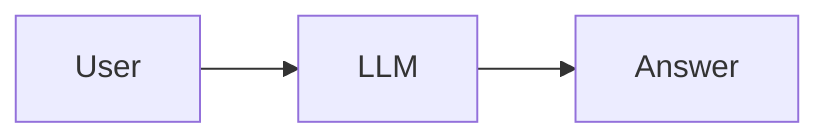
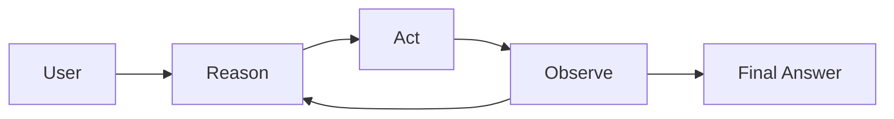
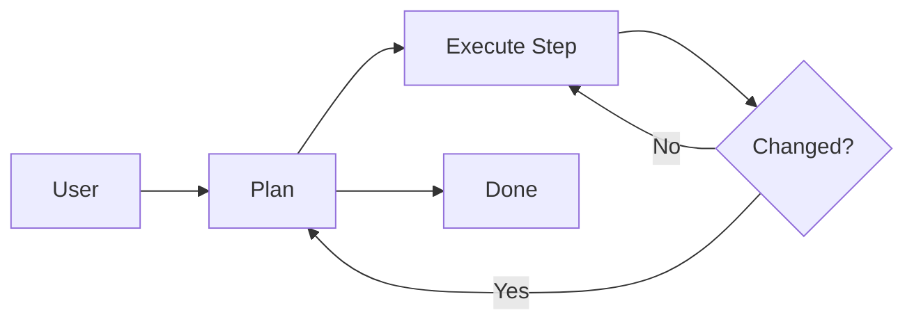
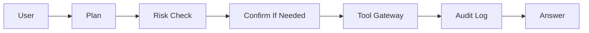
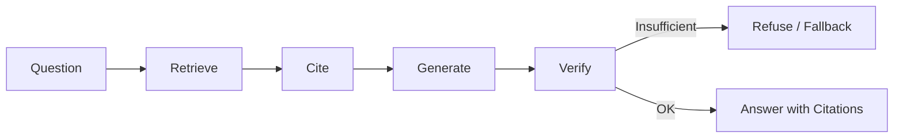
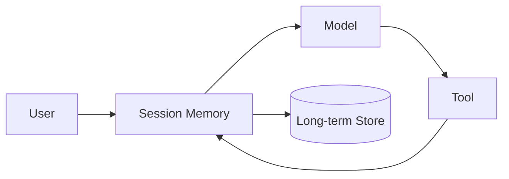
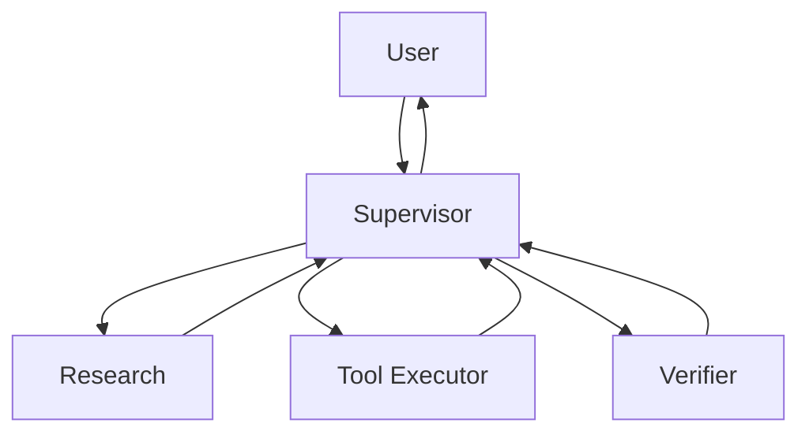
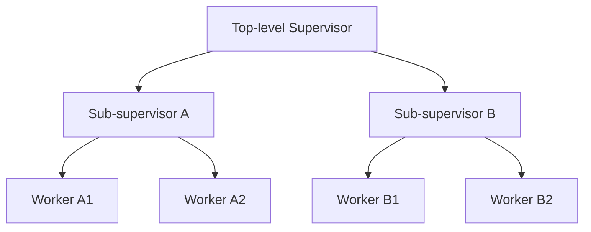
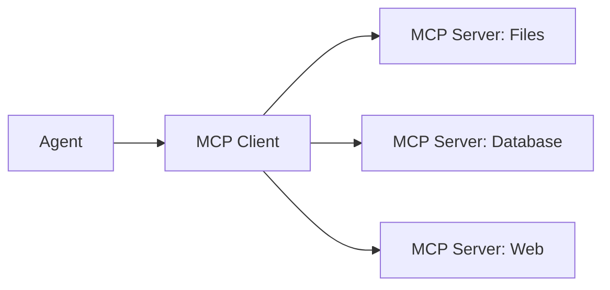
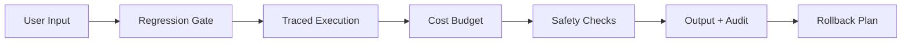

# Architecture Patterns Quick Reference

Use this as a design-selection card, not as a framework checklist. Pick the smallest
pattern that can satisfy the task with auditable evidence. Each pattern lists when to
use it, the trade-offs, and the anti-patterns to avoid.

## Pattern Table

| Pattern | Use When | Avoid When | Production Checks |
| --- | --- | --- | --- |
| Single LLM call | Simple answer, no tools | Evidence or action is needed | Prompt/version pin, refusal behavior, safety checks |
| ReAct loop | Tool use with observable steps | Tool results are untrusted | Tool schema, max iterations, retry policy, stop condition |
| Plan-and-Execute | Steps are known upfront or expensive to re-plan | Task changes often mid-flight | Plan validation, step contracts, replan trigger, cost budget |
| Tool-using Agent / Tool Gateway | External state or side effects are needed | Permissions are unclear | Risk classifier, confirmation, audit log, rollback |
| RAG Agent | Answer depends on private or current docs | Corpus is stale or untrustworthy | Retrieval eval, citations, fallback, source freshness |
| Memory-enhanced Agent | Context spans many turns or sessions | Every request is stateless | Retention policy, summary quality, privacy checks |
| Supervisor | Specialization and verification help | A single Agent with tools is enough | Task contracts, verifier, handoff schema, state isolation |
| Hierarchical teams | Work decomposes into many independent subteams | A flat supervisor is enough | Depth budget, escalation path, result aggregation |
| MCP-based Agent | You need many standard tool servers | One or two custom tools suffice | Schema pinning, server auth, timeouts, rate limits |
| Production Agent | Auth, evals, traces, rollback are required | You only need a prototype | Regression gate, observability, cost budget, incident runbook |

## Minimal Decision Flow

1. Does the task need current or private evidence? If yes, add RAG and a retrieval eval.
2. Does the task change external state? If yes, add tool risk classification and confirmation.
3. Does the task need multiple experts or independent verification? If yes, use a supervisor with narrow workers.
4. Does the task run in production? If yes, require evals, traces, cost limits, and rollback.
5. If none of the above are true, start with a single LLM call and a clear refusal path.

## Architecture Patterns

### Single LLM Call

- **When to use**: The task is a direct question with no tool call, no private retrieval, and no irreversible action.
- **Trade-offs**: Cheapest and easiest to debug, but cannot act on the world and cannot verify its own claims.
- **Anti-pattern**: Adding tools or retrieval "just in case" and letting the model decide whether to use them with no budget or policy.
- **Production checks**: Pin the prompt and model version, define refusal behavior, and run safety checks on the output.

### ReAct Loop

- **When to use**: The task needs tool use with observable, verifiable steps, such as lookup, calculation, or API calls.
- **Trade-offs**: Flexible and can correct course from observations, but every step adds latency, cost, and failure surface.
- **Anti-pattern**: Running with no maximum iterations, trusting raw tool output, or looping on the same failed action.
- **Production checks**: Enforce a max step budget, retry policy, stop condition, and a fail-closed path when tool results are missing or contradictory.

### Plan-and-Execute

- **When to use**: The steps are known upfront, expensive to re-plan, or must be shown to a human for approval.
- **Trade-offs**: Cheaper and more predictable than re-planning every step, but brittle when the task changes mid-flight.
- **Anti-pattern**: Executing a stale plan without a replan trigger, or re-planning so often that the plan adds no value.
- **Production checks**: Validate the plan against acceptance criteria, give each step a typed contract, and define what change triggers a replan.

### Tool-Using Agent / Tool Gateway

- **When to use**: The task changes external state or reads systems that need permissions.
- **Trade-offs**: Powerful and useful, but every side effect increases blast radius and debugging cost.
- **Anti-pattern**: Letting the model call tools directly without validation, permission checks, or audit.
- **Production checks**: The tool gateway should own validation, permissions, idempotency, retries, and audit behavior, with confirmation for high-risk actions.

### RAG Agent

- **When to use**: The answer depends on private, current, or domain-specific documents.
- **Trade-offs**: Grounds answers in evidence and supports citations, but adds retrieval latency, index maintenance, and new failure modes.
- **Anti-pattern**: Building RAG without a retrieval eval, or letting the model ignore retrieved context and hallucinate anyway.
- **Production checks**: Evaluate retrieval recall, context relevance, citation correctness, source freshness, and refusal when evidence is insufficient.

### Memory-Enhanced Agent

- **When to use**: The task needs context across many turns or sessions, such as assistants, research threads, or iterative work.
- **Trade-offs**: Enables continuity and personalization, but raises retention, privacy, cost, and staleness questions.
- **Anti-pattern**: Storing raw transcripts forever, or dumping everything into the context window until it overflows.
- **Production checks**: Define what is stored, for how long, who can read it, and how it is summarized; test summarization quality.

### Supervisor

- **When to use**: Work divides into specializations, or an independent verifier reduces risk.
- **Trade-offs**: Better isolation and verification, but more latency, cost, and coordination complexity.
- **Anti-pattern**: Adding agents for their own sake; a supervisor that re-plans every step; workers that duplicate each other's work.
- **Production checks**: Define task contracts, handoff schemas, verifier criteria, and state isolation; use multiple agents only when boundaries reduce risk or improve verification.

### Hierarchical Teams

- **When to use**: The task decomposes into many independent subproblems that each need their own coordination, such as large research programs.
- **Trade-offs**: Scales to big task graphs, but compounds latency, cost, and failure points; failures can cascade across levels.
- **Anti-pattern**: Deep trees for small tasks, unclear escalation, or subteams that aggregate results inconsistently.
- **Production checks**: Cap the depth, define an escalation path to a human, and standardize how subteam results are aggregated and verified.

### MCP-Based Agent

- **When to use**: You need many standard integrations, and servers expose tools, resources, prompts, schemas, and context over a shared protocol.
- **Trade-offs**: Reduces glue code and improves portability, but adds a protocol layer to debug and a dependency on server behavior.
- **Anti-pattern**: Assuming MCP replaces evals, guardrails, or auth; calling servers with unvalidated schemas or no timeouts.
- **Production checks**: Pin server schemas and versions, authenticate and rate-limit servers, set timeouts, and run an eval per integrated tool.

### Production Agent

- **When to use**: The system serves real users and a failure has real cost.
- **Trade-offs**: Production discipline protects users, but requires investment in evals, observability, and runbooks.
- **Anti-pattern**: Shipping a prototype behind a chat UI and calling it production-ready.
- **Production checks**: Require a regression gate, traces, cost limits, rollback rehearsal, and an incident runbook.

## Cross-Cutting Concerns

- **Evals before patterns**: Choose the architecture after defining the eval that proves it works, not before.
- **Fail closed by default**: When evidence, tools, or permissions are uncertain, refuse instead of guessing.
- **Cost budget at the loop level**: Enforce cost and step budgets inside the loop, not just at the API gateway.
- **State isolation**: Keep worker state typed and scoped so handoffs cannot leak or corrupt context.
- **Human escalation**: Every loop needs a defined point where it stops and asks a human.
- **Audit everything that touches the world**: Log the reasoning, the tool call, the result, and the approval for every external effect.

## Quick Review Questions

- What is the smallest architecture that can pass the acceptance criteria?
- Which part of the system can be evaluated independently?
- Which failure should fail closed rather than continue with a best guess?
- What is the maximum step and cost budget before a human is involved?
- Where does the audit log capture reasoning, tool results, and approvals?
