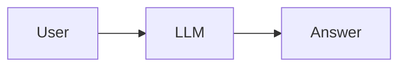
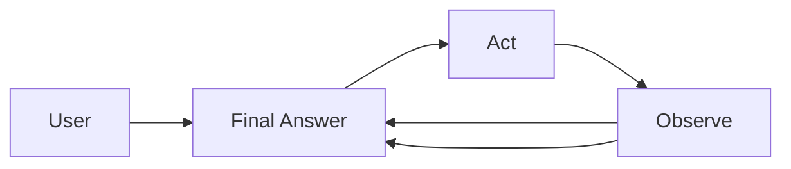
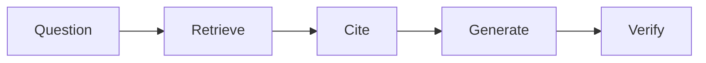
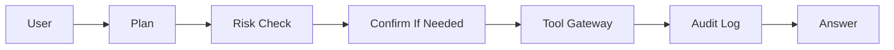
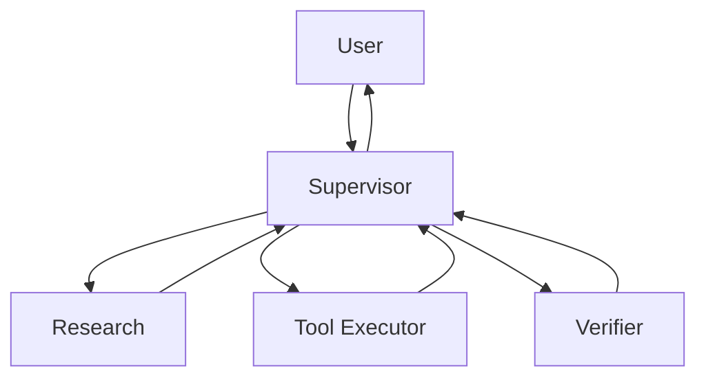

# Architecture Patterns Quick Reference

Use this as a design-selection card, not as a framework checklist. Pick the smallest pattern that can satisfy the task with auditable evidence.

## Pattern Table

| Pattern | Use When | Avoid When | Production Checks |
| --- | --- | --- | --- |
| Single LLM call | Simple answer, no tools | Evidence or action is needed | Prompt/version pin, refusal behavior, safety checks |
| ReAct loop | Tool use with observable steps | Tool results are untrusted | Tool schema, max iterations, retry policy, stop condition |
| RAG Agent | Answer depends on private or current docs | Corpus is stale or untrustworthy | Retrieval eval, citations, fallback, source freshness |
| Tool-using Agent | External state or side effects are needed | Permissions are unclear | Risk classifier, confirmation, audit log, rollback |
| Multi-agent supervisor | Specialization and verification help | A single Agent with tools is enough | Task contracts, verifier, handoff schema, state isolation |
| Production Agent | Auth, evals, traces, rollback are required | You only need a prototype | Regression gate, observability, cost budget, incident runbook |

## Minimal Decision Flow

1. Does the task need current or private evidence? If yes, add RAG and retrieval eval.
2. Does the task change external state? If yes, add tool risk classification and confirmation.
3. Does the task need multiple experts or independent verification? If yes, use a supervisor with narrow workers.
4. Does the task run in production? If yes, require evals, traces, cost limits, and rollback.
5. If none of the above are true, start with a single LLM call and a clear refusal path.

## Architecture Patterns

### Single LLM Call

Keep it simple only when there is no tool call, no private retrieval, and no irreversible action.

### ReAct Loop

The loop must have a maximum number of steps and a way to fail closed when tool results are missing or contradictory.

### RAG Agent

RAG quality is not just model quality. Evaluate retrieval recall, context relevance, citation correctness, and refusal when evidence is insufficient.

### Tool-Using Agent

The tool gateway should own validation, permissions, idempotency, and audit behavior.

### Multi-Agent Supervisor

Use multiple agents only when boundaries reduce risk or improve verification. Otherwise, a single agent with tools is usually cheaper and easier to debug.

## Quick Review Questions

- What is the smallest architecture that can pass the acceptance criteria?
- Which part of the system can be evaluated independently?
- Which failure should fail closed rather than continue with a best guess?
