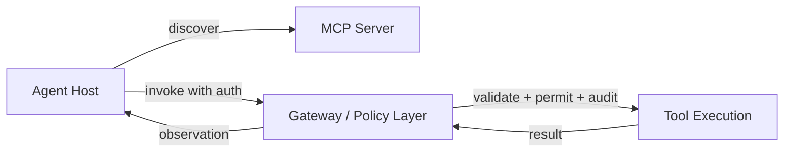

# Tool/MCP Safety Skill Card

## Skill Name

- English: Tool and MCP Safety
- Chinese: 工具与 MCP 安全边界
- Level: L2-L4

## Purpose

Help engineers expose external actions through a controlled boundary, including validation, permissions, confirmation, traces, and rollback. The skill turns "the model called a function" into "the system authorized and audited a side effect."

## When to Use

- The Agent can read or write external state.
- A tool call has side effects (write, mutate, send, delete).
- Permissions, idempotency, or audit requirements matter.
- You need to explain why a tool call failed without leaking sensitive data.
- You are integrating external capabilities through MCP servers.

## When Not to Use

- The task is a pure single-shot LLM answer.
- The tool is read-only and the blast radius is negligible.
- You are only learning prompt formatting.

## Core Knowledge

### Tool Contracts

Every tool needs a contract with four parts:

| Part | Question it answers | Example |
| --- | --- | --- |
| Inputs | What arguments are allowed and typed? | `{ "refund_id": string, "amount_cents": int }` |
| Outputs | What does success look like in machine-readable form? | `{ "ok": true, "refund_id": "R-123" }` |
| Errors | How are failures distinguished from empty results? | `{ "ok": false, "code": "NOT_FOUND" }` vs `{ "ok": true, "results": [] }` |
| Side effects | What changes in the world, and is it reversible? | creates a charge; reversible within 24h |

### Read / Write / Destructive Classification

Classify every tool before execution and attach a risk class:

| Risk class | Example | Default policy |
| --- | --- | --- |
| Read | `search_docs`, `get_balance` | Allowed, traced |
| Write | `update_ticket`, `set_status` | Allowed with validation, idempotency key |
| Destructive | `delete_account`, `refund`, `send_email` | Requires confirmation or approval, immutable audit |

The classification lives in code, not in the prompt. The model proposes an action; the gateway decides which policy applies.

### MCP Boundaries

MCP (Model Context Protocol) standardizes the Agent-tool boundary:

- **Host / client**: the Agent runtime that discovers and invokes capabilities.
- **Server**: exposes tools, resources, and prompts with schemas, transport, and auth.
- **Tools**: executable actions with typed schemas.
- **Resources**: read-only data the host can load into context.
- **Prompts**: reusable prompt templates served by the server.



MCP is **not** a permission system by itself. Permissions and audit belong in your gateway, server, or policy layer. The protocol transports the request; your code authorizes it.

### Safety Properties

A safe tool boundary has five properties:

1. **Validation**: arguments match the schema before any side effect.
2. **Authorization**: the actor, role, and tenant are checked per action.
3. **Confirmation**: irreversible actions require human-in-the-loop.
4. **Idempotency**: retries cannot double-execute side effects.
5. **Audit**: every call records actor, action, arguments, outcome, and correlation ID.

## Threat Model

What can go wrong at the tool boundary:

- **Prompt injection through tool output**: a tool returns attacker text that instructs the model to take a destructive action.
- **Argument smuggling**: the model passes an allowed tool name with unintended arguments.
- **Retry storms**: a timeout after a successful write leads to double execution.
- **Tenant confusion**: an action runs against the wrong account because tenant context is missing.
- **Information leak**: error messages or logs expose PII, secrets, or internal paths.
- **Side-effect before validation**: the tool runs, then validation fails, and nobody notices.

## Practice Evidence

- Lab: [`../../../labs/l2/single_agent_mcp/README.md`](../../../labs/l2/single_agent_mcp/README.md)
- Example: [`../../../examples/mcp-tool-boundary/README.md`](../../../examples/mcp-tool-boundary/README.md)
- Case: [`../cases/enterprise-multi-tool-agent.md`](../cases/enterprise-multi-tool-agent.md)
- Project artifact: tool gateway design note with a risk table and audit fields.

## Minimal Safe Gateway

```python
def execute_tool(tool_name: str, args: dict, actor: str, tenant: str, idempotency_key: str):
    tool = TOOLS[tool_name]
    risk = tool.risk_class
    if not valid_against_schema(args, tool.schema):
        return {"ok": False, "code": "SCHEMA_ERROR"}
    if not authorize(actor, tenant, tool_name, risk):
        return {"ok": False, "code": "FORBIDDEN"}
    if risk == "destructive" and not human_approved(actor, tool_name, args):
        return {"ok": False, "code": "APPROVAL_REQUIRED"}
    if has_run(idempotency_key):
        return {"ok": True, "cached": True, "result": stored_result(idempotency_key)}
    result = tool.fn(**args)
    store_result(idempotency_key, result)
    audit(tool_name, args, actor, tenant, result, correlation_id)
    return result
```

The gateway is the single choke point: no tool call reaches the world without schema validation, authorization, risk policy, and audit.

## Audit Log Fields

| Field | Example | Why it matters |
| --- | --- | --- |
| correlation_id | `req_7f3a…` | links trace and log |
| actor | `user:alice` | who caused the call |
| tenant | `acme` | scopes the blast radius |
| tool | `send_email` | which capability |
| args_hash | `sha256:…` | immutable argument record |
| risk_class | `destructive` | which policy applied |
| decision | `approved` / `denied` / `required_confirm` | gateway outcome |
| outcome | `success` / `partial` / `error` | actual result |
| timestamp | `2026-09-17T10:00:00Z` | ordering and audit |

## Review Questions

1. How do you classify a tool call before execution? — Map the tool to read/write/destructive by side effect and blast radius, then apply the matching policy in code.
2. What should happen when a tool result is empty but not an error? — Treat it as "no evidence": return an explicit empty result, let the loop decide to gather more evidence or answer that verification is impossible, never invent content.
3. How do you prevent the same destructive action from running twice? — Require an idempotency key, store executed keys with a TTL, and return the original result on retry; verify exactly-once with tests.
4. Who decides that a tool call is allowed — the model or the system? — The system. The model proposes; the gateway authorizes based on actor, tenant, risk class, and policy.
5. What belongs in the audit log and why? — Actor, tenant, tool, args hash, risk class, decision, outcome, and correlation ID, so every side effect can be replayed, scoped, and explained without storing raw secrets.

## Common Failure Modes

- Treating model output as an authorization decision.
- Logging sensitive request payloads (raw args) instead of hashes.
- Allowing retry after a write tool succeeds but response parsing fails.
- Missing tenant or actor context in the audit log.
- Putting the safety review only in the final prompt.
- No idempotency key, so a timeout leads to a double charge.
- MCP server with no health probe or timeout, hanging the loop.

## Production Notes

- Use a gateway for validation, permissions, and audit.
- Put rate limits and mutation gates close to tool execution.
- Prefer idempotency keys for side-effecting tools.
- Add regression evals for denied, retried, and partially successful calls.
- Probe MCP servers with a canary call on a schedule.
- Keep raw secrets out of tool descriptions and logs.

## Related Links

- Tutorial: [`../l2-single-agent-mcp.md`](../l2-single-agent-mcp.md)
- Concepts: [`../concepts/mcp.md`](../concepts/mcp.md)
- Template: [`../../../templates/agent-skill-card-template.md`](../../../templates/agent-skill-card-template.md)
