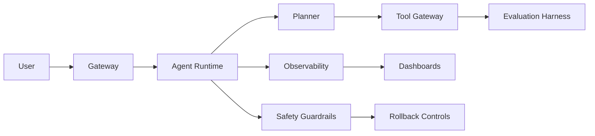

# L4 生产级 Agent 系统

## 目标

完成本教程后，你应该能把 L3 Agent 原型推进为生产候选系统：有评估门禁、可观测、安全控制、回滚路径，以及真实可执行的 Postmortem 流程。

## 为什么 L4 重要

L0 到 L3 证明系统能跑通；L4 证明系统能扛住真实流量：坏输入、工具失败、成本飙升、模型更新、以及人为操作失误。

生产级 Agent 不只是更好的 Prompt，而是一个有 owner、有指标、有失败模式、也有恢复方式的系统。

## 前置要求

- 已完成 L0 到 L3。
- 能本地运行 L4 Lab。
- 理解评估、trace 和回滚的基本概念。
- Python 3.10+。

## 场景

一个客服 Agent 已经能回答问题、调用工具、总结工单。进入生产后，它还需要：

1. 拒绝不安全或超出范围的请求。
2. 控制延迟、token 和请求速率。
3. 记录 trace，让工程师能复现问题。
4. 当模型、检索或工具网关失败时安全降级。
5. 发布后质量下降时回滚。
6. 从事故中学习，而不是掩盖问题。

## 生产架构

参考流程如下：



### Gateway

网关负责请求边界：

- 鉴权与授权。
- 租户或 session 识别。
- 限流。
- 输入大小和内容限制。
- 基础 prompt injection 检测。

### Agent Runtime

运行时负责编排，但不承载基础设施策略：

- 规划和工具路由。
- 记忆读写。
- 响应生成。
- 重试和 fallback。
- 结构化事件输出。

### Tool Gateway

所有工具调用都应经过网关：

- 校验权限。
- 记录请求和响应摘要。
- 应用超时。
- 阻断破坏性动作。
- 支持调试时回放工具调用。

### Evaluation Harness

评估必须发生在发布前和事故后，至少覆盖：

- 正确回答。
- 拒绝行为。
- 工具选择。
- 失败恢复。
- 成本和延迟回归。

### Observability

每个请求应产生 trace：

- user/session/request id。
- Planner 决策。
- 工具调用与结果。
- 模型版本或 prompt 版本。
- 延迟和 token 数。
- 安全检查结果。

### Rollback Controls

回滚不只是回退代码，还可能包括：

- 回退 prompt 版本。
- 禁用某条工具路径。
- fallback 到更简单的 Agent。
- 降低高风险功能流量。
- 冻结记忆写入。

## 跟做步骤

### Step 1: 过一遍生产检查清单

阅读仓库中的检查清单：

- [`production/evals-checklist.md`](production/评估清单.md)
- [`production/safety-checklist.md`](production/安全清单.md)
- [`production/quarterly-maintenance.md`](production/季度维护.md)
- [`production/cost-stability-operations.md`](production/成本稳定性运行手册.md)

对每个检查项写三选一：

- `covered`：有代码、配置或文档能证明覆盖。
- `partial`：有部分覆盖，但仍有缺口。
- `missing`：生产可用依赖它，但目前不存在。

实用规则：`partial` 不等于 `covered`。

### Step 2: 运行 L4 Lab

在仓库根目录执行：

```bash
python -m unittest labs.l4.production_postmortem.test_lab
```

期望结果：

```text
Ran 3 tests in ...
OK
```

这个 Lab 用本地数据模型模拟生产事故复盘，不依赖真实系统，也不泄漏敏感信息。目标是练习 Postmortem 的结构，而不是接入线上数据。

### Step 3: 理解 Lab 数据模型

Lab 把 Postmortem 表示为结构化数据：

- `summary`：发生了什么。
- `root_causes`：为什么发生。
- `action_items`：具体后续动作。
- `rollback_plan`：如何恢复安全或可用性。
- `evaluation_plan`：如何防止复发。
- `safety_controls`：新增或强制的安全控制。

每个 action item 有：

- 标题。
- owner。
- 截止日期。
- 类型，例如 `safety-guardrail`、`eval-regression` 或 `observability`。
- 完成状态。

这很重要，因为 Postmortem 不能只停留在叙事摘要；生产跟进必须有 owner 和日期。

### Step 4: 构造真实 Postmortem 草稿

使用下面这个本地示例作为模板：

```python
from datetime import date
from labs.l4.production_postmortem.agent_top_labs_l4_production_postmortem import (
    ActionItem,
    ActionType,
    PostmortemDraft,
    highest_severity,
    required_coverage,
    unresolved_actions,
)

draft = PostmortemDraft(
    summary="Agent 使用过期检索文档回答政策问题，且没有要求用户澄清。",
    root_causes=(
        "检索没有在回答政策问题前检查文档新鲜度。",
        "Prompt 没有要求在检索置信度低时请求澄清。",
        "回归 eval 集没有覆盖过期文档场景。",
    ),
    action_items=(
        ActionItem(
            title="政策检索必须要求 freshness metadata",
            owner="retrieval",
            due_date=date(2026, 9, 23),
            action_type=ActionType.IMMEDIATE_FIX,
        ),
        ActionItem(
            title="在 prompt contract 中加入澄清行为",
            owner="agent-runtime",
            due_date=date(2026, 9, 24),
            action_type=ActionType.SAFETY_GUARDRAIL,
        ),
        ActionItem(
            title="增加过期文档回归 eval",
            owner="quality",
            due_date=date(2026, 9, 25),
            action_type=ActionType.EVAL_REGRESSION,
        ),
        ActionItem(
            title="trace 记录检索文档 ID 和 freshness",
            owner="observability",
            due_date=date(2026, 9, 26),
            action_type=ActionType.OBSERVABILITY,
        ),
    ),
    rollback_plan="禁用 policy answer mode，在 freshness 检查通过前将政策问题路由到人工审核。",
    evaluation_plan="增加过期文档、缺失元数据和低置信度检索的 eval case。",
    safety_controls=(
        "缺少必要政策元数据时阻断最终回答。",
        "低置信度政策响应路由到澄清或人工审核。",
    ),
)
```

然后检查草稿：

```python
print(required_coverage(draft))
print(unresolved_actions(draft))
print(highest_severity(unresolved_actions(draft), today=date(2026, 9, 21)))
```

期望行为：

- `required_coverage(draft)` 返回 `[]`，因为必需字段都齐了。
- `unresolved_actions(draft)` 返回所有未完成 action item。
- `highest_severity(...)` 返回 `Severity.SEV2`，因为没有过期项，但存在紧急类型。

### Step 5: 加可追踪性

每个 action item 都应映射到以下生产控制之一：

- Eval：自动捕获这类失败。
- Guardrail：在响应或工具执行前阻断风险。
- Observability：下次失败时能看见。
- Rollback：快速恢复到已知安全状态。
- Process：改变 owner、review 或发布纪律。

如果一个 action item 映射不到这些控制，它可能只是备注，不是生产修复。

### Step 6: 定义发布门禁

发布应被这些门禁阻断：

- Golden eval set 通过。
- 安全 eval 无 critical failure。
- Trace 包含必需字段。
- 回滚说明已测试。
- 成本和延迟在配置限制内。
- 每个 open incident action item 都有 owner 和 due date。

推荐门禁策略：

- 安全 critical failure 阻断发布。
- 缺少 owner 或回滚计划阻断发布。
- 只有带书面到期时间和审批人的例外才可临时放行。

### Step 7: 运行完整仓库检查

在仓库根目录执行：

```bash
python scripts/check_repository.py
python -m unittest discover -s labs -p "test_*.py"
python -m compileall -q labs scripts
python -m ruff check .
```

四个命令都应通过，才能提出生产级变更。

## 常见错误

- 把事故摘要当成 Postmortem。
- 写“模型幻觉了”作为 root cause，却没有识别系统缺口。
- Action item 没有 owner 或截止日期。
- 忘记 retrieval、tool call 和 memory write 也都需要回滚路径。
- 只看延迟，不看正确性和安全性。
- 修了线上问题但没有补 eval 或回归检查。
- 因为事故看起来像运维问题就隐藏它。

## 生产就绪评分

给系统打 0 到 4 分：

- 0：只有原型，无 eval、无回滚。
- 1：有 eval，但安全和回滚靠人工。
- 2：有 eval、trace、guardrail 和回滚路径，但 owner 不一致。
- 3：门禁能阻断风险发布，Postmortem 产出被追踪的修复。
- 4：生产指标、事故复盘、eval 回归和成本控制持续维护。

好的 L4 作品集项目至少应达到 3 分。

## 自测

1. 什么让 Postmortem 可执行？
2. 为什么回滚要覆盖 prompt、检索、工具和记忆路径？
3. 如果发布期间安全 eval 失败，应该怎么做？
4. 如何判断延迟优化是否安全？
5. 哪些 action item 类型应被视为最高优先级？

## 关联资产

- [`production/evals-checklist.md`](production/评估清单.md)
- [`production/safety-checklist.md`](production/安全清单.md)
- [`production/quarterly-maintenance.md`](production/季度维护.md)
- [`production/cost-stability-operations.md`](production/成本稳定性运行手册.md)
- [`../../templates/postmortem-template.md`](../../templates/postmortem-template.md)
- [`../../labs/l4/production_postmortem/README.md`](../../labs/l4/production_postmortem/README.md)
- [`../../labs/l4/cost_and_stability_guardrails/README.md`](../../labs/l4/cost_and_stability_guardrails/README.md)

## 相关面试题

用同级生产化题库巩固 L4 概念：[`L4 生产化`](interviews/questions/L4生产化.md)。
