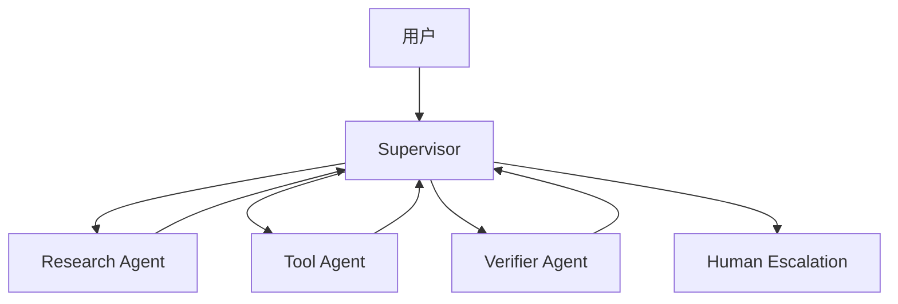

# 多 Agent 客服案例

## 场景

一个客服 Agent 可以回答产品问题、查询订单状态、更新工单，并在不安全或模糊时升级给人类。

## 架构

## 关键决策

- Supervisor 负责路由，单个 Agent 不直接决定全局路由。
- Research Agent 只基于检索和记忆回答。
- Tool Agent 处理工具执行和副作用。
- Verifier Agent 可以阻断缺少证据的最终回答。
- Human escalation 是正常路径，不是失败路径。

## 失败模式

- 检索返回过期政策。
- 工具参数有效但业务语义错误。
- Verifier 阻断回答但没有给用户解释。
- Supervisor 在多个 Agent 之间循环。

## 评估

- 工具选择正确率。
- 升级正确率。
- 低证据回答拒绝率。
- 每轮成本和延迟。

## 关联 Lab

- 多 Agent Supervisor：[`../../../labs/l3/multi_agent_supervisor/README.md`](../../../labs/l3/multi_agent_supervisor/README.md)
