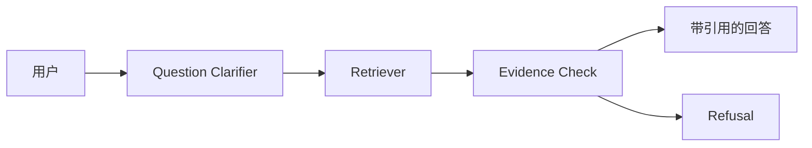

# 个人知识库 RAG 案例

## 场景

用户让 Agent 搜索本地笔记，并在有证据时回答，没有证据时拒绝。

## 架构

## 关键决策

- 检索范围只限用户本地语料。
- 记忆 存偏好，不默认存事实。
- 缺少证据时拒绝。
- 事实回答必须引用来源。

## 失败模式

- 过期笔记被当成当前事实。
- 重复笔记相互冲突。
- 记忆 覆盖了新检索到的证据。
- 回答没有引用。

## 评估

- required source 命中率。
- no-answer case 拒绝率。
- citation quality。
- stale document 检测率。

## 关联 Lab

- RAG Evaluator：[`../../../labs/l3/rag_evaluator/README.md`](../../../labs/l3/rag_evaluator/README.md)
