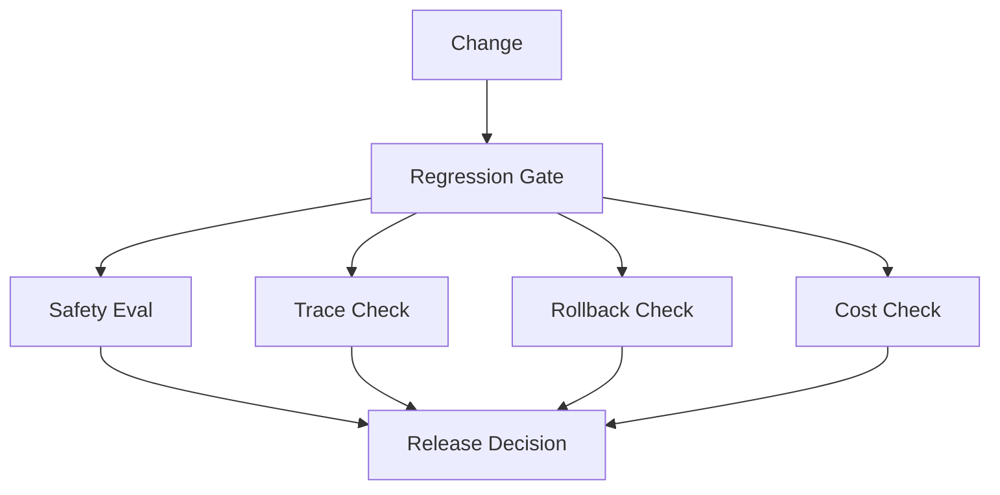

# 生产回归门禁案例

## 场景

生产 Agent 发布前必须通过安全、trace、rollback 和成本门禁。

## 架构

## 关键决策

- 安全失败阻断发布。
- 缺少 trace 字段阻断发布。
- 缺少 rollback plan 阻断发布。
- 成本超预算必须显式审批。

## 失败模式

- 团队跳过安全 eval。
- trace 字段缺失但系统上线。
- rollback plan 存在但未测试。
- 成本超过预算但没有 owner。

## 发布证据

- Golden prompt 通过。
- Safety eval 无 critical failure。
- Trace schema 完整。
- Rollback 已演练。
- Cost/latency 在预算内。

## 关联 Lab

- Regression Gate：[`../../../labs/l4/regression_gate/README.md`](../../../labs/l4/regression_gate/README.md)
