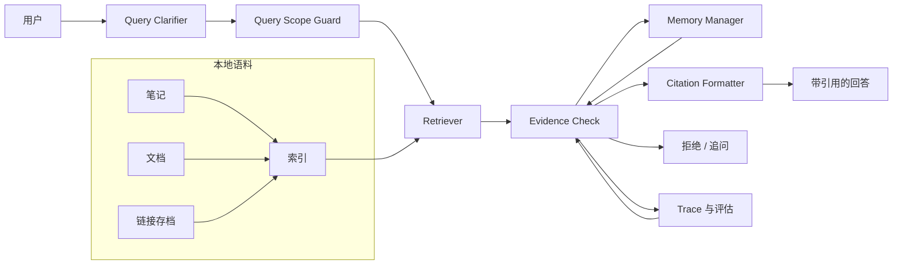

# 个人知识库 RAG 案例

## 场景与背景

个人 Agent 检索用户本地笔记、会议纪要、项目日志和收藏链接，并且只在检索结果能支撑回答时才作答。语料是私有的、持续增长的，远超模型上下文窗口，因此答案必须扎根于检索到的证据，每个事实性表述都要带上来源。

本案例有三个硬约束：

- **范围**：检索只限于本地语料。语料里没有答案时，Agent 不能悄悄回退到世界知识。
- **隐私**：笔记可能包含个人数据，因此提示词、工具调用和 trace 都不得把原始内容泄露到可信管线之外。
- **扎根**：没有可检索来源的事实性回答属于拒绝场景，而不是低置信度答案。

核心张力在于：个人笔记与公司文档的不可靠方式不同——它们会过期（三个月前的决定可能已被推翻）、会重复（同一场会议存在两个细节不同的文件）、会带主观意见（偏好绝不能当事实呈现）。

## 系统架构



这个流程是循环而不是流水线：当证据质量不足时，控制权回到 Clarifier 或拒绝路径，而不是强行产出一个回答。

## 组件职责表

| 组件 | 职责 | 边界 | 故障症状 |
| --- | --- | --- | --- |
| Query Clarifier | 把模糊问题改写成可检索的查询，缺失上下文（时间范围、项目、人物）时追问 | 澄清时不得编造事实 | 检索到的 top 结果毫不相关 |
| Query Scope Guard | 强制"仅本地语料"，拒绝需要世界知识的请求 | 无外部搜索或 API 回退 | Agent 用训练知识作答 |
| Indexer | 对笔记切块、计算 embedding、维护更新的本地索引 | 不得读取授权路径之外的私有内容 | 检索漏掉最近修改 |
| Retriever | 返回带分数、路径信息与元数据的 top-k 候选 | 排序只是证据，不是真相 | 好答案存在但永远不出现 |
| Evidence Check | 把每个候选分类为 supporting、conflicting、stale 或 irrelevant，决定回答还是拒绝 | 不能改变事实，只能承认事实 | 缺证据的回答被放行 |
| Memory Manager | 只存明确表达的偏好，标记为记忆而非事实 | 永远不覆盖检索到的证据 | 记忆盖过新笔记 |
| Citation Formatter | 给每个论断附上源文件、章节和片段锚点 | 只引用 Evidence Check 通过的来源 | 引用指向错误片段 |
| Trace 与评估器 | 每次请求记录 query、候选集、判定和最终回答 | 对发布无决策权 | 回归不可见 |

## 关键实现细节

### 系统提示词规则

系统提示词把扎根契约写得非常明确：

```
- 你只根据本地语料回答。
- 每个事实性句子都必须引用通过的 source id。
- "我找不到证据"是合法答案，猜测不是。
- 记忆中的偏好标注为 "用户偏好"，绝不标注为 "事实"。
- 来源冲突时，如实说明并请用户决定。
```

### 工具集

| 工具 | 输入 | 副作用 | 护栏 |
| --- | --- | --- | --- |
| `search_local_corpus(query, max_results=8)` | 查询字符串 | 无（只读） | 应用范围守卫 |
| `read_source(source_id)` | 来源 id | 无（只读） | 必须来自搜索结果 |
| `store_preference(key, value)` | 记忆键/值 | 写记忆 | 只用于明确表达的偏好 |
| `list_recent_notes(path, since)` | 路径与日期 | 无（只读） | 路径白名单 |

刻意不提供"搜索网络"工具。没有这个工具，拒绝就是设计结果，而不是提示词层面的愿望。

### 状态流

1. Clarifier 规范化问题，并把原始措辞记入 trace。
2. Scope Guard 对请求分类。本质上需要世界知识的请求，在任何检索成本发生之前就用一句简短拒绝收尾。
3. Retriever 返回候选，Evidence Check 把每个候选评为 `supporting`、`conflicting`、`stale` 或 `irrelevant`。
4. 存在唯一明确答案时，Citation Formatter 只用通过的来源构建回答。
5. 候选冲突时，Agent 把双方立场连同来源一起呈现，而不是合并。
6. 最佳候选早于配置的窗口且话题易变（价格、政策、决定）时，Agent 先请用户确认再作答。
7. 没有任何候选支撑论断时，Agent 拒绝并建议需要什么证据。

### 失败处理

- **证据缺失**：Agent 用一行理由加后续建议拒绝。拒绝行为记入评估集，作为必需行为。
- **笔记过期**：新鲜度元数据（捕获日期、最后修改时间）输入 Evidence Check；过期候选被降级，而不是悄悄丢弃。
- **重复冲突**：双方都带 source id 呈现，由用户决定。合并策略是"冲突事实绝不自动合并"。
- **记忆 vs 证据**：记忆只是个性化（语气、称呼）的最后手段，绝不是检索的替代品。让记忆获胜的原型产出了自信的错误回答。

## 设计权衡

| 选择 | 替代方案 | 代价 / 收益 |
| --- | --- | --- |
| 混合检索（关键词 + 向量） | 纯向量 | 对名字和缩写召回更好，代价是索引复杂度 |
| 整笔记切块加重叠 | 固定尺寸切块 | 长论断支持更好；检索更慢、候选更噪 |
| 缺证据时严格拒绝 | 低置信度回答 | 损失少量有帮助的回答；换来信任和评估稳定性 |
| 记忆只存明确偏好 | 记忆作为通用事实库 | 便利性下降；避免笔记与记忆分叉 |
| 每个来源都带新鲜度元数据 | 假设所有笔记都是最新的 | 多一个索引字段；防止过期回答事故 |

## 可迁移模式

- **把拒绝做成设计决策**：没有工具比提示词指令更强的保证。
- **证据判定标签**：`supporting / conflicting / stale / irrelevant` 让最后一步成为确定性过滤器，而不是又一次模型判断。
- **来源契约**：每个回答都带 `(source_id, excerpt, captured_at)`，让评估和用户信任都可操作。
- **检索前先做范围守卫**：先给请求分类再花 token，让越界工作便宜且可观测。
- **记忆是个性化，不是真相**：把偏好记忆与事实证据分开，让它们不会互相打架。

## 踩坑与生产教训

- **模糊查询检索效果很好，但答案是错的。** 修复方案是增加 Clarifier 步骤，并为模糊提示词补充评估用例。
- **笔记措辞是对的但内容过期了**，因为缺少 `updated_at`。现在每个来源都带 `captured_at` 和 `last_modified`。
- **"带着信心回答"的引导导致引用泄漏。** 提示词在改写段落；输出只从模型 token 开始，逐字段落改为链接而非生成。
- **细节不同的重复笔记看起来像检索成功。** 召回率指标是 1.0，但用户的真实情况是矛盾的；评估集现在包含冲突用例。
- **第一个引用质量指标是字符串重叠，奖励复制粘贴。** 指标改为"论断是否存在于被引用片段中"，更贴近用户价值。

## 讨论 / 自测题

1. 当记忆与刚检索到的笔记冲突时，谁应该赢？哪些 trace 字段能让该决策可审计？
2. 缺失来源与错误来源有什么区别？Agent 在两种情况下应分别怎么表现？
3. 如何衡量引用质量而不奖励模型逐字复制文本？
4. 用户问"关于服务器迁移我做了什么决定？"——Clarifier 在检索前应请求哪些上下文？
5. 如何添加"世界知识"逃生口，又不让 Agent 悄悄编造来源？

## 关联 Labs 与 Examples

- Lab：[RAG Evaluator](../../../labs/l3/rag_evaluator/README.md) —— 构建必需来源与拒绝场景评估集。
- Lab：[RAG、记忆与可观测性](../../../labs/l3/rag_memory_observability/README.md) —— 追踪检索与记忆决策。
- Lab：[多轮研究讨论](../../../labs/l3/multi_round_research_discussion/README.md) —— 带证据交接的多轮研究。
- Example：[RAG 证据拒绝](../../../examples/rag-evidence-refusal/README.md) —— 练习回答 vs 引用 vs 拒绝的决策。
- Example：[记忆 vs 证据](../../../examples/memory-vs-evidence/README.md) —— 观察偏好记忆与检索证据打架。
- Example：[记忆索引证据](../../../examples/memory-index-evidence/README.md) —— 检查过期记忆的索引事件证据。
- Example：[数据源策略](../../../examples/data-source-policy/README.md) —— 定义允许与过期的来源。

## 演练示例

查询："上个季度我关于服务器迁移做了什么决定？"

1. **Clarifier**：问题有时间和项目限定，无需请求额外上下文；trace 记录原始措辞。
2. **Scope Guard**：仅本地语料，通过。
3. **Retriever**：返回三个候选：Q3 决策笔记（supporting，`captured_at` 在窗口内）、Q4 跟进（conflicting，更新）、无关会议纪要（irrelevant）。
4. **Evidence Check**：候选 2 被标记为 `conflicting`，因为它记录决定已被推翻；候选 1 相对候选 2 是 `stale`。
5. **结果**：Agent 回答"你在 Q3 决定 X，Q4 又推翻了"，附两个 source id，并询问 Q4 的推翻是否是当前状态。
6. **Memory Manager**：不做任何记忆写入，因为决定是关于语料的事实，不是用户偏好。
7. **Trace**：请求记录 query、候选、判定和最终回答，便于索引变更后重放同一评估用例。

同一个问题在没有 Q4 跟进文件时，必须产出不同的、诚实的回答——而不是同一段文本——这正是回归评估需要每个问题多个 fixture 的原因。

## 评估与指标

评估集把 happy-path 召回与安全行为分开：

| 指标 | 定义 | 通过线 |
| --- | --- | --- |
| 必需来源命中 | % 评估答案的引用来源在允许集合内 | 100% |
| 拒绝正确性 | % 无证据用例拒绝而非猜测 | 100% |
| 无证据时错误回答 | % 无证据用例产出无根据回答 | 0% |
| 引用扎根 | 论断存在于被引用片段中 | >= 95% |
| 过期文档检测 | 过期候选被降级或标记 | >= 90% |
| Clarifier 额外成本 | Clarifier 带来的平均额外 token | 低于 15% |

每个评估用例都带预期判定，而不只是预期文本，因此检索变化导致正确回答变成拒绝，也会被当作回归捕获。

## 拒绝提示词

拒绝模板让用户保持掌控：

```
我无法根据你的笔记回答这个问题。
原因：本地没有覆盖 {topic} 的来源。
能帮助回答的证据：{文件类型或事件}。
你能补充它，还是我该去问团队里的人？
```

模板出现在评估 fixture 中，因此拒绝质量是被衡量的，而不是偶然的。


## 落地检查清单

- [ ] 索引进程对新增/修改文件在 5 分钟内可见。
- [ ] 所有来源字段：`source_id`、`captured_at`、`last_modified`、路径白名单。
- [ ] 评估集同时包含 answer、answer_with_citation、refuse 与 conflict 用例。
- [ ] 无"搜索网络"工具，且 Scope Guard 有单元测试。
- [ ] 记忆写入只来自 `store_preference`，且标注为偏好。
- [ ] trace 记录 query、候选集、判定与最终回答，不含原始私人文本。

## 要避免的反模式

- 为"以防万一"添加网络工具——它毁掉"仅本地"保证。
- 把新鲜度放在提示词里，而不是放在来源元数据里。
- 把冲突笔记合并进一个回答却不告诉用户。
- 用记忆填补检索空缺。
- 评估集只测 happy-path 问题。

## 启示

RAG 不是搜索。它是证据选择、拒绝与答案扎根——而系统的价值取决于它多诚实地说出"我不知道"。
