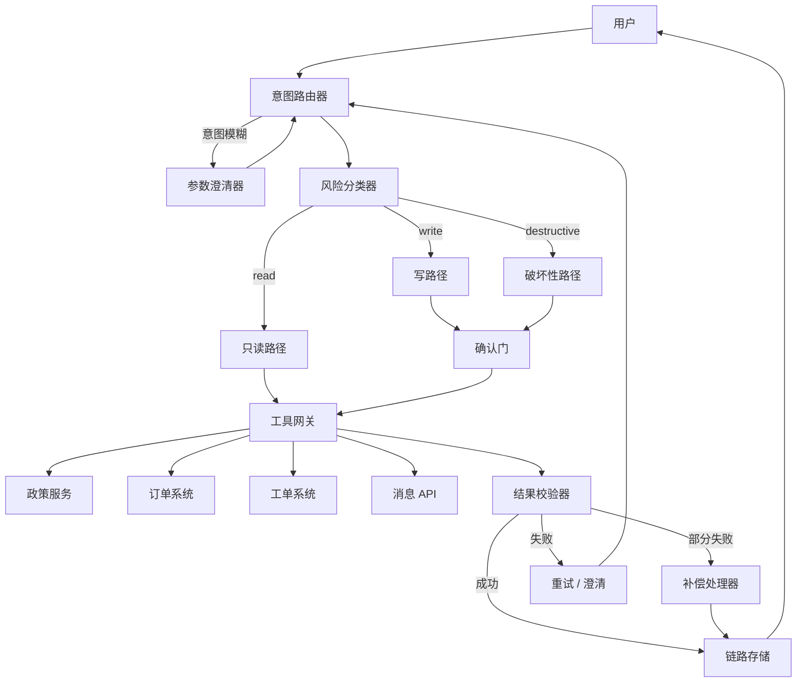

# 企业多工具 Agent 案例

## 场景与背景

一家中型公司运行一个客户运营 Agent，需要在一个聊天入口中完成查询订单、更新工单、检查政策、发送客户消息等操作。公司背后有四个异构后端：订单数据库、工单系统、政策服务和消息网关。在 Agent 之前，这些集成全部由人工在各自控制台操作，导致平均处理时长很长、政策执行不一致。

项目的约束让设计变得困难：

- Agent 必须在只读路径上自主行动，但任何写操作或破坏性操作都必须可审计、可撤销。
- 各后端由不同团队维护且无法修改，因此所有风险控制都必须放在 Agent 层。
- 多个租户共用一个订单系统，因此每次查询都必须限定在已认证的租户上下文内。
- 消息网关是异步的：返回 202 只表示"已受理"，不代表"已送达"。

目标不是最大化任务完成率，而是保证**五项安全属性**：工具选择正确、权限执行严格、确认准确、链路完整、失败可恢复。

## 系统架构



## 组件职责表

| 组件 | 职责 | 预防的失败模式 |
| --- | --- | --- |
| 意图路由器 | 把用户请求分类为 read、write 或 destructive，并选出候选工具集。 | 选错工具、跨工具意图模糊。 |
| 参数澄清器 | 参数缺失或歧义时提出针对性追问，绝不猜测。 | 静默传错参数、查错租户。 |
| 风险分类器 | 为每次工具调用标注风险级别，决定是否需要确认。 | 未确认就执行破坏性动作。 |
| 确认门 | 渲染一次性的、人类可读的确认信息，并要求带操作者身份的明确确认。 | 误写、发错收件人的消息。 |
| 工具网关 | 用统一接口归一化各后端，附加租户作用域，执行超时控制。 | 错误语义混杂、调用挂起。 |
| 结果校验器 | 对照预期检查返回状态，区分空结果、成功与失败。 | "空结果当成成功"的混淆。 |
| 补偿处理器 | 部分失败时执行补偿动作（如关闭重复工单、作废消息）。 | 遗留副作用。 |
| 链路存储 | 为每次调用持久化 request ID、操作者、工具、参数、风险级别、审批和结果。 | 动作不可审计。 |

## 关键实现细节

### 工具分类契约

每个工具在注册前都必须声明一段元数据：

```yaml
tool: send_customer_message
risk: destructive
confirmation: required
idempotency_key: required
scope: tenant_id
timeout_ms: 8000
```

对 Agent 的指令是：缺少必填字段的工具**不可调用**；Agent 必须停下并报告缺口，而不是现场发挥。这把工具注册变成了一个评审门，模型永远不需要在运行时推断权限规则。

### 路由器提示词摘录

```
你是意图路由器。只返回 JSON：
{"intent": "read|write|destructive", "tools": [...], "missing_fields": [...]}
规则：
- 任一必填参数缺失或歧义时，intent 置为 "read"，列出缺失字段，不执行任何工具。
- 请求涉及多个租户上下文时，标记为 "clarify"。
- 只有用户明确描述了动作及其目标对象时，才可选破坏性工具。
```

关键细节：路由器永远可以降级到只读 + 澄清模式。意图降级是安全的默认行为。

### 状态流与确认

1. 用户请求进入路由器。
2. 路由器输出意图 + 候选工具集，风险分类器依据元数据为每个工具标注风险级别。
3. 只读路径在租户上下文中立即执行。
4. 写路径和破坏性路径停在确认门，渲染 `{tool, target, side_effect, irreversible: true/false}`。
5. 确认后，工具网关打上 `request_id`、`actor`、`idempotency_key` 再调用后端。
6. 结果校验器检查响应：schema 合法、租户正确、语义成功。
7. 每一步写一条链路记录，最终把带关联 ID 的完整链路返回给用户。

### 失败处理

- **空结果 vs 失败**：空列表是合法的读取结果；超时或 schema 错误才是失败。校验器区分对待：空结果继续，失败触发重试或澄清。
- **错误租户**：即使后端返回成功，网关也会拒绝 `tenant_id` 与请求上下文不符的结果。这是一个廉价的恒等式检查，可防止跨租户泄漏。
- **部分失败**：消息已发送但工单更新失败 → 补偿处理器关闭重复工单并记录后续任务；用户只看到一个一致的状态，而不是两个互相矛盾的状态。
- **政策过期**：每次政策读取都带 `as_of` 和最大时效。缓存政策超过时限时，Agent 必须先取新副本再行动，否则必须给出明确理由拒绝。

## 设计权衡

| 权衡 | 选择 | 付出的代价 |
| --- | --- | --- |
| 严格 vs 自主 | 所有写操作和破坏性调用都过确认门。 | 低风险动作延迟更高、用户摩擦更多；后来对重复写放宽为会话内一次性确认。 |
| 网关归一化 vs 原生后端 | Agent 层使用统一工具接口。 | 后端特有优化被隐藏；后端加功能时团队必须演进网关契约。 |
| 事前校验 vs 事后补偿 | 尽可能先校验；失败已部分落地时用补偿。 | 每条写路径都要编写并测试补偿逻辑，写路径测试面积几乎翻倍。 |
| 集中链路存储 vs 各服务日志 | 集中存储、统一 schema。 | 额外写放大和单点依赖；用缓冲异步写入缓解。 |

## 可迁移模式

- **元数据驱动的工具注册表**：权限、确认要求、幂等性都是声明的，而不是推断的。模型只读元数据，绝不发明策略。
- **安全默认路由**：不确定时降级为只读 + 澄清。系统退化为"多问问题"，而不是"危险行动"。
- **语义化结果校验**：用显式契约区分空、成功与失败，并在后端结果之上附加租户/操作者不变量。
- **补偿作为一等模式**：每个非幂等写操作都配一个补偿动作，部分失败也能收敛到一致状态。

## 踩坑与生产教训

1. **缺少账户上下文的退款**：第一个原型在确认账户之前就高高兴兴地拉出了退款表单。修复：路由器在接受任何写意图前必须先解析操作者和租户。
2. **"成功"却属于错误租户**：某个后端返回了不含租户 id 的通用成功负载，网关默默接受了。修复：校验器现在拒绝缺少作用域字段的响应。
3. **消息发出、工单过期**：消息网关受理了负载，但工单更新返回 500。用户看到邮件却没有工单备注。修复：两条路径都加幂等键，并加补偿处理器。
4. **过期政策是安静的杀手**：缓存政策连续数周通过测试，因为测试夹具从未老化。修复：政策读取现在带 `as_of`，校验器强制最大时效。
5. **确认疲劳**：确认门上线后，用户不读内容就点确认。修复：高风险消息现在根据工具元数据生成一句显式摘要，且同一目标的重复操作在会话内跳过确认。

## 评估指标

| 指标 | 定义 | 目标 |
| --- | --- | --- |
| 工具选择正确率 | 路由后工具集与黄金标签一致的调用比例。 | ≥ 95% |
| 权限拒绝准确率 | 未授权调用被拦截而非执行的比例。 | 100% |
| 确认准确率 | 已确认调用中真正属于写/破坏性级别的比例。 | ≥ 98% |
| 链路完整率 | 已执行调用中拥有完整链路链的比例。 | 100% |
| 工具失败恢复率 | 失败调用在单次交互内收敛到已解决状态（重试、澄清或补偿）的比例。 | ≥ 90% |

## 讨论 / 自测题

1. 用户说"把退款发到我的邮箱"，但他有两个已验证邮箱。澄清应该发生在哪一环？链路如何记录这次选择？
2. 消息网关返回 HTTP 200，但 body 是 "queued"。你的校验器会把它当成成功吗？要区分"已排队"与"已送达"，你会补充什么证据？
3. 什么情况下事后补偿比事前拦截写入更安全？什么情况下补偿永远不可接受？选一条写路径从两个角度论证。
4. 如何扩展工具注册表，让新后端无需改动路由器提示词即可接入？
5. 描述一个"确认准确率高但权限准确率低"的场景。缺失了什么控制？

## 关联 Labs 与 Examples

- 单 Agent MCP 风格工具边界：[`../../../labs/l2/single_agent_mcp/README.md`](../../../labs/l2/single_agent_mcp/README.md)
- 成本感知路由器：[`../../../labs/l2/cost_aware_router/README.md`](../../../labs/l2/cost_aware_router/README.md)
- 护栏工具集：[`../../../labs/l1/guardrail_helpers/README.md`](../../../labs/l1/guardrail_helpers/README.md)
- MCP 工具边界练习：[`../../../examples/mcp-tool-boundary/README.md`](../../../examples/mcp-tool-boundary/README.md)
- 决策链路练习：[`../../../examples/agent-decision-trace/README.md`](../../../examples/agent-decision-trace/README.md)
- 数据源政策练习：[`../../../examples/data-source-policy/README.md`](../../../examples/data-source-policy/README.md)

## 作品集叙述

我设计了一个有明确风险边界的工具型 Agent。关键不是让模型更强，而是用权限、校验、链路和回滚约束工具执行。每条写路径都带有声明的风险级别、确认门、幂等键和补偿处理器。最有价值的生产教训是："成功"是一个必须结合租户作用域与时效性来校验的语义声明，而不是一个状态码。
