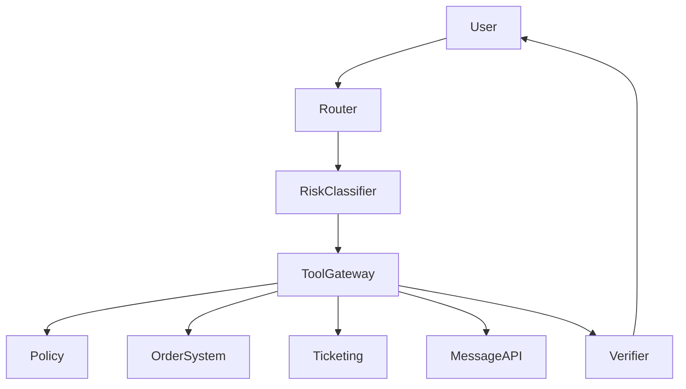

# 企业多工具 Agent 案例

## 场景

公司 Agent 可以查询订单、更新工单、检查政策并发送客户消息。

## 架构

## 关键决策

- 每个工具都有 read、write 或 destructive 分类。
- Destructive actions 需要确认。
- Tool calls 记录 request ID 和 actor。
- Tool arguments 模糊时触发 clarification。
- Empty tool result 与 tool failure 区分。

## 失败模式

- 用户请求 refund，但缺少 account context。
- Tool 返回 success，但属于错误 tenant。
- Message API 成功，但 ticket update 失败。
- Policy lookup 过期。

## 评估

- Correct tool selection。
- Permission-denied accuracy。
- Confirmation accuracy。
- Trace completeness。
- Tool failure recovery。

## 作品集叙述

我设计了一个有明确风险边界的 tool-using Agent。关键不是让模型更强，而是用权限、校验、trace 和 rollback 约束工具执行。
