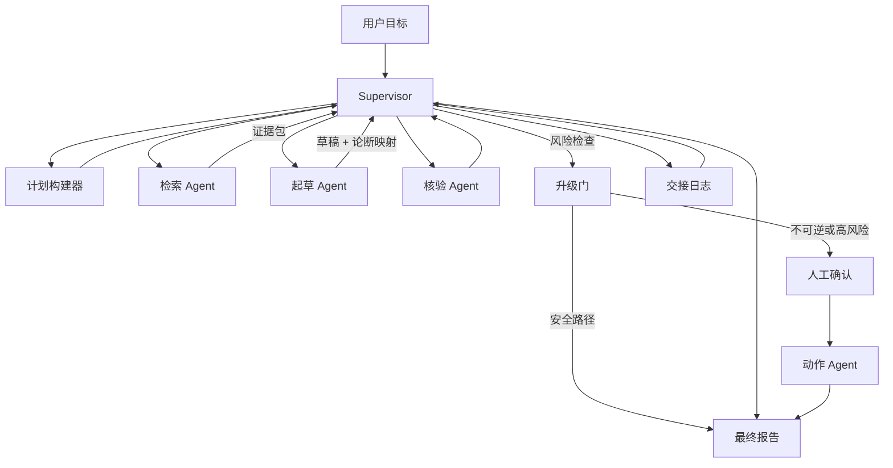

# 多 Agent 协作案例

## 场景与背景

一个研究助手需要收集资料、生成回答、核验观点，并在执行外部动作前把高风险步骤交给人工确认。实际负载是每周一次的例行简报：十到三十个研究问题，涵盖政策变化、市场动态和产品发布，回答必须引用来源，最终报告必须可以安全转发。

为什么要用多个 Agent 而不是一个超长的 ReAct 循环？三个实际观察到的失败模式促成了拆分：

1. 单循环会漂移：大量工具调用之后，模型丢失了原始问题，并用不支持的上下文"改进"了回答。
2. 检索、写作、校验混在一个上下文里会污染证据：草稿文字和检索片段变得难以区分。
3. 外部动作（发送报告、发布摘要）不可逆，因此需要一条独立的、带人工签核的决策路径。

设计原则是**窄职责、显式契约、单一目标所有者**：每个 worker 清楚自己的任务和输入/输出，只有 supervisor 拥有用户目标和任务状态。

## 系统架构



## 组件职责表

| 组件 | 职责 | 预防的失败模式 |
| --- | --- | --- |
| Supervisor | 拥有用户目标、任务状态和委派计划；负责路由和合并结果。 | 丢失用户目标、重复劳动。 |
| 计划构建器 | 把目标拆解为带依赖顺序和验收标准的任务列表。 | 委派混乱、过度委派。 |
| 检索 Agent | 检索来源，按相关性过滤，返回带 ID 和引文的证据包。 | 无依据的论断。 |
| 起草 Agent | 把证据包转化为带"论断到来源"映射的草稿；绝不编造事实。 | 无来源的正文、幻觉。 |
| 核验 Agent | 对照证据列表和置信度检查每个主要论断，向 supervisor 返回裁决。 | 虚假确定性、未核验论断。 |
| 升级门 | 把最终动作分类为安全、高风险或不可逆，并据此路由。 | 未授权的外部动作。 |
| 动作 Agent | 携带幂等键执行已批准动作并报告结果。 | 重复发送、静默失败。 |
| 交接日志 | 记录每次交接：意图、证据列表、置信度和期望输出。 | 职责不清、运行无法调试。 |

## 关键实现细节

### 交接契约

Agent 之间的每次交接都是结构化数据包，而不是自由文本：

```json
{
  "from": "research",
  "to": "supervisor",
  "intent": "evidence_packet",
  "for_claim": "refund_policy_changed",
  "evidence_ids": ["src-0142", "src-0143"],
  "confidence": 0.92,
  "requested_output": "claim accepted, needs draft citation",
  "trace_id": "tr-9f3a"
}
```

supervisor 拒绝处理缺少 `intent` 或 `requested_output` 的数据包。这个契约让交接变得可测试：畸形数据包是 bug，而不是"性格问题"。

### 提示词切片

Supervisor 系统提示词（摘录）：

```
你是 supervisor。你拥有用户目标和任务状态。
- 一次只委派一个工作单元；绝不把同一论断同时委派给两个 worker。
- 每个 worker 回复必须是包含 intent、evidence、confidence、
  requested_output 的交接数据包。否则要求重新给出数据包。
- 核验失败是回退，不是死路：把核验者的理由附上，路由回起草环节。
- 任何外部动作前先做升级决策：安全、高风险或不可逆。
  不可逆动作必须人工确认，未经确认不得执行。
```

核验 Agent 提示词（摘录）：

```
你的职责是核验论断，不是写报告。
- 只有当每个引用的来源确实支持该论断、且引文与原文一致时，
  论断才算 PASS。
- 来源 id 缺失或过期时，返回 NEEDS_EVIDENCE 并说明具体缺口。
- 不要接受起草者给出的 "confidence" 作为证据。
- 每个论断输出一个裁决。
```

两个提示词共享一条规则：**核验者的职责是拒绝，而不是客气**。一个会帮论断打圆场的核验者比没有核验者更糟。

### 状态流

1. supervisor 接收目标，计划构建器返回有序任务列表。
2. 检索 Agent 返回证据包；supervisor 存入共享任务状态，把论断标记为可起草。
3. 起草 Agent 返回草稿和"论断到来源"映射。
4. 核验 Agent 逐论断返回裁决。
5. 未通过的论断带核验者理由回到起草环节；每轮回环都记录日志，因此循环有上限。
6. 升级门对最终动作分类；不可逆动作暂停等待人工确认。
7. 动作 Agent 携带幂等键执行；只有执行成功或人工决定停止后，报告才定稿。

### 失败处理

- **核验者拒绝论断**：supervisor 带理由把草稿路由回去；同一论断失败两次后，supervisor 请用户收窄问题，而不是强行作答。
- **两个 Agent 冲突**：supervisor 是唯一的合并所有者。任何 worker 都不能覆盖共享状态；worker 只提交数据包，supervisor 用明确优先级（证据 > 草稿正文 > 时效新旧）裁决冲突。
- **过期共享状态**：共享状态只追加不覆盖；动作 Agent 收到带 trace id 的快照，过期结果无法静默替换新结果。
- **不可逆动作被阻塞**：人工确认超时 → supervisor 报告"待处理"且绝不执行；运行标记为未完成，而不是猜测完成。

## 设计权衡

| 权衡 | 选择 | 付出的代价 |
| --- | --- | --- |
| supervisor 单一所有者 vs 平级共识 | 单一所有者 + 交接日志。 | supervisor 是瓶颈和单点故障；通过给它的状态做检查点来缓解。 |
| 结构化数据包 vs 自然语言交接 | 严格 JSON 契约。 | 样板代码更多；必须训练 Agent 填全字段，schema 变更会影响所有 Agent。 |
| 有界核验循环 vs 无限迭代 | 最多两轮，然后请用户收窄。 | 部分合法回答被推迟；用可预期的延迟和成本换取。 |
| 人工门 vs 完全自主 | 每个不可逆动作都等人工确认。 | 人工响应慢时端到端延迟上升；因为一次错误的对外发送代价高得多，所以接受。 |

## 可迁移模式

- **一个所有者，多个 worker**：supervisor 拥有目标和任务状态，worker 拥有窄输出。当合并权威只有一个时，所有权争议自然消失。
- **交接即 API**：包含意图、证据、置信度和期望输出的数据包让多 Agent 行为可测试、可调试。
- **核验作为独立角色**：一个带有拒绝使命的专职核验者，比在起草者提示词里写一句"要小心"更能拦住无依据的确定性。
- **升级作为常规路径**：人工确认是图中的一个一等节点，而不是恐慌式兜底；系统能明确说明何时升级、为什么升级。
- **有界循环**：每个反馈循环都有最大迭代次数和收窄兜底，让延迟和 token 成本可预测。

## 踩坑与生产教训

1. **supervisor 丢失目标**：早期 supervisor 激进委派，最终报告回答了用户根本没问的侧面问题。修复：计划构建器现在在每批委派开头重申目标。
2. **核验者盖章放行**：当核验者与起草者共享上下文时，它会"记住"来源并停止检查。修复：核验者只接收论断、来源 id 和引文，其他一律不给。
3. **共享状态被覆盖**：两个 worker 写同一个可变存储，动作 Agent 用了过期结果。修复：只追加的数据包 + 带 trace id 的快照。
4. **冲突建议没有合并策略**：两个 Agent 给出相反建议，报告里两个都写了。修复：supervisor 是唯一合并所有者，并有文档化的优先级顺序。
5. **没有证据的确定性**：第一份报告声称"我们很有信心"，而 40% 的论断没有来源。修复：报告中的"置信度"章节只由已核验的裁决生成，绝不来自正文措辞。

## 评估指标

| 指标 | 定义 | 目标 |
| --- | --- | --- |
| 交接完整率 | 四个契约字段齐全的交接比例。 | 100% |
| 证据覆盖率 | 至少有一个已核验来源支撑的主要论断比例。 | ≥ 95% |
| 核验拒绝质量 | 核验拒绝的精确率（拒绝正确的比例）。 | ≥ 90% |
| 升级准确率 | 不可逆/高风险动作到达人工门的比例。 | 100% |
| 延迟与成本 | 每个任务的端到端时间与 token 成本，按循环轮次追踪。 | 持续监控、循环有界 |

## 讨论 / 自测题

1. 核验者连续两次拒绝同一论断。supervisor 应该请用户收窄问题，还是重新跑一轮检索？请用成本和信任两个角度论证。
2. 如果两个 worker 合法地需要共享同一个可变资源（比如一份共同编辑的文档），设计会怎么变？
3. 五种失败模式里，哪一种反而是单 Agent ReAct 循环处理得更好？为什么？
4. 人工确认超时且用户一直未返回。系统应该执行、等待还是取消？这个决策在哪里做？
5. 为"一个 Agent 产代码、另一个 Agent 产测试"的三 Agent 系统设计交接数据包 schema。哪些字段能防止"测试通过了但测错了东西"？

## 关联 Labs 与 Examples

- 多 Agent Supervisor Lab：[`../../../labs/l3/multi_agent_supervisor/README.md`](../../../labs/l3/multi_agent_supervisor/README.md)
- 多轮研究讨论 Lab：[`../../../labs/l3/multi_round_research_discussion/README.md`](../../../labs/l3/multi_round_research_discussion/README.md)
- RAG 评测 Lab：[`../../../labs/l3/rag_evaluator/README.md`](../../../labs/l3/rag_evaluator/README.md)
- RAG、记忆与可观测性 Lab：[`../../../labs/l3/rag_memory_observability/README.md`](../../../labs/l3/rag_memory_observability/README.md)
- 成本感知路由器 Lab：[`../../../labs/l2/cost_aware_router/README.md`](../../../labs/l2/cost_aware_router/README.md)
- RAG 证据拒绝练习：[`../../../examples/rag-evidence-refusal/README.md`](../../../examples/rag-evidence-refusal/README.md)
- 可观测性链路练习：[`../../../examples/observability-trace/README.md`](../../../examples/observability-trace/README.md)
- 记忆索引证据练习：[`../../../examples/memory-index-evidence/README.md`](../../../examples/memory-index-evidence/README.md)
- L3 系统设计面试题：[`../interviews/questions/L3系统设计题.md`](../interviews/questions/L3系统设计题.md)

## 作品集叙述

我设计了一个 Supervisor 研究 Agent，每个 worker 都有窄职责和明确契约。核心经验是多 Agent 系统通常失败在职责不清，而不是模型不够大。交接契约把协作变成 API，核验者把"要小心"变成拒绝使命，升级门让人工审批成为可预期、可审计的步骤。每个循环都有上限，每次状态写入都只追加，每个外部动作都带幂等键——这就是系统既快又安全的来源。
