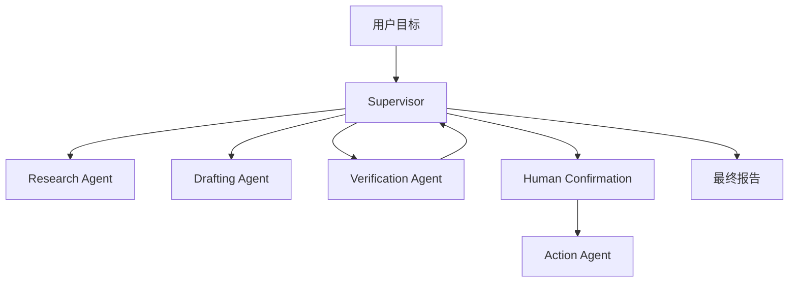

# 多 Agent 协作案例

## 场景

研究助手需要收集资料、生成回答、核验观点，并在执行外部动作前把高风险步骤交给人工确认。

## 架构

## 关键决策

- Supervisor 拥有任务主状态，worker agent 只维护自己的临时笔记。
- 检索、写作和验证的职责与工具分开。
- 验证失败时回到 Supervisor，而不是强行生成最终答案。
- 不可逆或高风险动作必须等待明确人工确认。
- 每次 handoff 都包含意图、证据列表、置信度和期望输出。

## 失败模式

- Supervisor 委派过多，丢失用户目标。
- Verifier 不检查来源就接受 claim。
- Action agent 使用了被覆盖的过期共享状态。
- 两个 agent 给出冲突建议，但没有合并策略。
- 最终报告表达了证据无法支持的确定性。

## 评估

- Handoff 完整性。
- 每个主要结论的证据覆盖率。
- Verification rejection 质量。
- 高风险动作升级是否正确。
- 端到端延迟与 token 成本。

## 作品集叙述

我设计了一个 Supervisor 研究 Agent，每个 worker 都有窄职责和明确 contract。核心经验是多 Agent 系统通常失败在职责不清，而不是模型不够大。

## 关联 Lab

- [`../../../labs/l3/multi_agent_supervisor/README.md`](../../../labs/l3/multi_agent_supervisor/README.md)
