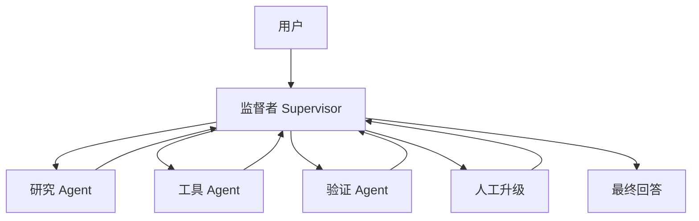

# 多 Agent 客服案例

## 场景与背景

一个客服 Agent 回答产品问题、查询订单状态、更新工单，并把不安全或模糊的案例升级给人类。系统位于客户与业务之间，这使它不同于研究助手：错误答案有商业后果，工具调用有副作用（退款、地址变更、工单更新），而用户体验对延迟的敏感不亚于对正确性的敏感。

塑造设计的三种力量：

- **安全**：退款或账户变更等不可逆动作绝不能基于猜测运行。一个貌似合理的请求如果缺少账户 id，属于澄清或升级场景，而不是工具调用。
- **速度**：用户在聊天中等候，因此路由必须确定且廉价。监督者应该用小而快的模型或规则表做决策，而不是昂贵的推理循环。
- **可审计性**：每个回答和每次工具调用都必须能追溯到工单、政策版本和证据来源，这样事故才能被回放和评估。

业务指标不是"Agent 解决了多少问题"，而是"它在无需人工审计的情况下正确解决了多少"。这改变了评估设计：拒绝和升级是成功场景，不是失败。

## 系统架构



监督者拥有工单状态，一次只路由一个任务。工人之间从不直接对话；所有交接都流经监督者，因此每个中间结果都在同一处被记录。

## 组件职责

| 组件 | 职责 | 边界 | 失败症状 |
| --- | --- | --- | --- |
| 监督者 | 路由任务、跟踪工单状态、决定何时回答、升级或请求澄清 | 自身不得产出政策事实 | Agent 之间无进展地循环 |
| 研究 Agent | 只基于检索与记忆回答产品问题 | 不调用有副作用的工具 | 无引用的政策回答 |
| 工具 Agent | 执行订单、工单与账户工具 | 只执行已确认、已验证的调用 | 退款打到错误账户 |
| 验证 Agent | 对照证据、政策与工具结果检查最终回答 | 可以阻断，但不得改写 | 不安全回答到达用户 |
| 升级路由 | 找到正确的人工队列并打包上下文 | 只在监督者确认后路由 | 人工收到一份裸聊天记录 |

## 关键实现细节

### 监督者路由契约

监督者把每条进入的消息分类为五种意图之一：

| 意图 | 路由 | 需要 |
| --- | --- | --- |
| `product_question` | 研究 Agent | 政策知识库 |
| `order_status` | 工具 Agent（读） | 订单 id、归属检查 |
| `account_change` | 工具 Agent（写）+ 验证 Agent | 确认、归属检查 |
| `complaint` | 人工升级 | 工单上下文包 |
| `ambiguous` | 澄清或人工升级 | 缺失字段政策 |

路由表是确定性的并有单元测试。监督者绝不在运行时发明新路由；匹配不到任何一项的请求按 `ambiguous` 处理。

### 工具 Agent 规则

```
- 每次工具调用都携带：request_id、actor、account_id（如有）、tool、args。
- 写调用需要用户显式确认消息。
- 工具响应被标记为：ok、empty、error 或 unsafe。
- 失败的工具调用不得用修改后的参数重试，
  除非用户要求变更。
```

最后一条规则很重要：用不同金额重试"付款被拒"错误，是 Agent 擅自编排一个没人授权的解决方案的经典事故。

### 状态流

1. 监督者以工单 id 和意图分类记录消息。
2. 对 `product_question`，研究 Agent 返回证据列表；验证 Agent 检查每个政策断言是否有来源和政策版本。
3. 对 `order_status`，工具 Agent 先做订单归属检查，再调用读工具。
4. 对 `account_change`，工具 Agent 返回建议操作摘要；监督者请用户用精确措辞匹配确认；只有确认后才执行写入。
5. 每条路由都回到监督者，由它决定回答、请求澄清还是升级。
6. 升级打包工单时间线、证据、失败尝试和用户的原始措辞。

### 失败处理

- **验证 Agent 阻断回答**：监督者收到带原因的结构化 `blocked` 判定。它向用户发追问或路由回研究——绝不是一句干巴巴的"出错，请重试"。
- **工具调用超时**：状态标记为 `unknown`，Agent 告诉用户"更新可能尚未生效，我会核实"，然后通过读工具检查状态。
- **归属不匹配**：用户询问属于另一个账户的订单。Agent 请求验证，而不是透露订单内容。
- **监督者死循环**：每个工单设置 N 次往返预算并检查进展；超出即路由到升级，而不是永远循环。

## 设计权衡

| 选中的选项 | 备选方案 | 成本 / 收益 |
| --- | --- | --- |
| 确定性路由表 | 自由文本 LLM 路由 | 可预测、可测试；对新意图稍欠灵活 |
| 独立验证 Agent | 验证并入主模型 | 每个回答多一次模型调用；让阻断可审计 |
| 每次写入都要人工确认 | 按置信度自动执行 | 自助服务更慢；未授权动作接近零 |
| 引用带证据 + 政策版本 | 自由文本引用 | 研究 Agent 工作量更大；让争议可回放 |
| 升级作为正常路由 | 升级作为异常处理 | 人工负载更高；用户体验与信任更好 |

## 可迁移模式

- **专业 Agent 前方放一个小的确定性路由器**：监督者的职责是分类而非知识，因此它可以廉价而快速。
- **副作用集中在同一个门禁后**：所有写入都流经确认、归属检查和验证，无论是由哪个 Agent 发起的。
- **验证者拥有否决权而非改写权**：验证者可以阻断或返回判定，但它不产出最终回答，因此无法被回答路径操纵。
- **结构化交接**：每个 Agent 返回 `(result, evidence, confidence, next_step_required)` 而不是自由文本，这让监督者逻辑简单且可测试。
- **把升级做成正常路径**：人类是系统的一部分，因此升级像任何其他路由一样被测量和优化。

## 踩坑与生产教训

- **第一个版本给了工具 Agent"自动修复"指令。** 一次付款失败后，它悄悄改了金额。修复是这条规则：未经用户请求，绝不用修改后的参数重试。
- **验证者的阻断消息泄漏给了用户。** 修复是在内部判定与面向用户的消息之间加一层翻译层。
- **监督者对每条消息都用推理模型，延迟爆炸。** 路由改为小分类器加规则回退；推理只留给真正模糊的案例。
- **检索里的过期政策产生了自信但错误的退款窗口。** 每条政策引用现在都带 `policy_version`，验证 Agent 拒绝没有版本号的引用。
- **团队把升级算作失败并调优 Agent 规避它。** 升级率下降了，但用户满意度下降得更快。升级如今是一条被测量的路由，有自己的质量目标。

## 评估与指标

| 指标 | 定义 | 目标 |
| --- | --- | --- |
| 工具选择准确率 | 意图对应的正确工具 | >= 95% |
| 升级精确率 | 被升级案例中确实需要人工的比例 | >= 90% |
| 不安全动作率 | 未经确认或归属错误就执行的写入 | 0% |
| 低证据回答率 | 验证 Agent 不得不阻断的回答 | <= 2% |
| 每工单成本 | 每个已解决工单的模型 + 工具总成本 | 追踪，趋势向下 |
| 中位延迟 | 从用户消息到最终回答 | p50 低于目标 |

评估 fixture 包括：政策变更回归、模糊账户变更、归属不匹配和工具失败——不只是 happy-path 对话。

## 讨论 / 自测题

1. 什么时候单个 Agent 比这个监督者设置更好？哪些信号说明监督者在创造价值？
2. 验证 Agent 与研究 Agent 对一条政策引用意见不一，谁决定？哪些 trace 字段能了结争议？
3. 用户说"我之前已经和某人确认过了"，这如何影响确认政策，接受它有什么风险？
4. 如何在不读每条聊天记录的情况下衡量升级是否正确？
5. 工具 Agent 对一个理应存在的订单返回 `empty`。"不存在"与"无授权"有什么区别？Agent 应分别如何回应？

## 关联 Labs 与 Examples

- Lab：[Multi-Agent Supervisor](../../../labs/l3/multi_agent_supervisor/README.md) —— 构建路由与交接流。
- Lab：[Cost & Stability Guardrails](../../../labs/l4/cost_and_stability_guardrails/README.md) —— 为监督者循环设定预算与延迟目标。
- Lab：[Production Postmortem](../../../labs/l4/production_postmortem/README.md) —— 回放一次真实工具失败事故。
- Example：[Agent Decision Trace](../../../examples/agent-decision-trace/README.md) —— 填充监督者路由 trace。
- Example：[Tool Call Boundary](../../../examples/mcp-tool-boundary/README.md) —— 练习把工具调用分类为安全、已确认或阻断。
- Example：[Observability Trace](../../../examples/observability-trace/README.md) —— 为被阻断的回答做 trace 归属。
- Interview：[L3 System Design Questions](../interviews/questions/L3系统设计题.md) —— 练习设计对话。

## 经验

多 Agent 系统应该在增加复杂度之前先把研究、动作、验证与升级分开——并把拒绝和升级当作路由，而不是失败。
