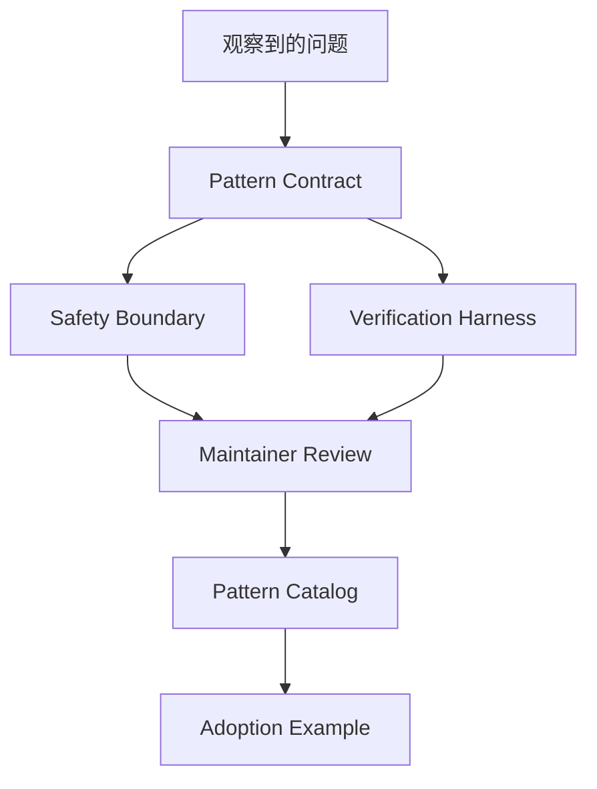

# 模式贡献案例

## 场景

团队复用一个自定义规划模式，并希望把它沉淀为 Agent-Top 的可复用贡献。

## 架构

## 关键决策

- 同一个 contract 在多个真实任务中重复出现时，模式才够稳定。
- 贡献内容把原则与框架代码分离。
- 模式必须包含 inputs、outputs、allowed tools、failure modes 和 acceptance criteria。
- 未知场景 fail closed，直到 contract 被扩展。
- Adoption example 同时提供无框架流程和框架 Lab 引用。

## 失败模式

- Pattern 只是某个框架 API 的 wrapper。
- Contract 没有 rollback 或 human confirmation。
- Verification harness 只覆盖 happy path。
- 术语与 glossary 不一致。
- Pattern 无法说明什么时候不应该使用它。

## 评估

- 至少三个场景的复用性。
- 已记录的 failure modes 数量。
- Maintainer review 结果。
- 新贡献者 adoption time。
- 下游 Lab 或案例反馈。

## 作品集叙述

我把团队反复使用的工作流转成可复用 Agent pattern，定义了稳定 contract、safety boundary 和 verification harness。贡献有价值是因为它沉淀了模式，而不是单个实现。

## 关联 Lab

- [`../../../labs/l5/pattern_catalog/README.md`](../../../labs/l5/pattern_catalog/README.md)
