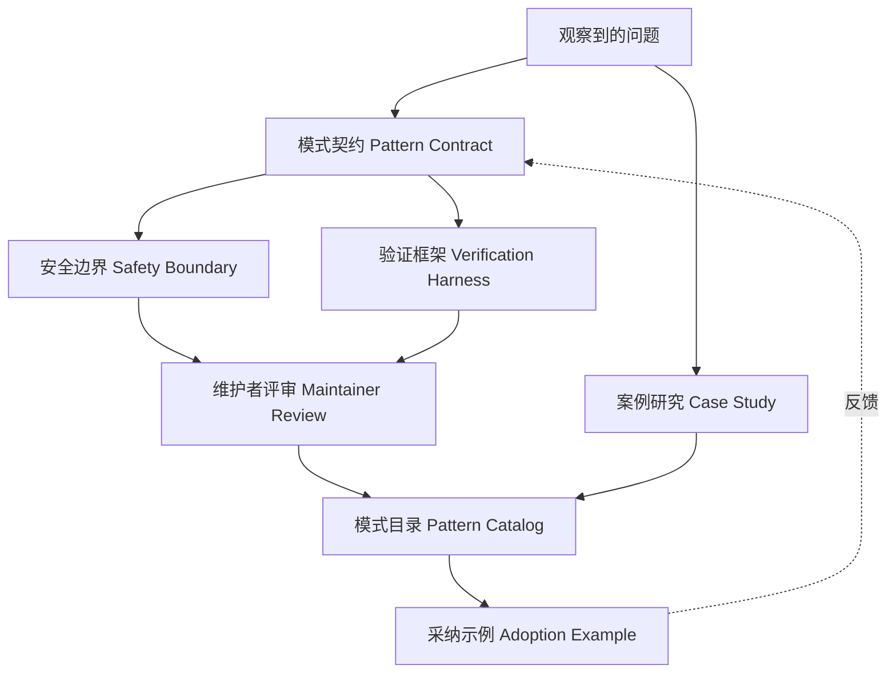

# 模式贡献案例

## 场景与背景

我们组织内的一个平台团队反复实现同一种"先研究、后确认"（research-then-confirm）工作流：Agent 从多个来源收集证据、起草方案，然后在执行任何不可逆操作之前暂停等待人工确认。这条工作流出现在三个不同产品、三套不同代码库中，而每个团队都用略有差异的假设重新实现了一遍。一个实现会在 60 秒超时后自动执行；另一个要求显式的 `--yes` 标志；第三个根本没有超时，结果在隔夜运行中卡死。

团队决定把这条重复出现的工作流沉淀为对 Agent-Top 的可复用贡献：一个有稳定契约、安全边界和验证框架的文档化模式。本案例记录了这次贡献是如何设计的、维护者强制了哪些权衡，以及这个模式如何进入目录（catalog），而不是变成又一个框架专属的包装器。

## 系统架构

贡献流水线把模式当作一等产物。观察到的问题变成契约；契约定义安全与验证；只有通过维护者评审的模式才能进入目录：



多出来的边很重要：记录原始问题的案例研究随模式一起流动，采纳反馈则回流到契约。一个无法从真实使用中演进的模式只是文档，不是模式。

## 组件职责

| 组件 | 职责 | 验收标准 |
| --- | --- | --- |
| 观察到的问题 | 真实任务中具体、反复出现的失败或摩擦 | 同一问题至少在三个场景中出现 |
| 模式契约 | 稳定的输入、输出、允许工具与显式失败模式 | 契约在重构后语义不变 |
| 安全边界 | 声明模式绝不可做什么、何时需要人工确认 | 不可逆动作绝不自动执行 |
| 验证框架 | 针对契约运行 happy-path、失败模式与对抗性用例 | 每个已记录的失败模式都有"先失败后通过"的测试 |
| 维护者评审 | 检查术语表一致性、范围与 fail-closed 行为 | 评审者能解释何时不该使用该模式 |
| 模式目录 | 随采纳示例与案例研究发布模式 | 新贡献者能在一天内采纳该模式 |
| 采纳示例 | 无框架走查 + 一个框架 Lab 引用 | 不安装框架也能运行走查 |

## 关键实现细节

### 模式契约

契约是贡献的核心。对于"先研究、后确认"模式，它被写成：

```yaml
pattern: research-then-confirm
inputs:
  research_question: string
  sources: list of data sources
  confirm_timeout: duration, default 30m
outputs:
  proposal: structured proposal with evidence links
  confirmation: explicit human decision record
allowed_tools:
  - read-only search and retrieval tools
  - draft/write tools that only stage changes
forbidden:
  - tools that execute irreversible actions before confirmation
failure_modes:
  - timeout_no_confirm: default to "proposal only", never auto-execute
  - source_unavailable: degrade to remaining sources and say so
  - ambiguous_proposal: require clarification instead of guessing
acceptance_criteria:
  - no irreversible action without a logged human confirmation
  - every run ends in proposal, confirmation, or explicit timeout
```

三个属性让这个契约可复用而非偶然：输入输出领域中立，每个失败模式都有定义好的行为，禁止清单是被强制执行的而不是建议。

### 安全边界

评审的主要交锋点是超时行为。那个 60 秒后自动执行的团队辩称自动化才是 Agent 的意义。维护者拒绝了：不可逆动作需要一条已记录的人工确认，超时默认值必须是"仅提案"（proposal only）。边界还要求确认记录本身机器可读，这样下游门禁才能核验它。

### 验证框架

框架对每个候选实现运行四类用例：

1. **Happy path**：所有来源可用、人工确认、提案完整。
2. **超时**：没有任何确认到达；运行必须以 `proposal only` 和一条超时记录结束。
3. **来源失败**：某个来源不可用；运行降级并点名缺失的来源。
4. **对抗性**：提供一个本可执行不可逆动作的工具；框架断言它在确认之前绝不被调用。

每个类别对应一个已记录的失败模式，所以框架测试的不只是代码，而是契约。

### 状态流与失败处理

一次运行经历五个状态：`gathering`、`drafting`、`awaiting_confirmation`、`executing` 或 `abandoned`。所有迁移都被记录。两条关键规则是：`awaiting_confirmation` 只能通过一条已记录的人工决策或一个默认转为 abandoned 的超时退出；每次状态迁移都写一条机器可读记录，让采纳团队可以在模式之上构建自己的门禁。

## 端到端走查

跟踪一次从观察到采纳的完整贡献会让流程变得具体。"先研究、后确认"模式走了这条路：

| 步骤 | 发生了什么 | 门禁 |
| --- | --- | --- |
| 1 | 三个团队在同一个 issue 里登记同样的摩擦：研究工作流卡住或意外自动执行 | 同一问题出现在三个场景 |
| 2 | 一位工程师起草带输入、输出、禁止工具和四个失败模式的契约 | 契约评审清单 |
| 3 | 安全边界被写出并评审；自动执行超时被判定为禁止项而否决 | 安全评审签字 |
| 4 | 参考实现加四类框架在同一次 PR 中落地 | 框架运行全绿 |
| 5 | 维护者检查术语表一致性：`confirmation` 与术语表一致，`approval` 被否决 | 术语表一致性 |
| 6 | 模式随案例研究和无框架走查进入目录 | 目录条目已发布 |
| 7 | 一位新贡献者为文档摘要产品采纳该模式，半天完成 | 记录采纳时间指标 |
| 8 | 采纳揭示一个新失败模式（`ambiguous_proposal`）；契约被扩展而非分叉 | 带新失败模式的契约 v2 |

第 8 步是整个设计的意义所在：因为契约拥有失败模式，生产中发现的缺口会变成模式的版本升级，而不是第三次重新实现。

## 模式生命周期与维护

目录中的模式是活文档，有明确的生命周期：

- **草稿（Draft）**：契约与框架存在于 PR 中，尚未入目录。
- **已入目录（Cataloged）**：通过维护者评审，可随案例研究被采纳。
- **已验证（Proven）**：被发起团队之外至少两个团队采纳，且采纳反馈已合并回来。
- **已弃用（Deprecated）**：被更广泛的模式取代或被证明有害；保留并重定向到继任者。
- **已移除（Removed）**：只在弃用之后移除，以便下游团队迁移。

两条维护规则让目录保持诚实。第一，未被采纳的模式在两个季度后被评审是否移除，因为没人采纳的模式只是文档，不是模式。第二，每次契约变更都是一次带 changelog 条目的版本升级，让采纳团队能评估升级的爆炸半径，而不是默默继承新行为。

## 评估与采纳指标

这次贡献成功，因为团队追踪的是行为而不是观点：

- **采纳时间**：从阅读目录条目到可用实现的中位时间。第一个外部采纳者不到一天。
- **失败模式覆盖率**：有框架用例的已记录失败模式占比。入目录时必须是 100%。
- **契约稳定性**：入目录后破坏性契约变更的次数。两个团队基于 v1 采纳、契约走到 v2，说明契约在关键处足够稳定。
- **下游事故率**：采纳团队中可归因于该模式安全边界的事故数。自超时修复以来为零。
- **目录健康度**：已采纳与未采纳模式的比率。一个不健康的模式是信号而不是丑闻，但它会迫使做弃用决策。

## 设计权衡

- **原则 vs. 框架代码。** 模式以文档化契约加参考实现的形式交付，而不是一个库。团队失去了复制粘贴的便利，却获得了能挺过框架迁移的契约。
- **Fail closed vs. 自主性。** 把超时默认设为"仅提案"牺牲了一些自动化，换来的是"不可逆动作绝不未经确认执行"的硬保证。
- **严格契约 vs. 快速迭代。** 严格契约拖慢了第一次采纳，但正是它让第三次采纳变快，因为框架已经编码了团队的决策。
- **目录条目 vs. 案例研究。** 不带原始案例研究交付模式，会让评审者猜测范围；案例研究是最便宜的文档，也是新采纳者最先读的东西。
- **三个场景 vs. 更早上线。** 等待三个独立出现会推迟贡献，但能过滤掉会污染目录的一次性 hack。

## 可迁移模式

- **契约先行，代码后行。** 模式贡献以契约和失败模式论成败，而不是参考实现写得有多干净。
- **默认 fail closed。** 契约没有覆盖的场景，模式必须安全降级并明说，绝不猜测。
- **框架测试契约而非实现。** 每个失败模式映射一个框架类别，因此新实现无需重写测试就能被验证。
- **采纳反馈是模式的一部分。** 每次发现缺口的采纳都会更新契约，这就是模式保持鲜活而不是腐烂的原因。
- **点名反范围（anti-scope）。** 一个说不清何时不该用的模式，还不配进入目录。

## 踩坑与生产教训

- **框架包装器不是模式。** 第一个提交是对某厂商 planner API 的薄包装。评审否决了它，因为去掉框架后没有任何可复用的想法。
- **省略回滚或确认的契约会腐烂。** 自动执行超时正是评审者抓到的那个失败；契约现在显式禁止它。
- **只测 happy path 的框架会通过错误的东西。** 第一个框架只验证成功运行，坏掉的超时路径差点上线。对抗性与超时用例现在是必选类别。
- **术语漂移破坏采纳。** 一个团队把 `confirmation` 改名为 `approval`，他们的评估覆盖范围悄然偏离了模式；术语表现在拥有这些术语。
- **未文档化的"何时不用"会误导采纳者。** 团队把模式用在确认毫无意义的全自主批量任务上；反范围章节解决了这个问题。

## 讨论与自测题

1. 什么让一个模式"足够稳定"可以贡献，为什么三个场景很重要？
2. 为什么超时默认应该是"仅提案"，而不是在确认缺席后自动执行？
3. 验证框架如何测试一个实现试图隐藏的失败模式？
4. 只贡献契约而不带原始案例研究，会损失什么？
5. 如果采纳团队需要第四个输入，应该扩展契约还是分叉模式？

## 关联 Lab

- L5 Pattern Catalog：[`../../../labs/l5/pattern_catalog/README.md`](../../../labs/l5/pattern_catalog/README.md)
- L5 Custom Pattern：[`../../../labs/l5/custom_pattern_lab/README.md`](../../../labs/l5/custom_pattern_lab/README.md)
- L5 Multilingual Pattern：[`../../../labs/l5/multilingual_pattern_lab/README.md`](../../../labs/l5/multilingual_pattern_lab/README.md)

## 关联 Example

- Agent Decision Trace：[`../../../examples/agent-decision-trace/README.md`](../../../examples/agent-decision-trace/README.md)
- MCP Tool Boundary：[`../../../examples/mcp-tool-boundary/README.md`](../../../examples/mcp-tool-boundary/README.md)
- Data Source Policy：[`../../../examples/data-source-policy/README.md`](../../../examples/data-source-policy/README.md)

## 本案例不覆盖的范围

- **框架专属配方库。** 模式在设计上框架中立；想要某个特定框架开箱即用库的团队，应该在契约之上构建它。
- **Agent-Top 之外的模式市场。** 这里的评审与生命周期规则是 Agent-Top 目录及其术语表专属的。
- **自主多 Agent 编排。** "先研究、后确认"模式覆盖一个 Agent 加一个人工确认点；编排多个 Agent 会改变安全边界，值得拥有自己的模式。
- **商业化与许可。** 本案例覆盖技术贡献，不覆盖发布或销售模式的商业决策。

## 采纳剧本

对想复制这次贡献的团队，实际奏效的顺序是：

1. **收集问题，而不是代码。** 在写任何实现之前，先登记三个独立团队的摩擦。
2. **先在纸上写契约。** 输入、输出、禁止工具和失败模式在一行代码存在之前就要被评审。
3. **让维护者攻击安全边界。** 自动执行超时是在评审中被抓到的，不是在生产中。
4. **从失败模式构建框架。** 四个失败模式意味着四个测试类别；只测 happy path 的测试是拒绝理由。
5. **把案例研究与模式一起交付。** 起源故事是最便宜的文档，也是采纳者最先读的东西。
6. **在宣布模式已验证之前，用一个季度追踪采纳时间和下游事故。**

## 作品集叙述

我把一个团队反复使用的工作流转化成了可复用 Agent 模式，定义了稳定契约、安全边界和验证框架。这次贡献有价值，是因为它沉淀了模式而不只是单个实现：三个团队现在采纳同一份契约，框架能抓住当初被发到生产环境里的超时失败模式，案例研究让新贡献者在写代码之前就理解范围。

## 经验

模式贡献是一份带安全边界和证据的契约，而不是代码投递。目录只有让每个条目回答三个问题才可信：契约是什么？它绝不可做什么？这一点如何被验证？Fail closed、文档化反范围，并让采纳反馈扩展契约。
