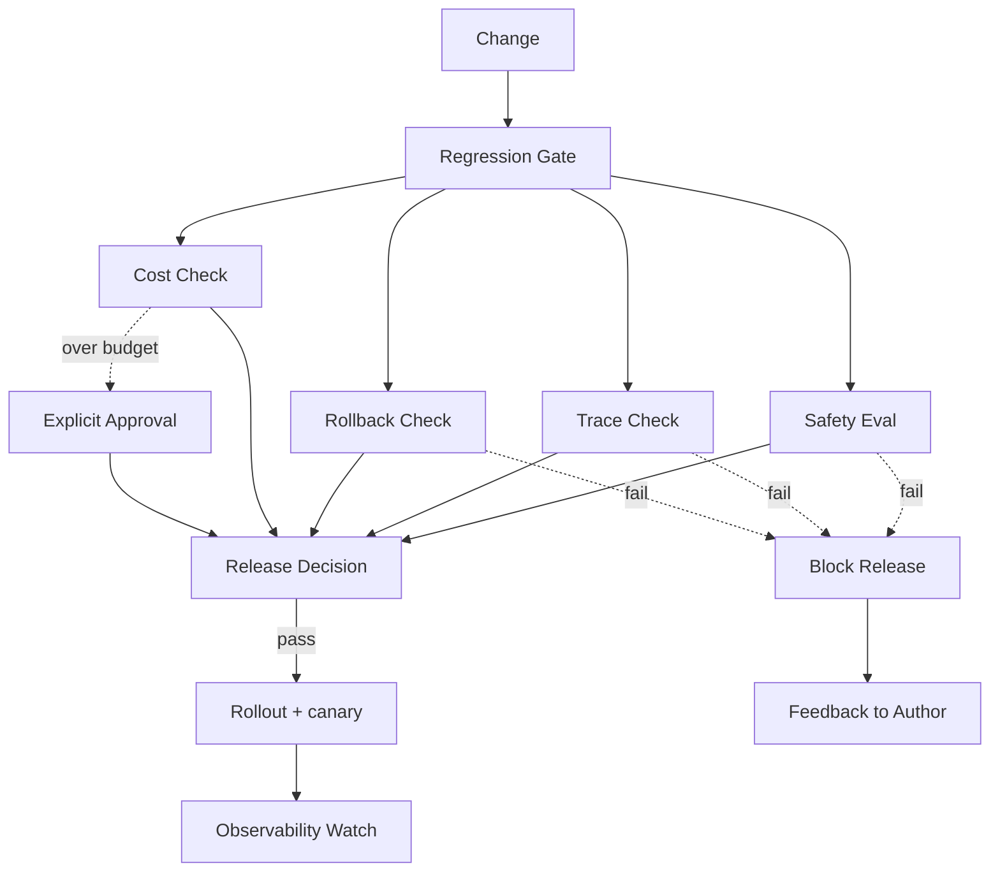

# 生产回归门禁案例

## 场景与背景

我们的团队维护一个面向客户的编码 Agent，它可以编辑仓库、执行命令并调用模型网关 API。早期，"在我机器上能跑"就是唯一的发布标准：工程师只要冒烟测试通过，就会合入 prompt 改动、新工具或模型版本升级，而失败通常要等客户提交工单才会被发现。

转折点是一次事故：新的模型版本升级改变了工具调用格式，Agent 静默停止持久化决策 trace，安全层再也看不到"破坏性命令已被人审阅"的证据。两天后，一次对着客户仓库的错误 `git push --force` 让回滚变得不可能，因为改动已经被传播出去。事后复盘产出一条硬性规则：**任何改动必须通过确定性回归门禁才能进入生产**，而且门禁的证据必须是机器可校验的，而不是发布前靠人记着的清单。

## 系统架构

门禁是一条 CI 优先的流水线。任何对 prompt、工具、模型路由或护栏配置的改动，都会进入一个人工审批甚至还没开始、门禁就已经先跑起来的环境：



Mermaid 图忠实反映实际流水线：四项检查并行运行，所有失败路径汇聚到"阻断发布"决策，只有成本检查可以转向显式审批而不是硬阻断。发布和发布后的可观测性观察也属于门禁叙事的一部分，因为一个在部署后就停止检查的门禁只算半个门禁。

## 组件职责

| 组件 | 职责 | 产出 |
| --- | --- | --- |
| 改动接入 | 规范化 diff（prompt、工具、路由、护栏），附上作者、工单和环境 | 机器可读的改动清单 |
| 安全评估 | 运行 golden prompt 集与对抗性用例；任何 critical 失败都是阻断项 | 带逐例结论的 `safety-report.json` |
| Trace 检查 | 验证改动在采样运行中产生包含全部必填字段的 trace 记录 | 缺失字段列表或 `trace-complete` |
| 回滚检查 | 验证回滚计划存在、有 owner，并且已针对上一版本演练过 | `rollback-plan.json` + 最近演练时间戳 |
| 成本检查 | 对改动重放成本预算和延迟预算；超预算不会自动阻断 | 含 delta 与 p95 延迟的预算报告 |
| 发布决策 | 汇总结论、持久化，并产出部署任务唯一信任的产物 | 已签名的 `release-decision.jsonl` |
| 金丝雀与可观测性观察 | 向一小部分流量发布，观察错误组与 trace 完整性 | 回滚触发信号或"观察窗口关闭"信号 |

## 关键实现细节

### Prompt / 工具契约

门禁不运行整个 Agent，而是运行**采样重放**：用一组固定的 golden prompt 和工具场景对候选改动执行，并记录每一步。重放契约属于改动本身的一部分：

```yaml
change:
  kind: model-routing-update   # prompt | tool | routing | guardrail
  ticket: PROD-482
  author: ada
  replay_set: golden-24        # 仓库中命名的重放集
  must_block_on: [safety-critical, trace-missing, rollback-untested]
```

### 状态流

1. 改动落地，门禁任务读取清单。
2. 安全、trace、回滚、成本四项检查并行运行，各自写入 JSON 报告。
3. 发布决策聚合器加载全部四份报告；任何 `block` 结论都让任务失败。
4. 成本超预算的结论转向显式审批记录，而不是让任务失败。
5. 通过后，部署任务签名并存储决策，然后触发金丝雀发布。
6. 可观测性观察者将金丝雀的错误组率和 trace 完整性与上一版本的基线对比。

### 失败处理

- 安全 critical 失败：阻断发布，呼叫安全 on-call，并从失败输入中创建后续 eval 用例。
- 缺失 trace 字段：阻断发布，并明确指出缺失的字段名和应当产出它的步骤。
- 回滚计划未演练：阻断发布。没有演练时间戳的计划文件与没有计划同等对待。
- 成本超预算：不硬阻断；决策记录必须引用一条带 owner 和过期时间的显式审批。

## 端到端走查

一次具体运行能让状态流变得清晰。改动是一次模型路由更新，把长上下文请求改路由到更便宜的模型（PROD-482）：

| 步骤 | 发生了什么 | 产出的证据 |
| --- | --- | --- |
| 1 | 作者发起改动并声明 `kind: model-routing-update`，`replay_set: golden-24` | `change-manifest.yml` |
| 2 | CI 解析清单，门禁任务启动 | 含固定门禁版本的构建日志 |
| 3 | 安全评估运行 golden + 对抗性 prompt；一个新的 prompt 触发了过度拒答 | `safety-report.json` |
| 4 | Trace 检查重放同一集合；24 条 trace 中有 3 条缺失 `tool_name`，因为新路由器丢弃了一个字段 | `trace-gaps.json` |
| 5 | 回滚检查加载 `rollback-plan.json`；计划已过期（上次演练在 47 天前） | 演练时间戳 < 30 天策略 |
| 6 | 成本检查按预算重放路由表；更便宜的模型预计节省 18% | `budget-report.json` |
| 7 | 聚合器看到 `trace-missing` 和 `rollback-untested`；任务失败并带着两个原因呼叫作者 | 带 `verdict: block` 的签名 `release-decision.jsonl` |
| 8 | 作者修复路由器以产出 `tool_name`，重新演练回滚，再次推送 | 第二次门禁运行，全部通过 |
| 9 | 部署任务签名决策，发布到 5% 金丝雀，并开启 6 小时可观测性观察窗口 | 带错误组基线的观察窗口 |

这次走查说明为什么门禁的产品是证据而不是记忆：trace 缺口和过期的回滚计划都是人眼扫 diff 时看不见的，但确定性检查在同一次运行中同时抓住了两者。

## 门禁判定示例

聚合器每次门禁运行写一条记录，这样任何事后复盘都能回答"门禁当时知道什么、何时知道的"：

```jsonl
{"run_id": "gate-2026-09-16-0142", "change": "PROD-482", "version": "2026.09.16-rc1"}
{"check": "safety", "verdict": "pass", "cases": 24, "critical_failures": 0}
{"check": "trace", "verdict": "block", "missing_fields": ["tool_name"], "affected_steps": ["router.invoke", "router.invoke", "router.invoke"]}
{"check": "rollback", "verdict": "block", "reason": "last_drill 47 days ago, policy 30 days"}
{"check": "cost", "verdict": "pass", "delta_percent": -18.0, "p95_latency_ms": 940}
{"decision": "block", "owners_paged": ["ada", "oncall-safety"], "followups": ["eval-case: over-refusal-482"]}
```

## 运营指标

我们追踪门禁本身的四个数字，而不只是它保护的系统：

- **按检查拆分的阻断率**：每项检查导致的阻断运行比例。当 trace-missing 主导阻断时，需要投资的是 trace 层，而不是门禁。
- **误阻断率**：24 小时内被人工覆盖的门禁结论比例。比率高说明门禁检查错了契约。
- **首次判定耗时**：从 push 到完整决策的中位分钟数。我们把它控制在 12 分钟内，让门禁留在作者的反馈环里。
- **漏网回归数**：门禁通过后由夜间全量评估套件抓到的回归数。这是对采样风险最诚实的度量。

## 设计权衡

- **重放采样 vs. 全量评估。** 每次改动都跑完评估集里所有 prompt 太贵；门禁采样一个命名的 golden 集，全量套件放到夜间。代价是 golden 集之外的回归可能漏过门禁，所以夜间全量套件仍然有回滚权限。
- **并行检查 vs. 顺序执行。** 检查并行以降低门禁延迟，但每份报告原子写入，聚合器永远不会看到半成品结论。
- **成本"需要审批" vs. 硬阻断。** 硬成本阻断会卡住合法的长时研究任务；把超预算改动导向显式审批，既保留速度也保留人工决策点。
- **CI 优先 vs. 开发者本机预检。** CI 优先意味着作者要等几分钟才有结论，但它保证了证据在即将发布的同一环境中产生。

## 可迁移模式

- **证据胜过断言。** 发布门禁的可信度取决于它持久化的证据。让每个结论机器可读（`JSONL`）并挂到发布决策上。
- **阻断项保持极少。** 只有三类结论阻断：安全 critical、缺失 trace 证据、回滚未演练。阻断清单越短，就越难被绕过去。
- **在改动里点名检查。** 要求作者声明改动类型和重放集，迫使他们早在门禁运行前就思考爆炸半径。
- **发布后观察也是门禁的一部分。** 一个在部署就结束的门禁会训练团队去钻门禁的空子；把它延伸到金丝雀和可观测性窗口，才能保持激励一致。

## 采用剧本

把门禁推进一个原本靠感觉发布的团队，需要分步走，而不是一次性大棒：

1. **从只读报告开始。** 前两周对每次改动运行全部四项检查，但只把报告发给作者。团队先接受度量，才会接受强制。
2. **把三条阻断规则正式化。** 安全 critical、缺失 trace 证据、回滚未演练，先成为书面发布政策，再让 CI 任务开始据此失败。
3. **先对安全和回滚开启硬阻断。** 这两项满足成本低、争议小，能帮门禁建立信任。
4. **等 trace 层稳定后再开启 trace-missing 阻断。** 否则门禁会拿噪音淹没作者，然后被禁用。
5. **用一个季度跟踪四个运营指标**，根据漏网回归调采样集，再扩展到更多改动类型。

分步顺序比单个检查更重要：第一天就失败的门禁第二周就会被删掉，而一个逐项赢得信任的门禁会变成文化的一部分。

## 踩坑与生产教训

- **清单会变成装饰。** 我们的第一个门禁是 wiki 页上的一份清单，事故期间从没人读过。把检查搬进 CI 后它们才不可回避。
- **未演练的回滚计划是虚构的。** 我们曾带着一个引用了两个版本前就删掉的脚本的回滚计划发布。现在演练时间戳会阻断任何未演练的计划。
- **没有 owner 的成本警告会静默衰减。** 没有 owner 和过期时间的"警告"会慢慢失效。超预算现在需要一条显式审批记录，而记录本身会过期。
- **跳过的安全评估会掩盖回归。** 当改动被标记为"仅文档"时评估被跳过，一次措辞改动改掉了工具权限。现在每种改动类型至少对应一个安全评估。
- **Trace 完整性是最先腐坏的东西。** 一次模型版本升级改变了 trace 格式；在把缺失字段从警告改成阻断之后，门禁才在用户发现之前抓住了问题。

## 运维检查清单

门禁只有在输入被固定时才可能是确定性的。每次门禁运行都基于一个 commit 级快照，并强制以下不变量：

- 重放集、模型版本和路由器配置按 commit 哈希固定，一个月后结论依然可复现。
- 每项检查原子写入固定 schema 版本的报告；聚合器拒绝未知 schema 版本而不是猜测。
- 没有人能在决策记录里悄悄翻转结论。人工覆盖是一条带 owner 和过期时间的新审计行，绝不是静默编辑。
- 每次运行都记录门禁二进制版本，因此"门禁行为变了"本身也是可诊断的。
- 回滚演练安排与清单引用的日历一致；没有日期化演练的计划在接入时就被拒绝。

## 讨论与自测题

1. 哪些失败应当永远阻断发布？为什么成本超预算要区别对待？
2. 为什么缺失 trace 字段应当是阻断项而不是警告级？
3. 用 golden 重放集采样而不用全量评估套件，会损失什么？
4. 你会如何给这个门禁加上 p95 延迟阈值，同时不让大型任务都被阻断？
5. 如果门禁通过后金丝雀仍然出现回归，复盘应该要求哪些新证据？

## 关联 Lab

- L4 回归门禁：[`../../../labs/l4/regression_gate/README.md`](../../../labs/l4/regression_gate/README.md)
- L4 生产复盘： [`../../../labs/l4/production_postmortem/README.md`](../../../labs/l4/production_postmortem/README.md)
- L4 部署卫生： [`../../../labs/l4/deployment_hygiene/README.md`](../../../labs/l4/deployment_hygiene/README.md)

## 关联 Example

- 发布门禁证据： [`../../../examples/release-gate-evidence/README.md`](../../../examples/release-gate-evidence/README.md)
- Agent 评估回归： [`../../../examples/agent-eval-regression/README.md`](../../../examples/agent-eval-regression/README.md)
- 安全评估： [`../../../examples/safety-eval/README.md`](../../../examples/safety-eval/README.md)
- 可观测性 trace： [`../../../examples/observability-trace/README.md`](../../../examples/observability-trace/README.md)

## 本案例不覆盖的范围

- **多区域发布顺序。** 门禁证明单个环境就绪，但不决定改动如何跨区域传播，那是这条流水线之外的决策。
- **面向客户的滥用与对抗流量。** 这里的安全评估覆盖工具和 prompt 行为，不覆盖线上滥用检测，那是另一套运行时控制。
- **人工审批的政治。** 门禁让证据可见，但解决作者与安全 owner 之间的争议是治理流程，不是 CI 任务。
- **长期成本漂移。** 预算按改动重放；许多小改动叠加造成的渐进成本漂移需要夜间套件和季度预算评审，而不是这个门禁。

## 门禁团队的组织配套

技术实现之外，三条组织约定让门禁没有被绕过：

- **发布 owner 负责解释证据。** 如果部署任务被人工覆盖，必须留下一条带 owner、原因和过期时间的审计记录，而不是把门禁静默关掉。
- **on-call 轮值覆盖门禁本身。** 门禁挂掉与生产故障同等对待：有告警、有轮值、有复盘。
- **门禁变更走同一套门禁。** 修改门禁规则、重放集或 schema 的 PR 自身也要通过门禁，防止"放宽规则"变成悄悄发布。

## 经验

生产就绪是一道门禁，而不是发布前靠人记着的清单。门禁真正的产物是持久化、机器可读的证据：一份决策记录，说明检查了什么、什么失败了、谁被呼叫了。让阻断清单保持极短，让每个结论原子化并签名，并把门禁延伸到部署之后的金丝雀与可观测性窗口。下一次事故发生时，复盘要能回答的第一个问题不是"谁忘了什么"，而是"门禁当时知道什么、何时知道的？"
