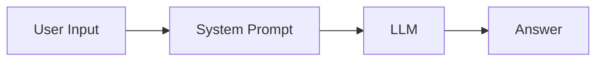
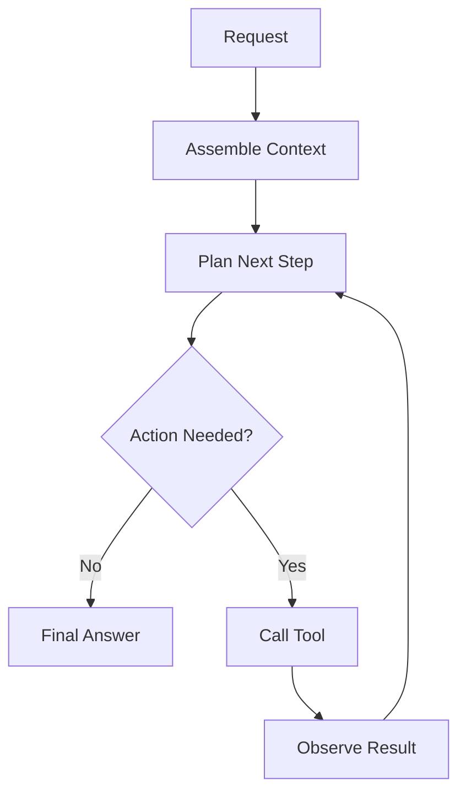
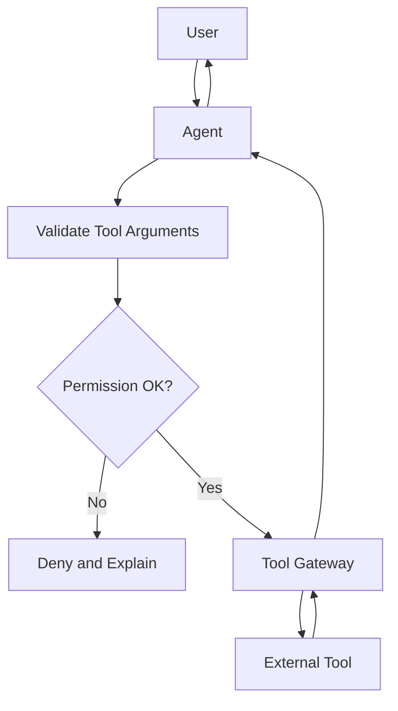
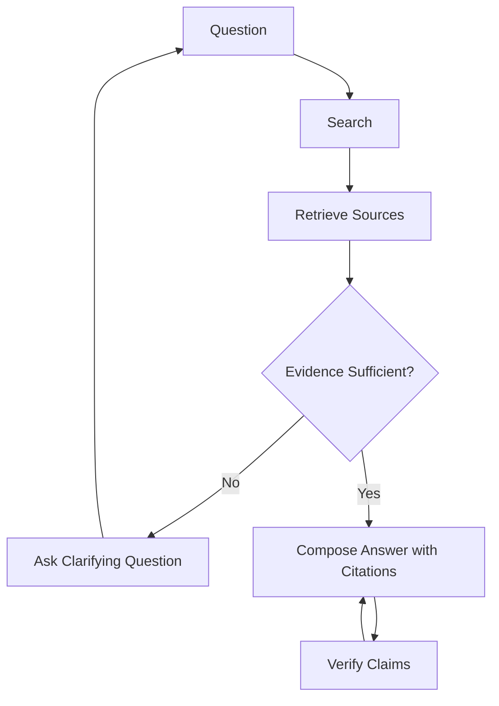
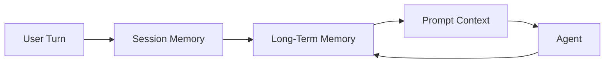
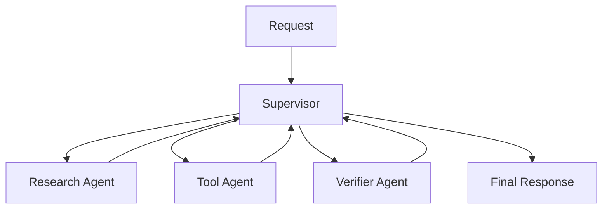
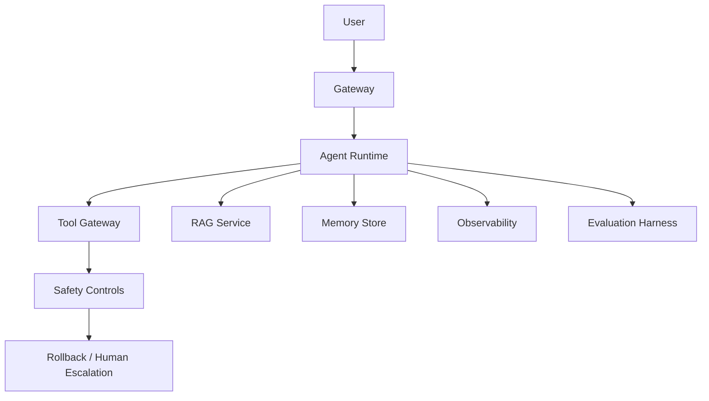

# Agent 系统架构

大多数公开 Agent 教程最终都收敛到相同的架构模式：一次 LLM 调用、一个循环、检索增强生成（RAG）、工具使用、记忆、可观测性与多 Agent 协调。

Agent-Top 把这些模式保留为稳定概念，然后把框架特定的代码放进 Labs。

## 1. 最小 LLM 调用

第一个构建块是带用户消息和系统提示的模型调用。

要学什么：

- Token 与上下文限制。
- 系统提示与用户提示的区别。
- 为什么直接回答不一定是最好的路径。

相关教程：

- [`../L0第一次LLM调用.md`](../L0第一次LLM调用.md)

## 从第一次 LLM 调用到多轮 Agent

第一次 LLM 调用有助于理解请求、消息、上下文限制和模型行为。多轮 Agent 在该模型调用周围增加了状态、工具、重试、观察与停止决策。

有用的区分：

| 阶段 | 已存在什么 | 学习者应证明什么 |
| --- | --- | --- |
| 第一次 LLM 调用 | 请求、系统提示、用户消息、响应 | 能解释上下文与输出形态 |
| 单循环 | 工具、观察、下一步决策 | 能停止并从工具结果恢复 |
| 多轮 Agent | 历史、记忆、工具、验证、升级 | 能解释每一轮为何存在 |

这是从教程式示例到生产级 Agent 系统的桥梁。

## 2. 单 Agent 循环

单个 Agent 使用循环：计划、行动、观察、更新、重复。

要学什么：

- 停止条件。
- 最大步数限制。
- 工具结果歧义。
- 每一步的可观测性。

相关 Labs：

- [`../../../labs/l1/minimal_react_agent/README.md`](../../../labs/l1/minimal_react_agent/README.md)
- [`../../../labs/l1/multi_turn_state/README.md`](../../../labs/l1/multi_turn_state/README.md)

## 3. 使用工具的 Agent

工具使用把模型从答案生成器变成系统参与者。工具提供外部事实、当前状态和副作用。

要学什么：

- 工具 schema 校验。
- 角色与租户权限。
- 只读、写入与破坏性动作的区别。
- 不可逆动作的确认机制。

相关 Labs：

- [`../../../labs/l1/guardrail_helpers/README.md`](../../../labs/l1/guardrail_helpers/README.md)
- [`../../../labs/l2/single_agent_mcp/README.md`](../../../labs/l2/single_agent_mcp/README.md)

## 4. RAG Agent

RAG 把答案扎根在检索到的来源上。当答案依赖私有、最新或大规模知识时尤其有用。

要学什么：

- 查询规划。
- 分块与检索。
- 来源新鲜度。
- 证据缺失时的拒绝。
- 首次检索遗漏时的多轮搜索。

相关教程与 Labs：

- [`多轮研究讨论.md`](多轮研究讨论.md)
- [`../L3RAG记忆与可观测.md`](../L3RAG记忆与可观测.md)
- [`../../../labs/l3/rag_evaluator/README.md`](../../../labs/l3/rag_evaluator/README.md)

## 5. 记忆增强的 Agent

记忆跨轮次与会话提供上下文。它有用但也有风险：记忆可能过期、涉私或过度自信。

要学什么：

- 短期记忆与长期记忆的区别。
- 用户偏好与事实证据的区别。
- 遗忘与删除。
- 如何防止过期记忆覆盖当前用户输入。

相关 Lab：

- [`../../../labs/l1/multi_turn_state/README.md`](../../../labs/l1/multi_turn_state/README.md)

## 6. 多 Agent 系统

多 Agent 系统拆分职责。当每个 Agent 拥有清晰边界、且编排者能验证或升级时，效果最好。

何时用多 Agent：

- 研究与行动需要不同工具。
- 验证有价值，值得协调成本。
- 需要人工审批路径。
- 专门化 Agent 能减少失败模式。

何时避免多 Agent：

- 单个带工具的 Agent 就够。
- 共享状态难以推理。
- 调试协调比解决任务更费劲。

相关 Lab：

- [`../../../labs/l3/multi_agent_supervisor/README.md`](../../../labs/l3/multi_agent_supervisor/README.md)

## 7. 生产级 Agent 系统

生产系统在 Agent 循环周围增加门禁。

生产分层：

- Gateway：认证、速率限制、输入限制。
- Runtime：规划、工具路由、状态。
- Tool gateway：权限、审计日志、副作用。
- RAG：限定范围检索与来源新鲜度。
- Memory：隐私、过期数据、删除。
- Observability：trace、延迟、成本。
- Evaluation：黄金提示、安全评估、回归门禁。
- Rollback：提示、工具、检索、记忆、流量控制。

相关文档：

- [`../production/评估清单.md`](../production/评估清单.md)
- [`../production/安全清单.md`](../production/安全清单.md)

## 如何阅读其他教程

遇到外部 Agent 教程时，把它映射到这些问题：

1. 这是单次 LLM 调用还是控制循环？
2. 它是否使用工具、RAG、记忆或多 Agent 协调？
3. 停止条件是什么？
4. 回答前必须存在什么证据？
5. 安全与回滚控制在哪里？
6. 哪些部分是稳定模式，哪些部分是框架特定？

这个映射正是 Agent-Top 想培养的核心学习技能。
