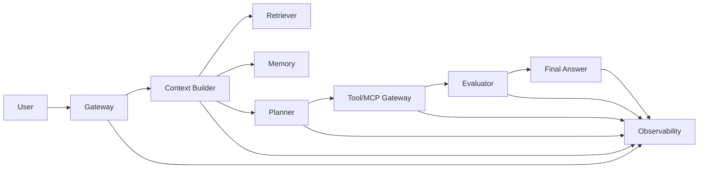

# Agent 系统蓝图

Agent 系统蓝图是模糊产品需求（"给我们做个 Agent"）与可评审、可投产的设计大纲之间的桥梁。它不取代实现；它迫使团队尽早做出昂贵决策——在这个阶段修改设计还只花得上一场会议，而不是一次迁移。

## 定义

蓝图是一种结构化设计文档，具备三个属性：

- **完整到可评审**：每个主要子系统都有负责人、输入、输出和故障模式。
- **具体到可构建**：每个决策都是具体的——一种策略、一个风险等级或一个具名数据源——而不是口号。
- **短到可维护**：如果一份文档需要重写才能跟上现状，说明架构已经过于复杂。

一个有用的心智模型：蓝图就是"架构的测试用例"。如果架构正确，蓝图读起来像清单；如果架构错误，蓝图读起来像散文。一份无法对照运行系统核验的蓝图——因为它躺在没人读的设计文档里——不是蓝图，只是摆设。

## 为什么蓝图重要（第一性原理）

Agent 是一个把模型输出转化为动作的控制循环。这个循环有三个结构性特征，让设计错误变得昂贵：

1. **不确定性叠加**：每一步都消耗上下文并增加延迟，因此循环开头的错误会在结尾被放大。
2. **动作不对称性**：幻觉的一句话是麻烦；幻觉的一个动作可能不可逆地改变状态。
3. **可观测性债务**：循环在无追踪的情况下运行得越久，事后解释其行为就越贵。

由此可以推出：杠杆率最高的工作在第一次模型调用之前——定义目标、非目标、工具风险、数据归属和门禁。蓝图恰好承载这份前置工作。从系统论角度看，蓝图是控制面的规格说明：它固定了循环的边界、不变量和逃生舱口，让运行时代码只负责执行那些已经被深思熟虑过的决策。

## 蓝图画布

画布是一份十段式模板，每份蓝图都必须填写。只有在被标记为开放风险时，"待定（TBD）"才是可接受的临时答案。

1. **用户与业务成果** —— 一句话目标、用户画像和成功指标。
2. **非目标与禁止动作** —— 系统绝不可做之事，以及它可以拒绝做之事。
3. **数据源与归属** —— 每个数据源、其负责人及其优先级。
4. **工具/MCP 面与风险等级** —— 每个工具、其权限模型及其风险等级。
5. **规划与路由策略** —— 系统如何在工具调用、子 Agent 与直接回答之间抉择。
6. **记忆与证据优先级** —— 记住什么、检索什么、冲突时谁赢。
7. **评估与安全门禁** —— 评估集，以及模型输出与动作之间的门禁。
8. **可观测性与 Trace 契约** —— 每条 Trace 必须包含哪些字段才能被回放。
9. **成本与延迟预算** —— 单请求预算和最慢可接受路径。
10. **发布、回滚与复盘流程** —— 变更如何上线、如何撤销、何时触发复盘。

## 架构图

参考架构有一个不那么明显的特性：上下文构建器位于规划器上游。检索与记忆塑造计划，这正是证据错误和记忆错误必须在规划之前、而非规划之后被捕获的原因。图中的每个框都对应画布的一个或多个章节：

| 组件 | 画布章节 | 该框必须应对的故障模式 |
| --- | --- | --- |
| 网关 Gateway | 1, 2 | 目标无边界；缺少认证、限流、安全校验 |
| 上下文构建器 Context Builder | 3, 6 | 错误或过期的上下文污染计划 |
| 检索器 Retriever | 3 | 检索不相关或低质量 |
| 记忆 Memory | 6 | 隐私泄露；过期事实压过新鲜证据 |
| 规划器 Planner | 5 | 路由错误、死循环、过度自信、缺少停止条件 |
| 工具/MCP 网关 | 4 | 未授权或不可逆的动作 |
| 评估器 Evaluator | 7 | 无依据的断言进入回答或动作 |
| 可观测性 Observability | 8 | Trace 无法复现故障 |

## 设计规则

- 使用满足目标的最简架构。
- 将请求输入与用户指令分开。
- 优先显式停止条件，而非置信度猜测。
- 在执行高风险动作之前先验证。
- 把检索到的记忆当作证据，而非权威。
- 让每个有风险的行为在上线前都可测试。

## 关键权衡

| 权衡 | 倾向哪边 | 注意什么 |
| --- | --- | --- |
| 子系统少 vs. 多 | 少 | 过早模块化会掩盖真实循环 |
| 规划深度 vs. 延迟 | 先浅 | 深度规划若无可观测性则无法调优 |
| 记忆复用 vs. 新鲜度 | 事实要新鲜 | 复用过期上下文会叠加错误 |
| 工具广度 vs. 权限安全 | 窄且显式 | 表面过大成倍增加风险等级 |
| 评估覆盖 vs. 上线速度 | 以最小评估集上线 | 没有动作门禁就上线不是捷径 |
| Trace 细节 vs. 成本 | 采样富 Trace | 采样却无完整捕获路径会漏掉事故 |

## 生产实践

- 把蓝图放在与代码相同的仓库里，让 diff 与架构变更保持关联。
- 在写任何代码之前，按蓝图做一次设计评审；架构变更时再评一次。
- 跟踪蓝图本身：开放风险清单、最近评审日期、评审人姓名。
- 把完成标准接入 CI 门禁：工具风险表未获批不得部署。
- 把回滚路径写成 runbook 步骤，而不是设计愿望。
- 每次复盘后，更新故障暴露出的蓝图章节。
- 成本与延迟预算必须带数字和单位，监控要按预算告警，而不只是按可用性告警。
- 保留"已知偏差"章节：每个对蓝图的刻意偏离都必须记录批准人和时间。

## 与相邻概念的关系

- 蓝图是设计评审的**输入**；[`Agent设计审查清单.md`](Agent设计审查清单.md) 是施加于其上的检查清单。
- 它引用 [`Agent系统架构.md`](Agent系统架构.md) 中的参考架构，以及 [`核心Agent实施手册.md`](核心Agent实施手册.md) 中的实施顺序。
- 它继承 [`../quick-reference/生产清单.md`](../quick-reference/生产清单.md) 中的生产约束。
- 成品可作为 [`../../../templates/agent-design-template.md`](../../../templates/agent-design-template.md) 的起点复用。
- 幻觉、工具错误等风险概念有自己的概念页详述；蓝图只需引用它们并指定负责人。

## 工作示例：客服 Agent

一个客服 Agent 蓝图可能长这样：

- **目标**：自主解决一级工单；成功指标是无人工移交的解决率。
- **非目标**：不做计费、不做账户删除、不制定政策；禁止动作包括任何未经二次检查的外部写入。
- **数据源**：知识库索引（优先级 1）、账户只读 API（优先级 2）、长期记忆（优先级 3，并以前两者刷新）。
- **工具/MCP 面**：三个工具——搜索知识库、读取账户、创建工单。创建工单属于"写"风险等级，需要模式校验和确认步骤。
- **规划**：先固定路由策略（意图分类器），最多三步工具调用，然后升级人工。
- **门禁**：无依据断言由验证器拦截；创建工单需要用户显式确认。
- **预算**：p95 延迟低于 5 秒；每张已解决工单成本低于 0.01 美元。
- **回滚**：自动回答一键熔断，立即回退到人工队列；每周在预发环境演练。

## 常见故障模式

| 故障 | 症状 | 蓝图中的根因 |
| --- | --- | --- |
| 范围蔓延 | Agent 做了团队没要求的事 | 非目标缺失或未被强制 |
| 工具混乱 | 未评审工具进入生产 | 工具面与风险等级缺失 |
| 静默过期 | 回答使用数月前的事实 | 数据源优先级未定义 |
| 死亡循环 | Agent 在单请求上无限重规划 | 没有显式停止条件 |
| 不可追踪事故 | 复盘无法重建运行过程 | Trace 契约未定义 |
| 回滚恐慌 | 值班人员无法撤销新行为 | 回滚流程不是 runbook 步骤 |

## 蓝图的范围

蓝图不是项目将产出的全部文档。它刻意排除：

- **实现细节**：具体提示词、分块大小、重试策略——这些属于代码或实现笔记，可以不经设计评审而调优。
- **运维手册**：事件响应、发布流程、值班轮换归运维所有；蓝图只说明预期行为和升级路径。
- **营销叙事**：价值主张和路线图宣言会遮蔽决策。如果一个句子放在幻灯片上也成立，它多半不是决策。

蓝图必须包含的是决策面：目标、边界、风险、预算和门禁。其余一切都是这些决策的输入或输出。保持这种范围纪律，才能让文档短到可维护、强到可评审。

## 自顶向下使用画布

自上而下填写画布，让每一节约束其下各节：

1. 先写目标和成功指标；后面每一节都服务于该指标。
2. 从目标推导非目标：目标不需要的都不做，而指标可能被钻空子的都是禁止动作。
3. 从非目标推导数据面：被禁止的动作不需要数据源。
4. 从数据面推导工具面，再按风险给每个工具分级。
5. 从工具风险等级推导规划约束，而不是从流行趋势推导。
6. 从成功指标推导预算：解决率目标隐含延迟与成本包络。
7. 最后围绕风险表写发布、回滚和复盘流程。

顺序之所以重要，是因为它消除了武断选择：每一节都可以对照其上一节核验。当评审者问"为什么用这个工具？"时，答案是一条终于目标的链条。

## 反模式

- **作品集蓝图**：十二页动机、零页决策。删掉叙事，保留风险表。
- **口号式蓝图**：只写"我们用 Agent 和 RAG"，却不点名工具、数据源和门禁。这句话适合幻灯片，不适合其他任何地方。
- **乌托邦蓝图**：为还不存在的团队设计完美架构。为下季度能招到的人优化，而不是为想象中的人。
- **冻结蓝图**：文档批准一次就再不动，与运行系统渐行渐远。说谎的蓝图比没有蓝图更糟。
- **只写主路径的蓝图**：只描述快乐路径，省略拒绝、错误和回滚路径。生产主要就是失败路径。
- **走过场的清单**：完成标准被勾选却无证据。每项完成标准都要链接到验证物（评估集、runbook 或测试）。

## 评审蓝图

评审与写作是两件事。一套可行的评审协议：

1. **陌生读者通读**：不在设计现场的人读蓝图后回答：不请教作者，我能构建出来吗？
2. **风险走查**：逐节提问，对每个工具和数据源问：它失败了会怎样？
3. **预算核对**：把计划步骤的单请求延迟与成本相加；若总和超出声明预算，预算或设计必须改变。
4. **门禁演练**：模拟每个安全门禁——拒绝工具调用、拒绝回答、触发回滚——并确认系统有定义好的行为。
5. **签署规则**：批准意味着评审者为开放风险负责，并附带复审日期。

## 完成标准

当以下各项全部存在且可评审时，蓝图才算完成：

- 一句话目标与成功指标。
- 工具风险表。
- 数据源优先级。
- 发布门禁。
- 回滚路径。
- 复盘触发条件。

## 自测题

1. **问：为什么上下文构建器必须位于规划器上游？**
   答：因为检索与记忆错误在规划之前拦截成本最低。如果证据错了，基于它制定的计划也错了，修复成本会在下游每一步成倍叠加。

2. **问：什么时候"最简架构"不是正确选择？**
   答：当目标明确要求验证、审计或委派时。最简意味着满足目标前提下子系统最少，而不是不惜代价追求零件数最少。

3. **问：非目标与禁止动作有什么区别？**
   答：非目标是系统不打算做的事；禁止动作是系统明确被禁止做的事。非目标划定范围，禁止动作塑造安全与权限校验。

4. **问：为什么"待定（TBD）"在蓝图里可以接受？**
   答：仅当其被标记为开放风险时。蓝图在风险清单——而非功能清单——清空时才完成；开放风险必须在写代码前对评审者可见。

5. **问：为什么回滚路径必须是 runbook 步骤？**
   答：因为回滚是时间敏感操作。设计愿望无法在事故压力下执行，经过演练的 runbook 步骤可以。如果回滚步骤不可运行，发布门禁就没有通过。

## 相关页面

- 实施手册：[`核心Agent实施手册.md`](核心Agent实施手册.md)
- Agent 设计模板：[`../../../templates/agent-design-template.md`](../../../templates/agent-design-template.md)
- 设计审查清单：[`Agent设计审查清单.md`](Agent设计审查清单.md)
- 生产清单：[`../quick-reference/生产清单.md`](../quick-reference/生产清单.md)
