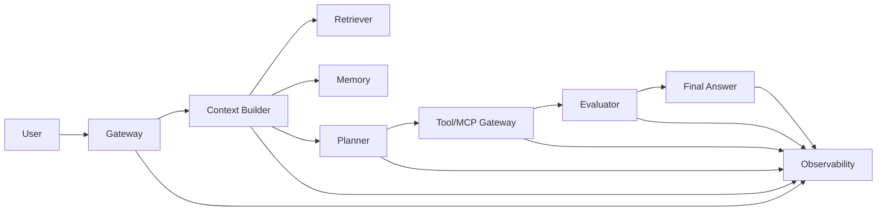

# Agent 系统蓝图

这份蓝图把需求转成可落地的系统设计大纲。

## 蓝图画布

1. 用户和业务结果。
2. Non-goals 与 denied actions。
3. 数据源和 owner。
4. Tool/MCP 接口和风险分类。
5. Plan 与 routing 策略。
6. Memory 与 evidence precedence。
7. Eval 与安全门禁。
8. Observability 与 trace contract。
9. 成本与延迟预算。
10. Release、rollback 与 postmortem 流程。

## 架构地图

## 设计规则

- 使用能满足目标的最简单架构。
- 把 request input 和 user instruction 分开。
- 显式 stop conditions 优先于 confidence guessing。
- 高风险动作执行前先验证。
- 把 retrieved memory 当作 evidence，而不是 authority。
- 每个危险行为上线前都必须可测试。

## 完成标准

- 一句话目标与 success metric。
- Tool risk table。
- Data source precedence。
- Release gate。
- Rollback path。
- Postmortem trigger。

## 相关页面

- 实施手册：[`核心Agent实施手册.md`](核心Agent实施手册.md)
- 审查清单：[`Agent设计审查清单.md`](Agent设计审查清单.md)
- 生产清单：[`../quick-reference/生产清单.md`](../quick-reference/生产清单.md)
