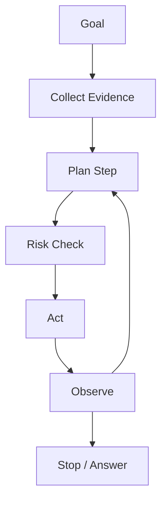

# Plan 与决策

Planning 是 Agent 的决策层：选择下一步、分配 tools 或 agents、以及决定何时停止。

## Planning 和 Acting 的区别

Planning 说明下一步应该发生什么。Acting 执行具体步骤。

- Plan：retrieve policy，然后 verify rollback path。
- Act：调用 `read_policy(policy_id="...")`。

好的系统会把两者分开，这样 side effects 前可以检查 plan。

## 决策输入

Plan 应考虑：

- 用户目标和 constraints。
- 已有 evidence。
- Tools 可用性和 permissions。
- Risk 和 reversibility。
- Budget：tokens、latency、API calls。
- Stop conditions。

## 决策输出

Decision 应产出：

- Next action。
- Action reason。
- Expected evidence。
- Risk level。
- Stop condition。
- Action 失败时的 fallback。

## 决策类型

| Decision | 问题 | Safe default |
| --- | --- | --- |
| Clarify | 目标是否模糊？ | 先问再执行 |
| Retrieve | 是否需要当前/私有 evidence？ | 先 RAG 再 claim |
| Tool call | 是否需要外部动作？ | Validate 和 audit |
| Delegate | 是否应由另一个 agent 负责？ | 使用 scheduler contract |
| Verify | 是否 evidence-heavy claim？ | 添加 verifier |
| Stop | 是否已准备好回答？ | Evidence 足够时停止 |

## 常见 Planning 失败

- Plan 重复调用同一个失败 tool。
- Plan 把 recommendation 当成 permission。
- Plan 跳过重要 claim 的 verification。
- Plan 隐藏 uncertainty。
- Plan 没有最大深度或 budget。
- Plan 未经人工确认执行不可逆步骤。

## Review 问题

1. 为什么选择这个 next action？
2. 它期待什么 evidence？
3. 失败时会发生什么？
4. Stop condition 是什么？
5. 这一步是否需要先 verify 或 human approval？
