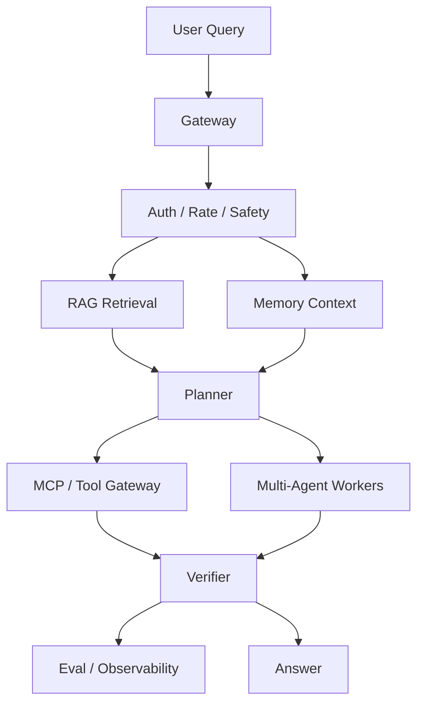

# RAG、记忆、多 Agent、MCP 流程

生产 Agent 系统通常组合多个子系统。理解数据流比记框架名字更重要。

## 流程

1. 用户 query 进入 gateway。
2. Gateway 检查 auth、rate、safety。
3. RAG 检索相关文档。
4. 记忆提供用户、任务或组织上下文。
5. Planner 选择 tool、subagent 或 answer path。
6. MCP 或 tool gateway 暴露工具和外部数据源。
7. 多 Agent 组件分解、验证或专门化处理工作。
8. Evaluation 和 observability 记录质量、延迟、成本和安全信号。

## 数据归属

| Source | 负责 | 风险 | 正确问题 |
| --- | --- | --- | --- |
| RAG | 当前问题的证据 | stale 或 irrelevant documents | Retrieval 是否返回了本次 query 需要的 source？ |
| 记忆 | 持久上下文 | privacy、stale facts、overgeneralization | 这个 fact 应该保存、删除还是遗忘？ |
| Tool gateway | 外部动作和状态 | permission mistakes、side effects | 这是 read、write 还是 destructive？ |
| Planner | 步骤选择和路由 | wrong route、loops、overconfidence | 下一步是否是最小有用步骤？ |
| Observability | trace、cost、latency、errors | incomplete trace、missing fields | 是否能从 trace 复现 incident？ |

## 设计规则

- Retrieval 应围绕问题 scoped。
- 记忆是隐私敏感的。
- Subagent 职责必须明确。
- Tool inputs/outputs 要谨慎记录。
- 用 eval sets 捕捉回归。
- Evidence 和 generated text 要分离。
- 最终答案不能隐藏 missing sources。
- 优先使用在 execution time 强制 permissions 的 tool gateway。
- Subagent output 也是 evidence，可能需要 verification。

## 失败排查顺序

当答案错误时，按这个顺序检查：

1. 用户请求是否信息足够？
2. Retrieval 是否返回正确 source？
3. 记忆是否引入 stale/private context？
4. Planner 是否选择正确路径？
5. Tool 是否执行正确动作？
6. Verification 是否在回答前捕获错误？
7. Trace 是否完整到可复现？

## 系统设计清单

- 系统能不能 refuse？
- 能不能 cite evidence？
- 能不能安全调用 tools？
- 能不能区分 read-only 和 write actions？
- 能不能检测 stale facts？
- 能不能 escalate 到 human？
- 能不能 rollback 或 disable risky path？
- 每个子系统能否独立评估？
